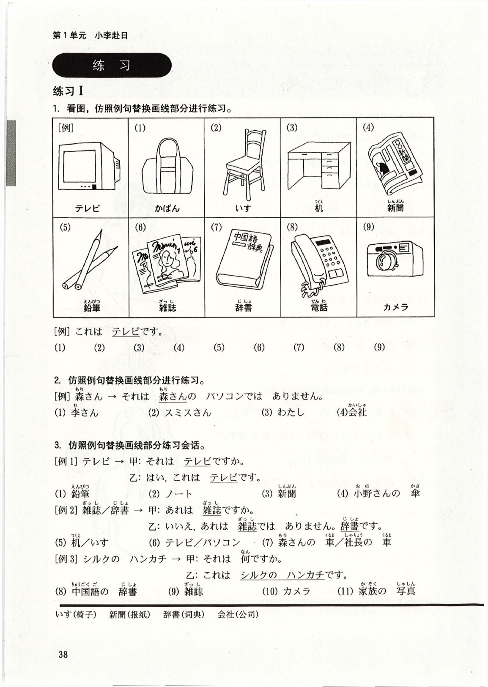

# 第2課 これは <ruby>本<rt>ほん</rt></ruby>です

Pages: 49-58

> 当前完成度：`S3+（精修版·二校）`。已逐页对照原书 400dpi PDF 二次校对；修正「えっ」例句田中さん→田中先生及升调符号；清理询问年龄段落拼接痕迹；补全「どうぞ」应答例句；移除应用课文中文舞台说明的多余 ruby；专栏还原パラサイト・シングル等原书内容。

Page 49

## 基本课文

### 基本句

1. これは <ruby>本<rt>ほん</rt></ruby>です。  
2. それは <ruby>何<rt>なん</rt></ruby>ですか。  
3. あれは だれの <ruby>傘<rt>かさ</rt></ruby>ですか。  
4. この カメラは スミスさんのです。  

### 会话 A

甲：これは テレビですか。  
乙：いいえ、それは テレビでは ありません。パソコンです。  

### 会话 B

甲：それは <ruby>何<rt>なん</rt></ruby>ですか。  
乙：これは <ruby>日本語<rt>にほんご</rt></ruby>の <ruby>本<rt>ほん</rt></ruby>です。  

### 会话 C

甲：<ruby>森<rt>もり</rt></ruby>さんの かばんは どれですか。  
乙：あの かばんです。  

### 会话 D

甲：その ノートは だれのですか。  
乙：わたしのです。  

Page 50

## 语法解释

### 1. `これ / それ / あれ は 名 です`

`これ` `それ` `あれ` 是指示事物的词，相当于汉语的"这""这个""那""那个"。汉语里有"这"和"那"两种说法，而日语里有 `これ` `それ` `あれ` 三种说法。其用法如下：

#### (1) 说话人和听话人相隔一段距离，面对面时

- `これ`：距说话人较近的事物（说话人的范围、领域内的事物）
- `それ`：距听话人较近的事物（听话人的范围、领域内的事物）
- `あれ`：距说话人和听话人都比较远的事物（不属于任一方范围、领域内的事物）

#### (2) 说话人和听话人位于同一位置，面向同一方向时

- `これ`：距说话人、听话人较近的事物
- `それ`：距说话人、听话人较远的事物
- `あれ`：距说话人、听话人更远的事物

例如：

- これは <ruby>本<rt>ほん</rt></ruby>です。  
  这是书。
- それは かばんです。  
  那是包。
- あれは テレビです。  
  那是电视。

### 2. `だれですか / 何ですか`

不知道是什么人时用 `だれ`，不知道是什么事物时用 `何` 来问。分别相当于汉语的”谁”和”什么”。句尾后续疑问词 `か`，一般读升调。

- それは <ruby>何<rt>なん</rt></ruby>ですか。  
  那是什么？
- あの <ruby>人<rt>ひと</rt></ruby>は だれですか。  
  那个人是谁？

> 注意：汉语里，句子中有”谁””什么”时，句尾不用”吗”。但日语里，句子中即便有 `だれ` `何`，句尾仍然要用 `か`。

`だれ` 的比较礼貌的说法是 `どなた`。`どなた` 适用于对方与自己地位相当或比自己地位低时。对尊长或比自己地位高的人用 `どちら様`。

- スミスさんは どなたですか。  
  史密斯先生是哪一位？

### 3. `名1 の 名2`

助词 `の` 连接名词和名词，表示所属。

- わたしの かぎ  
  我的钥匙
- <ruby>田中<rt>たなか</rt></ruby>さんの <ruby>車<rt>くるま</rt></ruby>  
  田中先生的车

Page 51

### 4. `この / その / あの + 名`

修饰名词时，要把：

- `これ / それ / あれ`

改成：

- `この / その / あの`

例如：

- この カメラは スミスさんのです。  
  这个照相机是史密斯先生的。
- その <ruby>自転車<rt>じてんしゃ</rt></ruby>は <ruby>森<rt>もり</rt></ruby>さんのです。  
  那辆自行车是森先生的。
- あの ノートは だれのですか。  
  那个笔记本是谁的？

> 参考：如上所示，一般把”この カメラは スミスさんの カメラです”中重复的名词删掉，成为”この カメラは スミスさんのです”。”その <ruby>自転車<rt>じてんしゃ</rt></ruby>は <ruby>森<rt>もり</rt></ruby>さんの <ruby>自転車<rt>じてんしゃ</rt></ruby>です”中的”<ruby>自転車<rt>じてんしゃ</rt></ruby>”也同样。成为”この カメラは スミスさんのです””その <ruby>自転車<rt>じてんしゃ</rt></ruby>は <ruby>森<rt>もり</rt></ruby>さんのです”。

### 5. `どれ / どの + 名`

`どれ` `どの` 是在三个以上的事物中，不确定是哪一个时所用的疑问词。单独使用时用 `どれ`，修饰名词时用 `どの`。

- <ruby>森<rt>もり</rt></ruby>さんの かばんは どれですか。  
  森先生的包是哪个？
- <ruby>長島<rt>ながしま</rt></ruby>さんの <ruby>車<rt>くるま</rt></ruby>は どれですか。  
  长岛先生的车是哪一辆？
- <ruby>小野<rt>おの</rt></ruby>さんの <ruby>机<rt>つくえ</rt></ruby>は どの <ruby>机<rt>つくえ</rt></ruby>ですか。  
  小野女士的桌子是哪一张？

## 100 以下的数字

| | | | | | |
| --- | --- | --- | --- | --- | --- |
| 0 | れい／ぜろ | 10 | じゅう | 20 | にじゅう |
| 1 | いち | 11 | じゅういち | 30 | さんじゅう |
| 2 | に | 12 | じゅうに | 40 | よんじゅう |
| 3 | さん | 13 | じゅうさん | 50 | ごじゅう |
| 4 | し／よん | 14 | じゅうし／じゅうよん | 60 | ろくじゅう |
| 5 | ご | 15 | じゅうご | 70 | ななじゅう |
| 6 | ろく | 16 | じゅうろく | 80 | はちじゅう |
| 7 | しち／なな | 17 | じゅうしち／じゅうなな | 90 | きゅうじゅう |
| 8 | はち | 18 | じゅうはち | 100 | ひゃく |
| 9 | く／きゅう | 19 | じゅうく／じゅうきゅう | | |
| 0.1 | れいてんいち | 2/3 | さんぶんのに | | |

Page 52

## 表达及词语讲解

### 1. `方`　【礼貌语言 ①】

在日语里，对长辈、工作单位的上司等应该尊敬的对象，或初次见面的人以及交往不多的人，一般使用礼貌语言。在会议或举行某种仪式等公开场合也是如此。  
将 `これ／それ／あれ` 的 `人` 变为 `この／その／あの` 的 `方`，即成为一种礼貌语言。

- あの <ruby>方<rt>かた</rt></ruby>は <ruby>田中<rt>たなか</rt></ruby>さんです。  
  那位是田中先生。

另外，用 `JC企画の 人ですか`（是 JC 策划公司的人吗？）、`日本人ですか`（是日本人吗？）直接询问，听起来会使对方不愉快。用 `JC企画の 方ですか`、`日本の 方ですか` 问比较礼貌。

### 2. 询问年龄　【礼貌语言 ②】

询问年龄时，用 `何歳ですか`（多大了？），或使用比较礼貌的语言 `おいくつですか`（多大了？）。不论所问对象及问话人的年龄多少，都可以使用。不过意思和说法略有不同："几（儿）岁了？"和"多大年纪了？"  
不过，在直接询问同龄的孩子的年龄时，一般用 `いくつ` 而不是 `何歳`。

- <ruby>何歳<rt>なんさい</rt></ruby>ですか。
- おいくつですか。

### 3. `どうぞ`

给对方东西、请对方收下时常说：

- これは <ruby>中国<rt>ちゅうごく</rt></ruby>の <ruby>名産品<rt>めいさんひん</rt></ruby>です。どうぞ。  
  （这是中国有名的特产，请收下。）  
  ——どうも ありがとう ございます。  
  （太感谢了。）

### 4. 叹词 ②

#### (1) `えっ`

对对方所说的话感到意外或吃惊时使用。

- あの <ruby>方<rt>かた</rt></ruby>は <ruby>田中<rt>たなか</rt></ruby><ruby>先生<rt>せんせい</rt></ruby>です。  
  那位是田中老师。  
  ——えっ。（以为田中老师是学生，因此吃惊。）

另外，也用于没听懂或没明白对方所说的话时的反问。但要注意，重复使用会使对方觉得不礼貌。

- 甲：わたしは <ruby>JC企画<rt>ジェーシーきかく</rt></ruby>の <ruby>社員<rt>しゃいん</rt></ruby>です。  
  乙：えっ（↗）？（什么？）（没听清公司名称）  
  甲：<ruby>JC企画<rt>ジェーシーきかく</rt></ruby>の <ruby>社員<rt>しゃいん</rt></ruby>です。（JC 策划公司的职员。）（重复公司名称）

#### (2) `わあ`

感动或者吃惊时发出的声音。应用课文中，用于小野看到真丝手绢时的高兴心情表达。

- わあ、シルクの ハンカチですか。  
  哇，是真丝手绢吗？

Page 53

### 5. `はい` 和 `ええ`

`ええ` 是 `はい` 的比较随便的说法。但只用于肯定对方的提问。在被别人叫到自己名字等场合，必须用 `はい`，而不能用 `ええ`。

- <ruby>森<rt>もり</rt></ruby>さん。  
  ——はい。（✓）  
  ——×ええ。

### 6. 外来词 ①

在日语里，从外语引进的词称为"外来词（外来語）"，用片假名书写。这种词大部分来自英语。古时候从中国引进的词称为"漢語（汉字词）"，这部分词不包含在外来词之中。

- シルク silk（丝绸）
- ハンカチ handkerchief（手绢）

另外，外国的地名、人名也用片假名书写。

- スワトウ　汕头
- ロンドン London（伦敦）
- スミスさん Mr.Smith（史密斯先生）

### 7. `どうも ありがとう ございます`　【寒暄语 ②】

`どうも` 用于加强 `ありがとう ございます` 所表示的谢意。但是，在略微感谢时，可以省略 `ありがとう ございます`，只用 `どうも`。

## 亲属的称谓

说到自己的亲属和别人的亲属时，要使用不同的称谓。

| | 自己的亲属 | 别人的亲属 | | 自己的亲属 | 别人的亲属 |
| --- | --- | --- | --- | --- | --- |
| 祖父 | <ruby>祖父<rt>そふ</rt></ruby>／外祖父 | おじいさん | 兄弟 | <ruby>兄弟<rt>きょうだい</rt></ruby>／兄弟姐妹 | <ruby>ご兄弟<rt>ごきょうだい</rt></ruby> |
| 祖母 | <ruby>祖母<rt>そぼ</rt></ruby>／外祖母 | おばあさん | 兄 | <ruby>兄<rt>あに</rt></ruby> | おにいさん |
| 両親 | <ruby>両親<rt>りょうしん</rt></ruby> | <ruby>ご両親<rt>ごりょうしん</rt></ruby> | 姐 | <ruby>姉<rt>あね</rt></ruby> | おねえさん |
| 父 | <ruby>父<rt>ちち</rt></ruby> | <ruby>お父さん<rt>おとうさん</rt></ruby> | 弟 | <ruby>弟<rt>おとうと</rt></ruby> | <ruby>弟<rt>おとうと</rt></ruby>さん |
| 母 | <ruby>母<rt>はは</rt></ruby> | <ruby>お母さん<rt>おかあさん</rt></ruby> | 妹 | <ruby>妹<rt>いもうと</rt></ruby> | <ruby>妹<rt>いもうと</rt></ruby>さん |
| 夫 | <ruby>主人<rt>しゅじん</rt></ruby> | <ruby>ご主人<rt>ごしゅじん</rt></ruby> | 伯伯 | おじ | おじさん |
| 妻 | <ruby>家内<rt>かない</rt></ruby> | <ruby>奥<rt>おく</rt></ruby>さん | 伯母 | おば | おばさん |
| 息子 | <ruby>息子<rt>むすこ</rt></ruby> | <ruby>息子<rt>むすこ</rt></ruby>さん | | | |
| 女儿 | <ruby>娘<rt>むすめ</rt></ruby> | <ruby>娘<rt>むすめ</rt></ruby>さん／<ruby>お嬢<rt>おじょう</rt></ruby>さん | | | |

> 直接称呼自己的亲属时，如 `お父さん`（爸爸）`パパ`（爸爸）。有多种多样的称谓。但称呼弟弟或妹妹时，一般直呼其名。

Page 54

## 应用课文

### 场景：<ruby>家族<rt>かぞく</rt></ruby>の<ruby>写真<rt>しゃしん</rt></ruby>

小李计划先在涩谷的宾馆住一段时间，然后再搬到公寓里。  
这天，小野来宾馆看望小李，两人在大厅喝茶。

（小李从包里取记事本时，从记事本里掉出一张照片）

<ruby>小野<rt>おの</rt></ruby>：<ruby>李<rt>り</rt></ruby>さん、それは <ruby>何<rt>なん</rt></ruby>ですか。  
<ruby>李<rt>り</rt></ruby>：これですか。<ruby>家族<rt>かぞく</rt></ruby>の <ruby>写真<rt>しゃしん</rt></ruby>です。  
<ruby>小野<rt>おの</rt></ruby>：（指着其中一个人）この <ruby>方<rt>かた</rt></ruby>は どなたですか。  
<ruby>李<rt>り</rt></ruby>：わたしの <ruby>母<rt>はは</rt></ruby>です。  
<ruby>小野<rt>おの</rt></ruby>：<ruby>お母さん<rt>おかあさん</rt></ruby>は おいくつですか。  
<ruby>李<rt>り</rt></ruby>：52歳です。  

（小李从包里取出一个盒子）

<ruby>李<rt>り</rt></ruby>：<ruby>小野<rt>おの</rt></ruby>さん、これ、どうぞ。  
<ruby>小野<rt>おの</rt></ruby>：えっ、<ruby>何<rt>なん</rt></ruby>ですか。  
<ruby>李<rt>り</rt></ruby>：<ruby>お土産<rt>おみやげ</rt></ruby>です。  

（小野打开一看，是一块很漂亮的刺绣手绢）

<ruby>小野<rt>おの</rt></ruby>：わあ、シルクの ハンカチですか。  
<ruby>李<rt>り</rt></ruby>：ええ。スワトウの ハンカチです。<ruby>中国<rt>ちゅうごく</rt></ruby>の <ruby>名産品<rt>めいさんひん</rt></ruby>です。  
<ruby>小野<rt>おの</rt></ruby>：どうも ありがとうございます。  

### 词语补充

- <ruby>写真<rt>しゃしん</rt></ruby>：照片
- <ruby>お母さん<rt>おかあさん</rt></ruby>：母亲
- <ruby>お土産<rt>おみやげ</rt></ruby>：礼物

Page 55

## 练习

### 练习 I

#### 1. 看图，仿照例句替换画线部分进行练习

- 例：`これは テレビです。`
- 图示项目：
  - `(1) かばん`
  - `(2) いす`
  - `(3) 机`
  - `(4) 新聞`
  - `(5) 鉛筆`
  - `(6) 雑誌`
  - `(7) 辞書`
  - `(8) 電話`
  - `(9) カメラ`

#### 2. 仿照例句替换画线部分进行练习

- 例：`森さん → それは 森さんの パソコンでは ありません。`
- 替换项目：
  - `(1) 李さん`
  - `(2) スミスさん`
  - `(3) わたし`
  - `(4) 会社`

#### 3. 仿照例句替换画线部分练习会话

- 例 1：
  - `テレビ → 甲：それは テレビですか。`
  - `乙：はい、これは テレビです。`
- 替换项目：
  - `(1) 鉛筆`
  - `(2) ノート`
  - `(3) 新聞`
  - `(4) 小野さんの 傘`

- 例 2：
  - `<ruby>雑誌<rt>ざっし</rt></ruby> / <ruby>辞書<rt>じしょ</rt></ruby> → 甲：あれは 雑誌ですか。`
  - `乙：いいえ、あれは 雑誌では ありません。辞書です。`
- 替换项目：
  - `(5) 机 / いす`
  - `(6) テレビ / パソコン`
  - `(7) 森さんの 車 / 社長の 車`

- 例 3：
  - `シルクの ハンカチ → 甲：それは 何ですか。`
  - `乙：これは シルクの ハンカチです。`
- 替换项目：
  - `(8) 中国語の 辞書`
  - `(9) 雑誌`
  - `(10) カメラ`
  - `(11) 家族の 写真`

Page 56

### 练习 I（续）

#### 4. 看图，仿照例句替换画线部分练习会话

- 例 1：
  - `甲：それは 何ですか。`
  - `乙：これは カメラです。`
- 替换项目：
  - `(1) かばん`
  - `(2) 靴`
  - `(3) 傘`

- 例 2：
  - `甲：あれは 何ですか。`
  - `乙：あれは 新聞です。`
- 替换项目：
  - `(4) 雑誌`
  - `(5) ラジオ`
  - `(6) 時計`

#### 5. 仿照例句在录音所说的内容上画 `○`，并反复练习

- 例：`これは { テレビ・カメラ } です。`
- `(1) これは { 車・机 } の かぎです。`
- `(2) これは { 森さん・わたし } の 傘では ありません。`
- `(3) あれは { だれ・何 } の かばんですか。`
- `(4) その 手帳は スミスさんの { です・では ありません }。`

#### 6. 听录音，仿照例句替换画线部分练习会话

- 例：
  - `傘 / かばん`
  - `甲：これは あなたの 傘ですか。`
  - `乙：いいえ、わたしのでは ありません。`
  - `甲：この かばんは？`
  - `乙：あっ、それは わたしのです。`
- 替换项目：
  - `(1) 本 / 辞書`
  - `(2) ラジオ / カメラ`
  - `(3) かぎ / 新聞`

Page 57

### 练习 II

#### 1. 在括号中填入适当的词语

- 例：`それは（ 何 ）ですか。 → これは パソコンです。`
- `(1) あれは（　　　）の かばんですか。 → 森さんの かばんです。`
- `(2) 李さんの 傘は（　　　）ですか。 → あれです。`
- `(3) この 本は（　　　）のですか。 → わたしのです。`
- `(4) （　　　）かばんですか。 → あの かばんです。`

#### 2. 在括号中填入一个平假名

- 例：`これ（ は ）本です。`
- `(1) その ノートは だれ（　）ですか。`
- `(2) 田中さんの 車（　）どれですか。`
- `(3) 吉田さん（　）43歳です。`
- `(4) これは 中国語の 辞書で（　）ありません。`

#### 3. 参照答句，写出疑问句

- 例：`（それは 何ですか。）→ これは 本です。`
- `(1) （　　　　　　　　　　）→ それは 李さんの 辞書です。`
- `(2) （　　　　　　　　　　）→ その ノートは 田中さんのです。`
- `(3) （　　　　　　　　　　）→ いいえ、これは 雑誌では ありません。`
- `(4) （　　　　　　　　　　）→ はい、あれは 林さんの 車です。`

#### 4. 边看图边听录音，回答提问

- 图示项目：
  - 例：辞書
  - `(1) ラジオ`
  - `(2) 本`
  - `(3) 小野さんの 傘`
  - `(4) 長島さんの カメラ`
- 例：`これは 雑誌ですか。 → いいえ、雑誌では ありません。辞書です。`

#### 5. 将下面的句子译成日语

- `(1) 那是谁的伞？`
- `(2) 这是日语书。`
- `(3) 森先生的包是哪一个？`

Page 58

## 生词表

### 词条

- `ほん（本）` `[名]` 书
- `かばん` `[名]` 包，公文包
- `ノート` `[名]` 笔记本，本子
- `えんぴつ（鉛筆）` `[名]` 铅笔
- `かさ（傘）` `[名]` 伞
- `くつ（靴）` `[名]` 鞋
- `しんぶん（新聞）` `[名]` 报纸
- `ざっし（雑誌）` `[名]` 杂志
- `じしょ（辞書）` `[名]` 词典
- `カメラ` `[名]` 照相机
- `テレビ` `[名]` 电视机
- `パソコン` `[名]` 个人电脑
- `ラジオ` `[名]` 收音机
- `でんわ（電話）` `[名]` 电话
- `つくえ（机）` `[名]` 桌子，书桌
- `いす` `[名]` 椅子
- `かぎ` `[名]` 钥匙，锁
- `とけい（時計）` `[名]` 钟，表
- `てちょう（手帳）` `[名]` 记事本
- `しゃしん（写真）` `[名]` 照片
- `くるま（車）` `[名]` 车
- `じてんしゃ（自転車）` `[名]` 自行车
- `おみやげ（お土産）` `[名]` 礼物
- `めいさんひん（名産品）` `[名]` 特产，名产
- `シルク` `[名]` 丝绸
- `ハンカチ` `[名]` 手绢
- `かいしゃ（会社）` `[名]` 公司
- `ひと（人）` `[名]` 人
- `かた（方）` `[名]` （敬称）位，人
- `かぞく（家族）` `[名]` 家人，家属
- `はは（母）` `[名]` （我）母亲
- `おかあさん（お母さん）` `[名]` 母亲
- `にほんご（日本語）` `[名]` 日语
- `ちゅうごくご（中国語）` `[名]` 汉语，中文
- `これ` `[代]` 这，这个
- `それ` `[代]` 那，那个
- `あれ` `[代]` 那，那个
- `どれ` `[疑]` 哪个
- `なん（何）` `[疑]` 什么
- `だれ` `[疑]` 谁
- `どなた` `[疑]` 哪位
- `この` `[连体]` 这，这个
- `その` `[连体]` 那，那个
- `あの` `[连体]` 那，那个
- `どの` `[连体]` 哪个
- `えっ` `[叹]` 啊
- `わあ` `[叹]` 哇
- `ええ` `[叹]` （应答）嗯，是

### 专有名词

- `ながしま（長島）` `[专]` 长岛
- `にほん（日本）` `[专]` 日本
- `スワトウ` `[专]` 汕头
- `ロンドン` `[专]` 伦敦

### 表达

- `ありがとうございます` 谢谢
- `おいくつ` 多大
- `なん〜 / 〜さい（何〜 / 〜歳）`

### 专栏：家庭的形态

在日本，出生率急剧下降。从家庭成员的构成情况来看，20 世纪 60 年代平均每个家庭约 `4.14` 人，到 2000 年已经减少到约 `2.67` 人。也就是说，由双亲及两个孩子构成的家庭，变成了由双亲及 1 个孩子或没有孩子的家庭。其原因之一是晚婚现象的影响，男女的平均初婚年龄与 40 年前相比数字部分上升了 3 岁。

近年来，单身族的出现也使得孩子减少的现象日趋加剧。这些年轻人不自食其力，同时过着 `パラサイト・シングル`（不结婚寄居父母生活的人）的生活。
