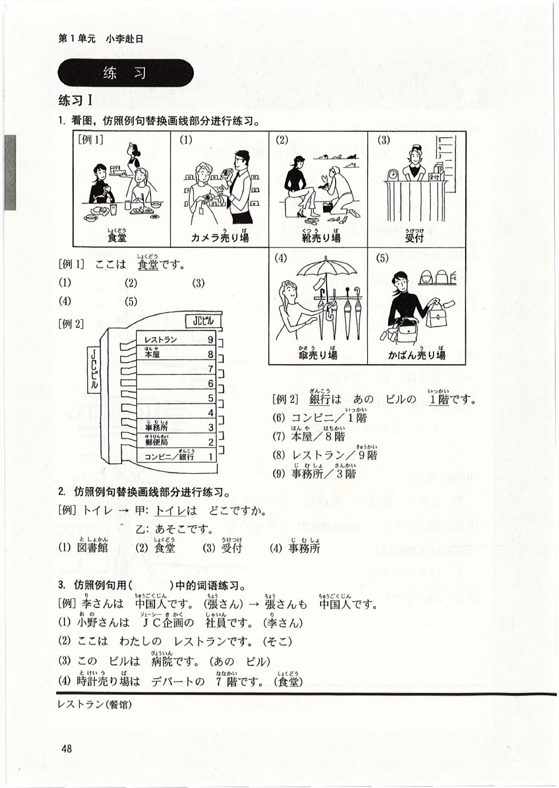

# 第3課 ここはデパートです

Pages: 59-68

> 当前完成度：`S3+（精修版·二校）`。已逐页对照原书 400dpi PDF 二次校对；语法点 5 还原原书说明措辞并修正かばん翻译；省略②修正「省略的句子」；确认用法修正これ→这；专栏消除重复句整合为原书连贯叙述。

Page 59

## 基本课文

### 基本句

1. ここは デパートです。  
2. <ruby>食堂<rt>しょくどう</rt></ruby>は デパートの 7<ruby>階<rt>かい</rt></ruby>です。  
3. あそこも <ruby>JC企画<rt>ジェーシーきかく</rt></ruby>の ビルです。  
4. かばん<ruby>売り場<rt>うりば</rt></ruby>は 1<ruby>階<rt>かい</rt></ruby>ですか、2<ruby>階<rt>かい</rt></ruby>ですか。  

### 会话 A

甲：トイレは どこですか。  
乙：あちらです。  

### 会话 B

甲：ここは <ruby>郵便局<rt>ゆうびんきょく</rt></ruby>ですか、<ruby>銀行<rt>ぎんこう</rt></ruby>ですか。  
乙：<ruby>銀行<rt>ぎんこう</rt></ruby>です。  

### 会话 C

甲：これは いくらですか。  
乙：それは 5,800<ruby>円<rt>えん</rt></ruby>です。  
甲：あれは？  
乙：あれも 5,800<ruby>円<rt>えん</rt></ruby>です。  

Page 60

## 语法解释

### 1. `ここ / そこ / あそこ は 名 です`

指示场所时，用 `ここ` `そこ` `あそこ`。所表示的位置关系与 `これ` `それ` `あれ` 相同。

- ここは デパートです。  
  这里是百货商店。
- そこは <ruby>図書館<rt>としょかん</rt></ruby>です。  
  那里是图书馆。
- あそこは <ruby>入り口<rt>いりぐち</rt></ruby>です。  
  那儿是入口。

### 2. `名 は 名［場所］です`

表示”名词存在于名词场所”。

- <ruby>食堂<rt>しょくどう</rt></ruby>は デパートの 7<ruby>階<rt>かい</rt></ruby>です。  
  食堂在百货商店的 7 层。
- トイレは ここです。  
  厕所在这儿。
- <ruby>小野<rt>おの</rt></ruby>さんは <ruby>事務所<rt>じむしょ</rt></ruby>です。  
  小野女士在事务所。

> 注意：`小野さんは 事務所です` 的汉语译文是”小野女士在事务所”，不能翻译为”小野女士是事务所”。日语的 `です` 比汉语的”是”有更宽广的含义。在这里表示存在的地点。  
> `トイレは ここです` 意思是”厕所在这儿”，是将 `トイレ` 作为话题来叙述。`ここは トイレです` 意思是”这里是厕所”，是将 `ここ` 作为话题来叙述。句型相同但重点不同。

### 3. `名 は どこですか`

用于询问存在的场所。

- トイレは どこですか。  
  厕所在哪儿？  
  ——あちらです。  
  　在那儿。
- あなたの かばんは どこですか。  
  你的包在哪儿？  
  ——わたしの かばんは ここです。  
  　我的包在这儿。

### 4. `名 も 名 です`

助词 `も` 基本相当于汉语的”也”。

- ここは <ruby>JC企画<rt>ジェーシーきかく</rt></ruby>の ビルです。  
  这里是 JC 策划公司的大楼。
- あそこも <ruby>JC企画<rt>ジェーシーきかく</rt></ruby>の ビルです。  
  那里也是 JC 策划公司的大楼。
- <ruby>李<rt>り</rt></ruby>さんは <ruby>中国人<rt>ちゅうごくじん</rt></ruby>です。  
  小李是中国人。
- <ruby>張<rt>ちょう</rt></ruby>さんも <ruby>中国人<rt>ちゅうごくじん</rt></ruby>です。  
  小张也是中国人。

### 5. `名 は 名 ですか、名 ですか`

答案有多种可能时，需询问其中的一种时，可以重复使用谓语 `〜ですか`。因为这里询问的是哪一种，不能用 `はい` 或 `いいえ` 来回答。

- かばん<ruby>売り場<rt>うりば</rt></ruby>は 1<ruby>階<rt>かい</rt></ruby>ですか、2<ruby>階<rt>かい</rt></ruby>ですか。  
  （卖包的柜台在 1 层还是 2 层？）
- <ruby>今日<rt>きょう</rt></ruby>は <ruby>水曜日<rt>すいようび</rt></ruby>ですか、<ruby>木曜日<rt>もくようび</rt></ruby>ですか。  
  （今天是星期三还是星期四？）
- <ruby>林<rt>はやし</rt></ruby>さんは <ruby>韓国人<rt>かんこくじん</rt></ruby>ですか、<ruby>日本人<rt>にほんじん</rt></ruby>ですか、<ruby>中国人<rt>ちゅうごくじん</rt></ruby>ですか。  
  （林先生是韩国人？还是日本人？还是中国人？）  
  ——<ruby>日本人<rt>にほんじん</rt></ruby>です。  
  　是日本人。

Page 61

### 6. `名 は いくらですか`

询问价钱时，用 `いくら`。

- これは いくらですか。  
  这个多少钱？
- その <ruby>服<rt>ふく</rt></ruby>は いくらですか。  
  那件衣服多少钱？

## 100 以上的数字

| | | | | | |
| --- | --- | --- | --- | --- | --- |
| 100 | ひゃく | 1,000 | せん | 10,000 | いちまん |
| 200 | にひゃく | 2,000 | にせん | 100,000 | じゅうまん |
| 300 | **さんびゃく** | 3,000 | **さんぜん** | 1,000,000 | ひゃくまん |
| 400 | よんひゃく | 4,000 | よんせん | 10,000,000 | いっせんまん |
| 500 | ごひゃく | 5,000 | ごせん | | |
| 600 | **ろっぴゃく** | 6,000 | ろくせん | 9,002 | きゅうせん に |
| 700 | ななひゃく | 7,000 | ななせん | 9,020 | きゅうせん にじゅう |
| 800 | **はっぴゃく** | 8,000 | **はっせん** | 9,200 | きゅうせん にひゃく |
| 900 | きゅうひゃく | 9,000 | きゅうせん | | |

> "一百""一千"在日语中是 `ひゃく` `せん`，前面不加 `いち`。但"一万""一亿"是 `いちまん` `いちおく`，"一千万"是 `いっせんまん`，前面要加 `いち`。（参看第 2 课 100 以下的数字。）

- その <ruby>車<rt>くるま</rt></ruby>は いくらですか。（那辆车多少钱？）  
  ——1,980,000<ruby>円<rt>えん</rt></ruby>です。（198 万日元。）

> 注意：`530` 必须说成 `ごひゃくさんじゅう`。如果说成 `ごひゃくさん` 就变成了"503"的意思。

Page 62

## 表达及词语讲解

### 1. `1階`

`階` 是量词。日语的量词和前面的数词搭配使用时，有时候会有多种发音的情况，详见附录 IV 数、量词搭配使用表。

- `1階`：いっかい
- `3階`：さんがい
- `6階`：ろっかい

### 2. 省略 ②　【谓语的省略】

在会话中，进一步询问时，一般省略已经说过一遍的谓语部分。被省略的部分一般包含整个谓语。

例如，首先用 `これは いくらですか`（这个多少钱？）询问，接着进一步询问 `あれは いくらですか`（那个多少钱？）与第一个问句后半部分 `いくらですか` 相同，谓语常常省略，只说 `あれは（↗）`就可以了。这里的 `あれは（↗）` 读成升调。

应用课文中，`マンションの 隣は`（公寓的旁边呢？）也是同样将谓语省略的句子。句尾同样要读升调。

### 3. 礼貌语言 ③

#### (1) `こちら / そちら / あちら / どちら`

`こちら / そちら / あちら / どちら` 是 `ここ / そこ / あそこ / どこ` 的礼貌说法。`こちら / そちら / あちら / どちら` 原本是表示方向的词语。

- <ruby>受付<rt>うけつけ</rt></ruby>は どちらですか。  
  接待处在哪儿？（礼貌说法）
- <ruby>受付<rt>うけつけ</rt></ruby>は どこですか。  
  接待处在哪儿？（一般说法）  
  ——あちらです。  
  　在那边。

Page 63

#### (2) `お国はどちらですか` / `会社はどちらですか`

询问来自哪一国家时，一般用 `国は どちらですか`（你是哪个国家的？）。在 `国` 前面加上 `お` 变成 `お国は どちらですか`，则更加礼貌。不过，要注意并不是所有的名词前面都可以加 `お`。

- お<ruby>国<rt>くに</rt></ruby>は どちらですか。（你是哪个国家的？）

`会社は どちらですか`（你的公司在哪儿？）也包含两种意思。一种是询问公司所在处，另一种是询问所属公司的名称。具体是哪一种含义要根据上下文来判断。

- <ruby>会社<rt>かいしゃ</rt></ruby>は どちらですか。  
  你的公司在哪儿？ / 你是哪个公司的？
- 乙1：<ruby>上海<rt>シャンハイ</rt></ruby>です。  
  在上海。
- 乙2：<ruby>JC企画<rt>ジェーシーきかく</rt></ruby>です。  
  对方询问所属公司的名称的回答。

### 4. 缩略词

`パソコン` 由 `パーソナルコンピュータ`（英语的 personal computer）缩略而来。日语中有将一个长词缩短的情况，这样形成的词叫做缩略词。

- パーソナルコンピュータ → パソコン
- コンビニエンスストア → コンビニ（便利店）
- デジタルカメラ → デジカメ（数码相机）

### 5. `あのう`　【搭话 ①】

用于向对方搭话或欲引起对方注意。另外，在说到难以启齿的事情、开始一个新话题以及向别人提出请求时，也可用 `あのう`。

- （部下向正在工作的科长乙搭话，希望把注意力转向自己）  
  甲：あのう、<ruby>課長<rt>かちょう</rt></ruby>……  
  乙：<ruby>何<rt>なん</rt></ruby>ですか。（什么？）

### 6. `〜ですか`　【确认】

用于进一步确认对方所说的信息。句尾读升调。

- あのう、<ruby>東京<rt>とうきょう</rt></ruby>の <ruby>地図<rt>ちず</rt></ruby>は どこですか。（请问，东京地图在什么地方？）  
  ——<ruby>地図<rt>ちず</rt></ruby>ですか（↗）。そちらです。（地图？在那儿。）

在对方所说的内容后加 `か`，重复一遍，可表示理解了对方所说的内容。这时句尾读降调。

- これは パソコンです。（这是个人电脑。）  
  ——パソコンですか（↘）。（是个人电脑啊。）

## 英文字母

| | | | | | | | |
| --- | --- | --- | --- | --- | --- | --- | --- |
| A a | エー | B b | ビー | C c | シー | | |
| D d | ディー | E e | イー | F f | エフ | | |
| G g | ジー | H h | エイチ／エッチ | I i | アイ | | |
| J j | ジェー | K k | ケー | L l | エル | | |
| M m | エム | N n | エヌ | O o | オー | | |
| P p | ピー | Q q | キュー | R r | アール | | |
| S s | エス | T t | ティー | U u | ユー | | |
| V v | ブイ | W w | ダブリュー | X x | エックス | | |
| Y y | ワイ | Z z | ゼット／ズィー | | | | |

Page 64

## 应用课文

### 场景：ホテルの <ruby>周辺<rt>しゅうへん</rt></ruby>

小李请小野带自己熟悉宾馆的周边环境。宾馆附近有各种店铺，非常方便。

（她们走到宾馆附近的便利店前）

<ruby>小野<rt>おの</rt></ruby>：ここは コンビニです。<ruby>隣<rt>となり</rt></ruby>は <ruby>喫茶店<rt>きっさてん</rt></ruby>です。  
<ruby>李<rt>り</rt></ruby>：（指着前方的建筑物）あの <ruby>建物<rt>たてもの</rt></ruby>は ホテルですか、マンションですか。  
<ruby>小野<rt>おの</rt></ruby>：あそこは マンションです。  
<ruby>李<rt>り</rt></ruby>：（指着远处的高楼）あの <ruby>建物<rt>たてもの</rt></ruby>は <ruby>何<rt>なん</rt></ruby>ですか。  
<ruby>小野<rt>おの</rt></ruby>：あそこも マンションです。  
<ruby>李<rt>り</rt></ruby>：マンションの <ruby>隣<rt>となり</rt></ruby>は？  
<ruby>小野<rt>おの</rt></ruby>：マンションの <ruby>隣<rt>となり</rt></ruby>は <ruby>病院<rt>びょういん</rt></ruby>です。  

（走了一会儿）

<ruby>李<rt>り</rt></ruby>：<ruby>本屋<rt>ほんや</rt></ruby>は どこですか。  
<ruby>小野<rt>おの</rt></ruby>：（指着前方不远处）そこです。その ビルの 2<ruby>階<rt>かい</rt></ruby>です。  

（书店的收款台前）

<ruby>李<rt>り</rt></ruby>：あのう、<ruby>東京<rt>とうきょう</rt></ruby>の <ruby>地図<rt>ちず</rt></ruby>は どこですか。  
<ruby>店員<rt>てんいん</rt></ruby>：<ruby>地図<rt>ちず</rt></ruby>ですか。（指着小李身后）そちらです。  

（小李将地图拿到收款台）

<ruby>李<rt>り</rt></ruby>：いくらですか。  
<ruby>店員<rt>てんいん</rt></ruby>：500<ruby>円<rt>えん</rt></ruby>です。  

Page 65

## 练习

### 练习 I

#### 1. 看图，仿照例句替换画线部分进行练习

- 例 1：
  - `ここは 食堂です。`
- 图示项目：
  - `(1) カメラ売り場`
  - `(2) 靴売り場`
  - `(3) 受付`
  - `(4) 傘売り場`
  - `(5) かばん売り場`

- 例 2：
  - `銀行は あの ビルの 1階です。`
- 楼层替换项目：
  - `(6) コンビニ / 1階`
  - `(7) 本屋 / 8階`
  - `(8) レストラン / 9階`
  - `(9) 事務所 / 3階`

#### 2. 仿照例句替换画线部分进行练习

- 例：`トイレ → 甲：トイレは どこですか。`
- `乙：あそこです。`
- 替换项目：
  - `(1) 図書館`
  - `(2) 食堂`
  - `(3) 受付`
  - `(4) 事務所`

#### 3. 仿照例句用括号中的词语练习

- 例：`李さんは 中国人です。（張さん）→ 張さんも 中国人です。`
- 替换项目：
  - `(1) 小野さんは JC企画の 社員です。（李さん）`
  - `(2) ここは わたしの レストランです。（そこ）`
  - `(3) この ビルは 病院です。（あの ビル）`
  - `(4) 時計売り場は デパートの 7階です。（食堂）`

Page 66

### 练习 I（续）

#### 4. 仿照例句替换画线部分进行练习

- 例 1：
  - `中国人 / 韓国人`
  - `甲：あの 人は 中国人ですか、韓国人ですか。`
  - `乙：中国人です。`
- 替换项目：
  - `(1) 会社員 / 学生`
  - `(2) フランス人 / アメリカ人`

- 例 2：
  - `郵便局 / 銀行`
  - `甲：あそこは 郵便局ですか、銀行ですか。`
  - `乙：郵便局です。`
- 替换项目：
  - `(3) デパート / ホテル`
  - `(4) 本屋 / コンビニ`

#### 5. 听录音，仿照例句替换画线部分练习会话

- 例：
  - `トイレ / 食堂`
  - `甲：すみません。トイレは どこですか。`
  - `乙：トイレですか。トイレは あちらです。`
  - `甲：食堂は？`
  - `乙：食堂は 5階です。`
- 替换项目：
  - `(1) 受付 / かばん売り場`
  - `(2) エスカレーター / バーゲン会場`
  - `(3) 電話 / カメラ売り場`

#### 6. 看图，仿照例句替换画线部分练习会话

- 例：
  - `甲：これは いくらですか。`
  - `乙：それは 8,900円です。`
  - `甲：あれは？`
  - `乙：どれですか。`
  - `甲：あの かばんです。`
  - `乙：あれも 8,900円です。`
- 价目图示项目：
  - `(1) 傘 / 2,500円`
  - `(2) 靴 / 16,000円`
  - `(3) パソコン / 114,000円`
  - `(4) コート / 39,800円`
  - `(5) 車 / 2,340,000円`

#### 7. 听录音，反复练习数字

- `(1) 490`
- `(2) 111`
- `(3) 610`
- `(4) 20,300`
- `(5) 1,400`
- `(6) 9,030`
- `(7) 380`
- `(8) 15,700`

Page 67

### 练习 II

#### 1. 从词语框中选择合适的词语填入括号中

- 词语框：`何 / どれ / だれ / どの / どこ / そこ`
- 例：`（ここ）は 銀行ですか。`
- `(1) あれは（　　　）ですか。 → 病院です。`
- `(2) 受付は（　　　）ですか。 → あそこです。`
- `(3) 森さんの 本は（　　　）ですか。 → これです。`
- `(4) その 辞書は（　　　）のですか。 → わたしのです。`
- `(5) ジョンソンさんは（　　　）人ですか。 → あの 人です。`

#### 2. 在括号中填入一个平假名

- 例：`ここ（は）デパートです。`
- `(1) ここは 郵便局です（　）、銀行ですか。`
- `(2) ここは ホテルです。そこ（　）ホテルです。`
- `(3) この カメラ（　）いくらですか。`
- `(4) レストランは デパート（　）8階です。`
- `(5) 日中商事（　）こちらですか。`

#### 3. 边看图边听录音，回答提问

- 图示价格卡：
  - `① 90円`
  - `② 110円`
  - `③ 270円`
  - `④ 350円`
  - `⑤ 100円`
  - `⑥ 420円`
- 例 1：`90円です。どれですか。 → ①`
- 例 2：`いくらですか。① + ② → 200円です。`
- 练习项目：
  - `(6) ① + ⑤`
  - `(7) ① + ③`
  - `(8) ④ + ⑤`
  - `(9) ② + ⑥`
  - `(10) ③ + ④`

#### 4. 将下面的句子译成日语

- `(1) 厕所在哪儿？`
- `(2) 这里是邮局还是银行？`
- `(3) 这个多少钱？`

Page 68

## 生词表

### 词条

- `デパート` `[名]` 百货商店
- `しょくどう（食堂）` `[名]` 食堂
- `ゆうびんきょく（郵便局）` `[名]` 邮局
- `ぎんこう（銀行）` `[名]` 银行
- `としょかん（図書館）` `[名]` 图书馆
- `マンション` `[名]` （高级）公寓
- `ホテル` `[名]` 宾馆
- `コンビニ` `[名]` 便利店
- `きっさてん（喫茶店）` `[名]` 咖啡馆
- `びょういん（病院）` `[名]` 医院
- `ほんや（本屋）` `[名]` 书店
- `レストラン` `[名]` 餐馆，西餐馆
- `ビル` `[名]` 大楼，大厦
- `たてもの（建物）` `[名]` 大楼，建筑物
- `うりば（売り場）` `[名]` 柜台，出售处
- `トイレ` `[名]` 厕所，盥洗室
- `いりぐち（入り口）` `[名]` 入口
- `じむしょ（事務所）` `[名]` 事务所，办事处
- `うけつけ（受付）` `[名]` 接待处
- `バーゲンかいじょう（〜会場）` `[名]` 降价处理大卖场
- `エスカレーター` `[名]` 自动扶梯
- `ふく（服）` `[名]` 衣服
- `コート` `[名]` 风衣，大衣
- `デジカメ` `[名]` 数码相机
- `くに（国）` `[名]` 国，国家
- `ちず（地図）` `[名]` 地图
- `となり（隣）` `[名]` 旁边
- `しゅうへん（周辺）` `[名]` 附近，周边
- `きょう（今日）` `[名]` 今天
- `げつようび（月曜日）` `[名]` 星期一
- `かようび（火曜日）` `[名]` 星期二
- `すいようび（水曜日）` `[名]` 星期三
- `もくようび（木曜日）` `[名]` 星期四
- `きんようび（金曜日）` `[名]` 星期五
- `どようび（土曜日）` `[名]` 星期六
- `にちようび（日曜日）` `[名]` 星期日
- `ここ` `[代]` 这里，这儿
- `そこ` `[代]` 那里，那儿
- `あそこ` `[代]` 那里，那儿
- `こちら` `[代]` 这儿，这边
- `そちら` `[代]` 那儿，那边
- `あちら` `[代]` 那儿，那边
- `どこ` `[疑]` 哪里，哪儿
- `どちら` `[疑]` 哪儿，哪边
- `あのう` `[叹]` 请问，对不起
- `いくら` 多少钱
- `お〜 / 〜かい / 〜えん / 〜ようび（お〜 / 〜階 / 〜円 / 〜曜日）`

### 专有名词

- `シャンハイ（上海）` `[专]` 上海
- `とうきょう（東京）` `[专]` 东京

### 专栏：地下食品商场

`デパ地下` 指百货商店地下的食品商场。这些食品商场里面都设有副食品的柜台，品种极为丰富。其中也有很多来自全国各地著名的老店，由于可以经常买到著名餐厅的产品，名副其实的点心比在超市买的东西显得高档、有品位，因此很受消费者的青睐。

另外，通过限定数量、时间的销售方法也使得某些商品已显示出名牌效应，有不少人甚至出现排队购买的现象。
