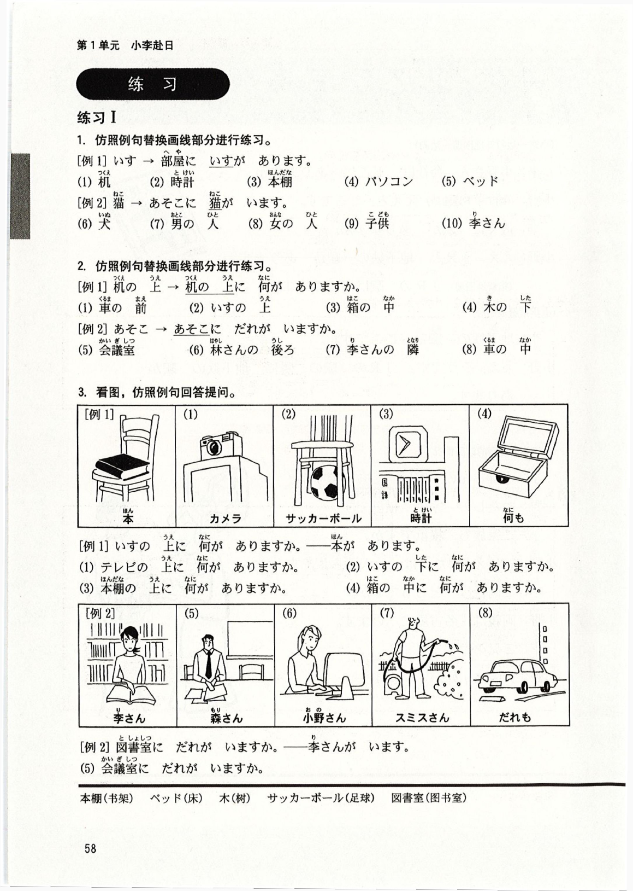
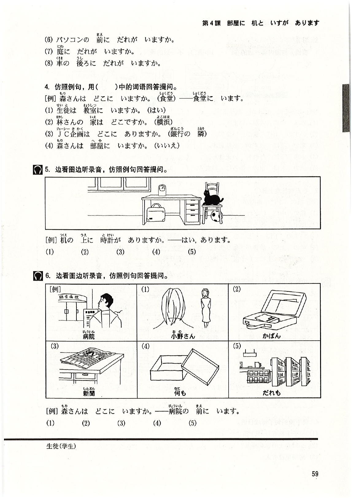
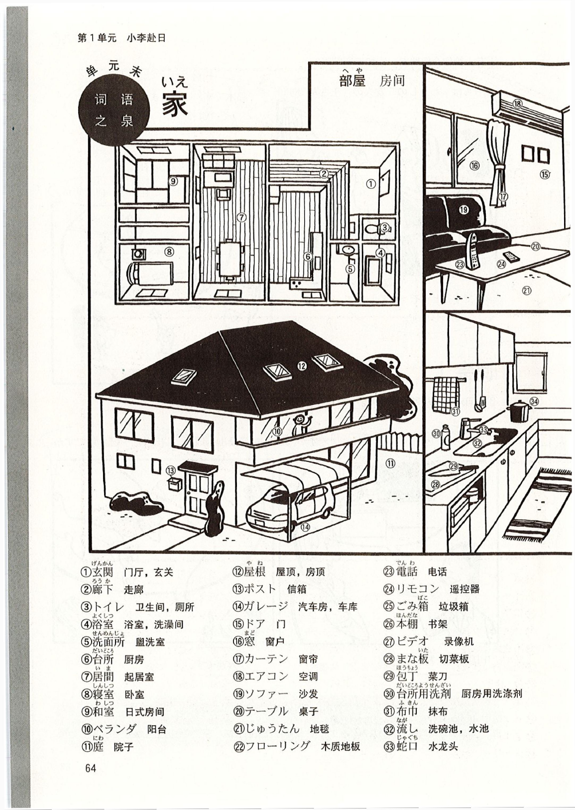
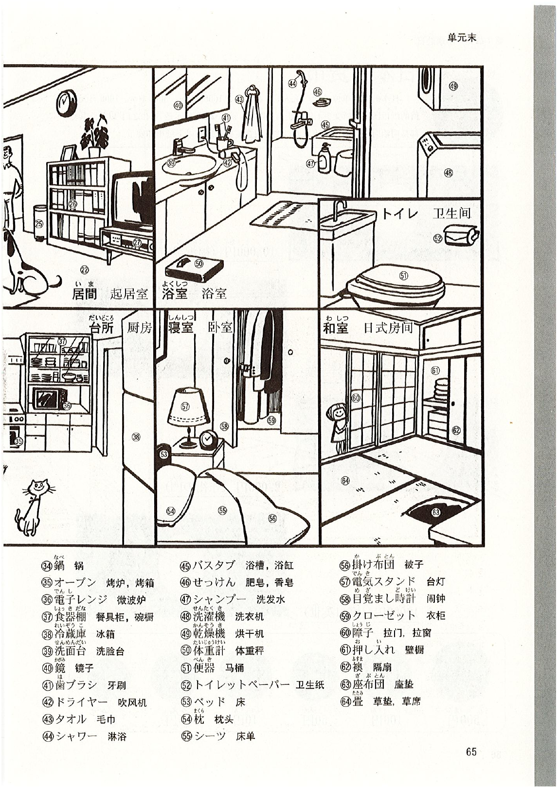

# 第4課 <ruby>部屋<rt>へや</rt></ruby>に <ruby>机<rt>つくえ</rt></ruby>と いすが あります

Pages: 69-83

> 当前完成度：`S3+（精修版·三校）`。已逐页对照原书 400dpi PDF 三次校对；二校追加：修正位置词例句匹配原书（会社の隣に花屋、猫は箱の中に）；生词表ええ→ええと；移除应用课文中文舞台说明多余 ruby；补充缺失的专栏「自动检票机」。

Page 69

## 基本课文

### 基本句

1. <ruby>部屋<rt>へや</rt></ruby>に <ruby>机<rt>つくえ</rt></ruby>と いすが あります。  
2. <ruby>机<rt>つくえ</rt></ruby>の <ruby>上<rt>うえ</rt></ruby>に <ruby>猫<rt>ねこ</rt></ruby>が います。  
3. <ruby>売店<rt>ばいてん</rt></ruby>は <ruby>駅<rt>えき</rt></ruby>の <ruby>外<rt>そと</rt></ruby>に あります。  
4. <ruby>吉田<rt>よしだ</rt></ruby>さんは <ruby>庭<rt>にわ</rt></ruby>に います。  

### 会话 A

甲：その <ruby>箱<rt>はこ</rt></ruby>の <ruby>中<rt>なか</rt></ruby>に <ruby>何<rt>なん</rt></ruby>が ありますか。  
乙：<ruby>時計<rt>とけい</rt></ruby>と <ruby>眼鏡<rt>めがね</rt></ruby>が あります。  

### 会话 B

甲：<ruby>部屋<rt>へや</rt></ruby>に だれが いますか。  
乙：だれも いません。  

### 会话 C

甲：<ruby>小野<rt>おの</rt></ruby>さんの <ruby>家<rt>いえ</rt></ruby>は どこに ありますか。  
乙：<ruby>横浜<rt>よこはま</rt></ruby>に あります。  

### 会话 D

甲：あそこに <ruby>犬<rt>いぬ</rt></ruby>が いますね。  
乙：ええ、わたしの <ruby>犬<rt>いぬ</rt></ruby>です。  

Page 70

## 语法解释

### 1. `あります` 和 `います`

表示事物的存在时，最常用的谓语是 `あります` 和 `います`。`あります` 用于花、草、桌子等不具有意志的事物。`います` 用于具有意志的人、动物或昆虫。使用 `あります` 和 `います` 的句型有以下两种。

### 2. 存在句：`场所 に 名 が あります / います`

相当于汉语的”`〜有〜`”。

- <ruby>部屋<rt>へや</rt></ruby>に <ruby>机<rt>つくえ</rt></ruby>が あります。  
  房间里有桌子。
- ここに <ruby>本<rt>ほん</rt></ruby>が あります。  
  这儿有书。
- <ruby>箱<rt>はこ</rt></ruby>に <ruby>何<rt>なに</rt></ruby>が ありますか。  
  盒子里有什么？
- <ruby>部屋<rt>へや</rt></ruby>に <ruby>猫<rt>ねこ</rt></ruby>が います。  
  房间里有一只猫。
- <ruby>公園<rt>こうえん</rt></ruby>に <ruby>子供<rt>こども</rt></ruby>が います。  
  公园里有孩子。
- あそこに だれが いますか。  
  那里有谁？

### 3. 位置句：`名 は 场所 に あります / います`

相当于汉语的”`〜在〜`”。

- いすは <ruby>部屋<rt>へや</rt></ruby>に あります。  
  椅子在房间里。
- <ruby>本<rt>ほん</rt></ruby>は ここに あります。  
  书在这儿。
- <ruby>眼鏡<rt>めがね</rt></ruby>は どこに ありますか。  
  眼镜在哪儿？
- <ruby>吉田<rt>よしだ</rt></ruby>さんは <ruby>庭<rt>にわ</rt></ruby>に います。  
  吉田先生在院子里。
- <ruby>子供<rt>こども</rt></ruby>は <ruby>公園<rt>こうえん</rt></ruby>に います。  
  孩子在公园。
- <ruby>犬<rt>いぬ</rt></ruby>は どこに いますか。  
  狗在哪儿？

第 3 课我们学了 `〜は どこですか` 的用法（☞第 3 课语法解释 3）。这个句型也可以用 `〜は どこに ありますか / いますか` 来表示。

- <ruby>小野<rt>おの</rt></ruby>さんの <ruby>家<rt>いえ</rt></ruby>は どこですか。 = <ruby>小野<rt>おの</rt></ruby>さんの <ruby>家<rt>いえ</rt></ruby>は どこに ありますか。  
  小野女士的家在哪里？
- <ruby>林<rt>はやし</rt></ruby>さんは どこですか。 = <ruby>林<rt>はやし</rt></ruby>さんは どこに いますか。  
  林先生在哪里？

Page 71

### 4. `名1 と 名2`

助词 `と` 可以连接两个名词，表示并列，相当于“和”。

- <ruby>時計<rt>とけい</rt></ruby>と <ruby>眼鏡<rt>めがね</rt></ruby>  
  表和眼镜
- ビールと ウイスキー  
  啤酒和威士忌
- <ruby>居間<rt>いま</rt></ruby>に テレビと ビデオが あります。  
  起居室里有电视机和录像机。

### 5. `上 / 下 / 前 / 後ろ / 隣 / 中 / 外`

表示具体位置时，常用：

- `名词 + の + 上`
- `名词 + の + 下`
- `名词 + の + 前`
- `名词 + の + 後ろ`
- `名词 + の + 隣`
- `名词 + の + 中`
- `名词 + の + 外`

例如：

- <ruby>机<rt>つくえ</rt></ruby>の <ruby>上<rt>うえ</rt></ruby>に <ruby>猫<rt>ねこ</rt></ruby>が います。  
  桌子上面有一只猫。
- <ruby>会社<rt>かいしゃ</rt></ruby>の <ruby>隣<rt>となり</rt></ruby>に <ruby>花屋<rt>はなや</rt></ruby>が あります。  
  公司旁边有花店。
- <ruby>猫<rt>ねこ</rt></ruby>は <ruby>箱<rt>はこ</rt></ruby>の <ruby>中<rt>なか</rt></ruby>に います。  
  猫在箱子里。
- <ruby>売店<rt>ばいてん</rt></ruby>は <ruby>駅<rt>えき</rt></ruby>の <ruby>外<rt>そと</rt></ruby>に あります。  
  小卖部在车站的外边。

> 注意：汉语说"椅子上""桌子下"，而日语说 `いすの 上` `机の 下`，`の` 不能省略。

### 6. `ね`　【确认】

当说话人就某事征求听话人的同意时，句尾用助词 `ね`，读升调。

- あそこに <ruby>犬<rt>いぬ</rt></ruby>が いますね。  
  那儿有一只狗啊。
- この <ruby>新聞<rt>しんぶん</rt></ruby>は <ruby>林<rt>はやし</rt></ruby>さんのですね。  
  这报纸是林先生的吧。
- <ruby>駅<rt>えき</rt></ruby>の <ruby>前<rt>まえ</rt></ruby>に <ruby>銀行<rt>ぎんこう</rt></ruby>が ありますね。  
  车站前面有家银行吧。

### 7. `疑问词 + も + 否定`

表示全面否定。

- <ruby>教室<rt>きょうしつ</rt></ruby>に だれも いません。  
  教室里谁也没有。
- <ruby>冷蔵庫<rt>れいぞうこ</rt></ruby>に <ruby>何<rt>なん</rt></ruby>も ありません。  
  冰箱里什么也没有。

Page 72

## 表达及词语讲解

### 1. `上` 所表示的范围

日语的 `上` 所表示的范围比汉语的”上”窄，只表示垂直上方的范围。汉语的”墙上”意思是墙壁的表面，而日语的 `壁の 上` 意思是墙壁上方的天棚，不是墙壁的表面。墙壁的表面不用 `壁の 上に` 而说 `壁に`。

- <ruby>壁<rt>かべ</rt></ruby>に スイッチが あります。  
  墙上有开关。
- × <ruby>壁<rt>かべ</rt></ruby>の <ruby>上<rt>うえ</rt></ruby>に スイッチが あります。

### 2. `ええと`

`ええと` 是被别人问及某事，思考该如何回答时说的话。

- <ruby>小野<rt>おの</rt></ruby>さん、<ruby>会社<rt>かいしゃ</rt></ruby>は どこに ありますか。  
  小野，公司在哪儿呢？  
  ——ええと、ここです。  
  　嗯……在这儿。（在地图上找、考虑等）

### 3. `ご家族` `ご兄弟` `ご両親`　【礼貌语言 ④】

`ご家族`（家人）`ご兄弟`（兄弟姐妹）`ご両親`（父母）是说到对方亲属时的礼貌说法。在会话中用 `ご家族`（家人）来指”对方的家人”，而用 `家族` 指”自己的家人”。但不是所有的词前面都可以加 `ご`。（☞第 2 课”亲属的称谓”表格）

### 4. `兄弟`

`兄弟` 指同一父母的人，也用于仅是同父或同母的情况。汉字写作”兄弟”，但不仅仅指男性兄弟之间，兄妹、姐弟也称 `きょうだい`。

- <ruby>兄弟<rt>きょうだい</rt></ruby>が いますか。  
  你有兄弟姐妹吗？
- はい、<ruby>妹<rt>いもうと</rt></ruby>が います。  
  有，有妹妹。

Page 73

### 5. `JR` 和 `地下鉄`

`JR` 原来是国营铁道（国铁），是”日本国有铁道（日本国有铁路）”的简称。1987 年民营化之后，改为现在的名称。`JR` 是 `Japan Railways` 的简称。

人们出行时，经常利用新干线等的列车。近距离移动时除 `JR` 之外也经常利用 `私鉄`（私铁）。在札幌、东京、横滨、大阪、名古屋、福冈等大城市都有地铁运行。

不论是 `JR`，还是私铁或是地铁都有详细的列车运行时刻表，如果不发生事故等特殊情况，一般都是正点运行。其准确性使很多外国人感到吃惊。

### 6. `一人暮らし`

小野的家人住在名古屋，而小野的公司在东京。她不能每天从名古屋往返上班，因此，一个人住在距东京较近的横滨，离开家人一个人生活称作 `一人暮らし`。

## 建筑设施

| 日语 | 中文 | 日语 | 中文 | 日语 | 中文 |
| --- | --- | --- | --- | --- | --- |
| ビル／<ruby>建物<rt>たてもの</rt></ruby> | 大楼、建筑物 | <ruby>市役所<rt>しやくしょ</rt></ruby> | 市政府 | お<ruby>店<rt>みせ</rt></ruby> | 商店、小店 |
| <ruby>映画館<rt>えいがかん</rt></ruby> | 电影院 | <ruby>消防署<rt>しょうぼうしょ</rt></ruby> | 消防局 | <ruby>本屋<rt>ほんや</rt></ruby> | 书店 |
| <ruby>美術館<rt>びじゅつかん</rt></ruby> | 美术馆 | <ruby>交番<rt>こうばん</rt></ruby> | 派出所 | <ruby>肉屋<rt>にくや</rt></ruby> | 肉店 |
| <ruby>体育館<rt>たいいくかん</rt></ruby> | 体育馆 | <ruby>病院<rt>びょういん</rt></ruby> | 医院 | <ruby>魚屋<rt>さかなや</rt></ruby> | 鱼店 |
| <ruby>博物館<rt>はくぶつかん</rt></ruby> | 博物馆 | | | そば<ruby>屋<rt>や</rt></ruby> | 荞麦面店 |
| <ruby>図書館<rt>としょかん</rt></ruby> | 图书馆 | <ruby>銀行<rt>ぎんこう</rt></ruby> | 银行 | <ruby>床屋<rt>とこや</rt></ruby> | 理发店 |
| | | <ruby>郵便局<rt>ゆうびんきょく</rt></ruby> | 邮局 | <ruby>薬局<rt>やっきょく</rt></ruby> | 药店 |
| <ruby>公園<rt>こうえん</rt></ruby> | 公园 | | | <ruby>喫茶店<rt>きっさてん</rt></ruby> | 咖啡馆 |
| <ruby>動物園<rt>どうぶつえん</rt></ruby> | 动物园 | <ruby>工場<rt>こうじょう</rt></ruby> | 工厂 | | |
| <ruby>遊園地<rt>ゆうえんち</rt></ruby> | 游乐园 | <ruby>劇場<rt>げきじょう</rt></ruby> | 剧场 | ホテル | 宾馆 |
| | | <ruby>駐車場<rt>ちゅうしゃじょう</rt></ruby> | 停车场 | デパート | 百货商店 |
| <ruby>駅<rt>えき</rt></ruby> | 车站 | | | スーパー | 超市 |
| <ruby>空港<rt>くうこう</rt></ruby> | 机场 | <ruby>学校<rt>がっこう</rt></ruby> | 学校 | コンビニ | 便利店 |
| | | | | レストラン | 餐馆、西餐馆 |
| | | | | ガソリンスタンド | 加油站 |
| <ruby>警察署<rt>けいさつしょ</rt></ruby> | 警察局 | <ruby>八百屋<rt>やおや</rt></ruby> | 蔬菜店 | | |

Page 74

## 应用课文

### 场景：<ruby>会社<rt>かいしゃ</rt></ruby>の <ruby>場所<rt>ばしょ</rt></ruby>

今天是星期天。从明天开始小李要到公司本部上班。小野来到小李住的宾馆，向她说明公司的地理位置。

（小李一边打开地图册一边问）

<ruby>李<rt>り</rt></ruby>：<ruby>小野<rt>おの</rt></ruby>さん、<ruby>会社<rt>かいしゃ</rt></ruby>は どこに ありますか。  
<ruby>小野<rt>おの</rt></ruby>：（翻了一下地图册）ええと、ここです。  
<ruby>李<rt>り</rt></ruby>：<ruby>近く<rt>ちかく</rt></ruby>に <ruby>駅<rt>えき</rt></ruby>が ありますか。  
<ruby>小野<rt>おの</rt></ruby>：ええ。JRと <ruby>地下鉄<rt>ちかてつ</rt></ruby>の <ruby>駅<rt>えき</rt></ruby>が あります。  
<ruby>小野<rt>おの</rt></ruby>：（指着地图册）JRの <ruby>駅<rt>えき</rt></ruby>は ここです。  

（小李指着地图册）

<ruby>李<rt>り</rt></ruby>：<ruby>地下鉄<rt>ちかてつ</rt></ruby>の <ruby>駅<rt>えき</rt></ruby>は ここですね。  
<ruby>小野<rt>おの</rt></ruby>：ええ、そうです。JRの <ruby>駅<rt>えき</rt></ruby>の <ruby>隣<rt>となり</rt></ruby>に <ruby>地下鉄<rt>ちかてつ</rt></ruby>の <ruby>駅<rt>えき</rt></ruby>が あります。  

（小李询问小野的家庭情况）

<ruby>李<rt>り</rt></ruby>：<ruby>小野<rt>おの</rt></ruby>さんの <ruby>家<rt>いえ</rt></ruby>は どちらですか。  
<ruby>小野<rt>おの</rt></ruby>：わたしの <ruby>家<rt>いえ</rt></ruby>は <ruby>横浜<rt>よこはま</rt></ruby>です。  
<ruby>李<rt>り</rt></ruby>：ご<ruby>家族<rt>かぞく</rt></ruby>も <ruby>横浜<rt>よこはま</rt></ruby>ですか。  
<ruby>小野<rt>おの</rt></ruby>：いいえ、わたしは <ruby>一人暮らし<rt>ひとりぐらし</rt></ruby>です。  
<ruby>李<rt>り</rt></ruby>：ご<ruby>両親<rt>りょうしん</rt></ruby>は どちらですか。  
<ruby>小野<rt>おの</rt></ruby>：<ruby>両親<rt>りょうしん</rt></ruby>は <ruby>名古屋<rt>なごや</rt></ruby>に います。  
<ruby>李<rt>り</rt></ruby>：ご<ruby>兄弟<rt>きょうだい</rt></ruby>は？  
<ruby>小野<rt>おの</rt></ruby>：<ruby>大阪<rt>おおさか</rt></ruby>に <ruby>妹<rt>いもうと</rt></ruby>が います。  

### 词语补充

- <ruby>場所<rt>ばしょ</rt></ruby>：所在地
- <ruby>近く<rt>ちかく</rt></ruby>：附近

Page 75

## 练习

### 练习 I

#### 1. 仿照例句替换画线部分进行练习

- 例 1：`いす → 部屋に いすが あります。`
- 替换项目：
  - `(1) 机`
  - `(2) 時計`
  - `(3) 本棚`
  - `(4) パソコン`
  - `(5) ベッド`

- 例 2：`猫 → あそこに 猫が います。`
- 替换项目：
  - `(6) 犬`
  - `(7) 男の 人`
  - `(8) 女の 人`
  - `(9) 子供`
  - `(10) 李さん`

#### 2. 仿照例句替换画线部分进行练习

- 例 1：`机の 上 → 机の 上に 何が ありますか。`
- 替换项目：
  - `(1) 車の 前`
  - `(2) いすの 上`
  - `(3) 箱の 中`
  - `(4) 木の 下`

- 例 2：`あそこ → あそこに だれが いますか。`
- 替换项目：
  - `(5) 会議室`
  - `(6) 林さんの 後ろ`
  - `(7) 李さんの 隣`
  - `(8) 車の 中`

#### 3. 看图，仿照例句回答提问

- 图示 1：`テレビの 上の カメラ`
- 图示 2：`いすの 下の サッカーボール`
- 图示 3：`本棚の 上の 時計`
- 图示 4：`箱の 中の 何もない状態`
- 图示 5-8：`図書室の 李さん / 会議室の 森さん / 小野さん / スミスさん / だれも`

- 例 1：
  - `いすの 上に 何が ありますか。 → 本が あります。`
- 练习项目：
  - `(1) テレビの 上に 何が ありますか。`
  - `(2) いすの 下に 何が ありますか。`
  - `(3) 本棚の 上に 何が ありますか。`
  - `(4) 箱の 中に 何が ありますか。`

- 例 2：
  - `図書室に だれが いますか。 → 李さんが います。`
- 练习项目：
  - `(5) 会議室に だれが いますか。`
  - `(6) パソコンの 前に だれが いますか。`
  - `(7) 庭に だれが いますか。`
  - `(8) 車の 後ろに だれが いますか。`

Page 76

### 练习 I（续）

#### 4. 仿照例句，用括号中的词语回答提问

- 例：`森さんは どこに いますか。（食堂）→ 食堂に います。`
- 练习项目：
  - `(1) 生徒は 教室に いますか。（はい）`
  - `(2) 林さんの 家は どこですか。（横浜）`
  - `(3) JC企画は どこに ありますか。（銀行の 隣）`
  - `(4) 森さんは 部屋に いますか。（いいえ）`

#### 5. 边看图边听录音，仿照例句回答提问

- 房间图示包含：`机 / かばん / 時計 / いす / 猫 / サッカーボール`
- 例：`机の 上に 時計が ありますか。 → はい、あります。`
- 练习项目：
  - `(1) かばんは 机の 下に ありますか。`
  - `(2) 猫は いすの 上に いますか。`
  - `(3) サッカーボールは いすの 下に ありますか。`
  - `(4) 時計は 机の 上に ありますか。`
  - `(5) 窓は 机の 後ろに ありますか。`

#### 6. 边看图边听录音，仿照例句回答提问

- 例：`森さんは どこに いますか。 → 病院の 前に います。`
- 图示项目：
  - `(1) 小野さん`
  - `(2) かばん`
  - `(3) 新聞`
  - `(4) 何も ない箱`
  - `(5) だれも いない通り`

Page 77

### 练习 II

#### 1. 看图，与图内容一致的在括号中画 `○`，不一致的画 `×`

- 例：`あそこに ビルが あります。`
- `(1) 車の 中に 犬が います。`
- `(2) いすの 上に 猫が います。`
- `(3) 木の 下に いすが あります。`
- `(4) 木の 下に だれも いません。`
- `(5) 男の 人は 車の 後ろに います。`

#### 2. 在正确答案上画 `○`

- 例：`机の 上に 新聞が（あります・います）。`
- `(1) 箱の 中に（だれ・何）が ありますか。`
- `(2) 田中さんの 後ろに だれも（います・いません）。`
- `(3) いすの 下に（どこも・何も）ありません。`
- `(4) 机の 上に 辞書が あります。雑誌（は・も）あります。`
- `(5) ベッドの 上に（子供・雑誌）が あります。`

#### 3. 边看图边听录音，回答提问

- 图示包含：`駅 / デパート / 郵便局 / 受付 / かばん売り場 / カメラ売り場 / バーゲン会場 / 食堂`
- 例：`駅の 前に 何が ありますか。 → デパートが あります。`
- 练习项目：
  - `(1) 郵便局は どこに ありますか。`
  - `(2) 受付は 何階に ありますか。`
  - `(3) かばん売り場は 何階に ありますか。`
  - `(4) カメラ売り場は 何階に ありますか。`
  - `(5) 食堂は 何階に ありますか。`

#### 4. 将下面的句子译成日语

- `(1) 桌子上面有（一只）猫。`
- `(2) 小野女士的家在哪儿？`
- `(3) 房间里没有人。`

Page 78

## 生词表

### 词条

- `へや（部屋）` `[名]` 房间，屋子
- `にわ（庭）` `[名]` 院子
- `いえ（家）` `[名]` 家
- `いま（居間）` `[名]` 起居室
- `れいぞうこ（冷蔵庫）` `[名]` 冰箱
- `かべ（壁）` `[名]` 墙壁
- `スイッチ` `[名]` 开关
- `ほんだな（本棚）` `[名]` 书架
- `ベッド` `[名]` 床
- `ねこ（猫）` `[名]` 猫
- `いぬ（犬）` `[名]` 狗
- `はこ（箱）` `[名]` 盒子，箱子
- `めがね（眼鏡）` `[名]` 眼镜
- `ビデオ` `[名]` 录像机
- `サッカーボール` `[名]` 足球
- `ビール` `[名]` 啤酒
- `ウイスキー` `[名]` 威士忌
- `こども（子供）` `[名]` 孩子，小孩
- `きょうだい（兄弟）` `[名]` 兄弟姐妹
- `りょうしん（両親）` `[名]` 父母，双亲
- `いもうと（妹）` `[名]` 妹妹
- `おとこ（男）` `[名]` 男
- `おんな（女）` `[名]` 女
- `せいと（生徒）` `[名]` 学生
- `うえ（上）` `[名]` 上面
- `そと（外）` `[名]` 外面
- `なか（中）` `[名]` 里面，内部，中间
- `した（下）` `[名]` 下面
- `まえ（前）` `[名]` 前，前面
- `うしろ（後ろ）` `[名]` 后，后面
- `ちかく（近く）` `[名]` 附近，近旁
- `ばしょ（場所）` `[名]` 所在地，地方，场所
- `きょうしつ（教室）` `[名]` 教室
- `かいぎしつ（会議室）` `[名]` 会议室
- `としょしつ（図書室）` `[名]` 图书室
- `こうえん（公園）` `[名]` 公园
- `はなや（花屋）` `[名]` 花店
- `ばいてん（売店）` `[名]` 小卖部，售货亭
- `えき（駅）` `[名]` 车站
- `ちかてつ（地下鉄）` `[名]` 地铁
- `き（木）` `[名]` 树，树木
- `ひとりぐらし（一人暮らし）` `[名]` 单身生活
- `あります` `[动1]` 有，在（非意志者）
- `います` `[动2]` 有，在（具意志者）
- `ええと` `[叹]` 嗯……

### 专有名词

- `よこはま（横浜）` `[专]` 横滨
- `なごや（名古屋）` `[专]` 名古屋
- `おおさか（大阪）` `[专]` 大阪
- `ジェーアール（JR）` `[专]` JR

### 表达

- `ええと` 嗯……
- `ご〜` 表示尊敬

### 专栏：自动检票机

近年来，随着普及无人化在日本列车站，东京都内的大部分车站都引入了 `自動改札機`（自动检票机）。这是一种不用剪票、乘客通过检票口时自动进行检票和出票的系统。如果用无乘车记录的车票或过期月票出检票口时，自动检票机会自动关闭检票口，引来车站工作人员前来询问情况。

另外，最近又开发了利用 IC 卡的月票，只需将放在钱夹里的月票轻轻触在自动检票机即可通过。车票方便，这种月票还有 `プリペイドカード`（预付费用的 IC 卡）的功能，用月票乘坐超出后追加的车费都可以自动扣除。

Page 79

## 单元末补充

### 场景对话：在礼品店

1. 问东西是什么  
   `これは 何ですか。`  
   `それは 貯金箱ですよ。`

2. 问价格  
   `これは おいくらですか。`  
   `こちらは 3,000円、こちらは 5,000円です。`

3. 问东西在哪里  
   `絵はがきは どこに ありますか。`  
   `あちらです。レジの 横です。`

4. 购买与结账  
   `これを ください。`  
   `ありがとうございます。850円です。`

Page 80

### 场景对话：晚会上

1. 介绍朋友  
   `こちらは わたしの 友人の 王さんです。`  
   `鈴木です。はじめまして。どうぞ よろしく お願いします。`

2. 问兴趣  
   `ご趣味は 何ですか。`  
   `趣味は テニスです。`

3. 问职业  
   `失礼ですが、お仕事は 何ですか。`  
   `中国語の 教師です。`

4. 问出身  
   `ご出身は どちらですか。`  
   `大連です。`

Page 81

### 词语之泉：家

#### 房屋与公共区域

- <ruby>玄関<rt>げんかん</rt></ruby>：门厅，玄关
- <ruby>廊下<rt>ろうか</rt></ruby>：走廊
- ベランダ：阳台
- <ruby>庭<rt>にわ</rt></ruby>：院子
- <ruby>屋根<rt>やね</rt></ruby>：屋顶
- ポスト：信箱
- ガレージ：车库

#### 客厅

- ソファー：沙发
- テーブル：桌子
- じゅうたん：地毯
- フローリング：木质地板
- <ruby>電話<rt>でんわ</rt></ruby>：电话
- リモコン：遥控器
- <ruby>ごみ箱<rt>ごみばこ</rt></ruby>：垃圾箱
- <ruby>本棚<rt>ほんだな</rt></ruby>：书架
- ビデオ：录像机

Page 82

#### 厨房、浴室、卧室与和室

厨房：

- <ruby>まな板<rt>まないた</rt></ruby>：切菜板
- <ruby>包丁<rt>ほうちょう</rt></ruby>：菜刀
- <ruby>台所用洗剤<rt>だいどころようせんざい</rt></ruby>：厨房用洗涤剂
- <ruby>布巾<rt>ふきん</rt></ruby>：抹布
- <ruby>流し<rt>ながし</rt></ruby>：洗碗池
- <ruby>蛇口<rt>じゃぐち</rt></ruby>：水龙头
- <ruby>鍋<rt>なべ</rt></ruby>：锅
- オーブン：烤箱
- <ruby>電子レンジ<rt>でんしレンジ</rt></ruby>：微波炉
- <ruby>食器棚<rt>しょっきだな</rt></ruby>：餐具柜
- <ruby>冷蔵庫<rt>れいぞうこ</rt></ruby>：冰箱

浴室 / 洗面：

- <ruby>洗面台<rt>せんめんだい</rt></ruby>：洗脸台
- <ruby>鏡<rt>かがみ</rt></ruby>：镜子
- <ruby>歯ブラシ<rt>はブラシ</rt></ruby>：牙刷
- ドライヤー：吹风机
- タオル：毛巾
- シャワー：淋浴
- バスタブ：浴缸
- せっけん：肥皂
- シャンプー：洗发水
- <ruby>洗濯機<rt>せんたくき</rt></ruby>：洗衣机
- <ruby>乾燥機<rt>かんそうき</rt></ruby>：烘干机
- <ruby>体重計<rt>たいじゅうけい</rt></ruby>：体重秤
- <ruby>便器<rt>べんき</rt></ruby>：马桶
- トイレットペーパー：卫生纸

卧室 / 和室：

- ベッド：床
- <ruby>枕<rt>まくら</rt></ruby>：枕头
- シーツ：床单
- <ruby>掛け布団<rt>かけぶとん</rt></ruby>：被子
- <ruby>電気スタンド<rt>でんきスタンド</rt></ruby>：台灯
- <ruby>目覚まし時計<rt>めざましどけい</rt></ruby>：闹钟
- クローゼット：衣柜
- <ruby>障子<rt>しょうじ</rt></ruby>：拉门 / 拉窗
- <ruby>押し入れ<rt>おしいれ</rt></ruby>：壁橱
- <ruby>襖<rt>ふすま</rt></ruby>：隔扇
- <ruby>座布団<rt>ざぶとん</rt></ruby>：座垫
- <ruby>畳<rt>たたみ</rt></ruby>：草垫 / 草席

Page 83

### 日本风情：日本的货币

日本货币单位是 `円`（えん）。

#### 常见纸币

| 面额 | 常见说明 |
| --- | --- |
| `10,000円` | 高面额纸币 |
| `5,000円` | 常见纸币 |
| `2,000円` | 流通量相对较少 |
| `1,000円` | 最常见的纸币之一 |

#### 常见硬币

| 面额 | 常见场景 |
| --- | --- |
| `500円` | 自动贩卖机、简餐 |
| `100円` | 零钱主力 |
| `50円` | 有穿孔 |
| `10円` | 小额找零 |
| `5円` | 有穿孔 |
| `1円` | 最小面额 |

