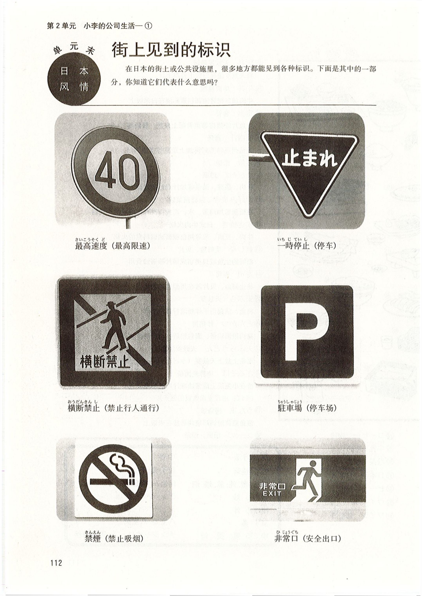

# 第8課 <ruby>李<rt>り</rt></ruby>さんは <ruby>日本語<rt>にほんご</rt></ruby>で <ruby>手紙<rt>てがみ</rt></ruby>を <ruby>書きます<rt>かきます</rt></ruby>

Pages: 115-129

> 当前完成度：`S3+（精修版）`。已按 REFINE_SPEC v2 逐页对照原书 400dpi PDF 校对。

Page 115

## 基本课文

### 基本句

1. <ruby>李さん<rt>りさん</rt></ruby>は <ruby>日本語<rt>にほんご</rt></ruby>で <ruby>手紙<rt>てがみ</rt></ruby>を <ruby>書きます<rt>かきます</rt></ruby>。
2. わたしは <ruby>小野さん<rt>おのさん</rt></ruby>に <ruby>お土産<rt>おみやげ</rt></ruby>を あげます。
3. わたしは <ruby>小野さん<rt>おのさん</rt></ruby>に <ruby>辞書<rt>じしょ</rt></ruby>を もらいました。
4. <ruby>李さん<rt>りさん</rt></ruby>は <ruby>明日<rt>あした</rt></ruby> <ruby>長島さん<rt>ながしまさん</rt></ruby>に <ruby>会います<rt>あいます</rt></ruby>。

### 会话 A

甲：<ruby>昨日<rt>きのう</rt></ruby>、<ruby>母<rt>はは</rt></ruby>に <ruby>誕生日<rt>たんじょうび</rt></ruby>の プレゼントを <ruby>送りました<rt>おくりました</rt></ruby>。\
乙：<ruby>何で<rt>なんで</rt></ruby> <ruby>送りました<rt>おくりました</rt></ruby>か。\
甲：<ruby>航空便<rt>こうくうびん</rt></ruby>で <ruby>送りました<rt>おくりました</rt></ruby>。

### 会话 B

甲：その <ruby>映画<rt>えいが</rt></ruby>の チケットを だれに あげますか。\
乙：<ruby>李さん<rt>りさん</rt></ruby>に あげます。

### 会话 C

甲：だれに その パンフレットを もらいましたか。\
乙：<ruby>長島さん<rt>ながしまさん</rt></ruby>に もらいました。

### 会话 D

甲：すみません、<ruby>李さん<rt>りさん</rt></ruby>は いますか。\
乙：もう <ruby>帰りました<rt>かえりました</rt></ruby>よ。

Page 116

## 语法解释

### 1. `名[工具]で + 动`

第 6 课学习了表示交通工具的助词“で”（☞第 6 课“语法解释 4”）。“で”还可以用来表示其他手段以及原材料。

- <ruby>李さん<rt>りさん</rt></ruby>は <ruby>日本語<rt>にほんご</rt></ruby>で <ruby>手紙<rt>てがみ</rt></ruby>を <ruby>書きます<rt>かきます</rt></ruby>。\
  （小李用日语写信。）
- <ruby>手紙<rt>てがみ</rt></ruby>を <ruby>速達<rt>そくたつ</rt></ruby>で <ruby>送りました<rt>おくりました</rt></ruby>。\
  （用速递寄了信。）
- <ruby>新聞紙<rt>しんぶんし</rt></ruby>で <ruby>紙飛行機<rt>かみひこうき</rt></ruby>を <ruby>作りました<rt>つくりました</rt></ruby>。\
  （用报纸折了纸飞机。）
- <ruby>何で<rt>なんで</rt></ruby> うどんを <ruby>作ります<rt>つくります</rt></ruby>か。\
  （用什么做面条？）

### 2. `名1[人]は 名2[人]に 名3[物]を あげます`

“あげます”相当于汉语的“给”，通常在物品以“第一人称→第二人称→第三人称”或“第三人称→第三人称”的形式移动时使用。物品用助词“を”表示，接受者用助词“に”表示。

- わたしは <ruby>小野さん<rt>おのさん</rt></ruby>に <ruby>お土産<rt>おみやげ</rt></ruby>を あげます。\
  （我送给小野女士礼物。）
- <ruby>小野さん<rt>おのさん</rt></ruby>は <ruby>森さん<rt>もりさん</rt></ruby>に チョコレートを あげました。\
  （小野女士给了森先生巧克力。）

另外，当第三人称的其中之一是说话人的亲戚时，按说话人的立场处理。

- <ruby>弟<rt>おとうと</rt></ruby>は <ruby>小野さん<rt>おのさん</rt></ruby>に <ruby>花<rt>はな</rt></ruby>を あげました。\
  （弟弟送花给小野女士。）
- <ruby>母<rt>はは</rt></ruby>は <ruby>長島さん<rt>ながしまさん</rt></ruby>に ワインを あげました。\
  （母亲送葡萄酒给长岛先生。）

Page 117

### 3. `名1[人]は 名2[人]に / から 名3[物]を もらいます`

“もらいます”与“あげます”相反，表示物品以“第三人称→第二人称→第一人称”或“第三人称→第三人称”的形式移动，相当于汉语的“得到”“接受”等意思。物品用“を”表示，赠送者用助词“に”表示。赠送者也可以看成是物品移动的起点，用助词“から”来表示。

- わたしは <ruby>小野さん<rt>おのさん</rt></ruby>に <ruby>辞書<rt>じしょ</rt></ruby>を もらいました。\
  （我从小野女士那儿得到一本词典 / 小野女士给了我一本词典。）
- わたしは <ruby>長島さん<rt>ながしまさん</rt></ruby>から <ruby>写真<rt>しゃしん</rt></ruby>を もらいました。\
  （我从长岛先生那儿得到了照片。）
- <ruby>森さん<rt>もりさん</rt></ruby>は <ruby>長島さん<rt>ながしまさん</rt></ruby>に パンフレットを もらいました。\
  （森先生从长岛先生那儿得到了小册子。）

另外，当第三人称的其中之一是说话人的亲戚时，按说话人的立场处理。

- <ruby>母<rt>はは</rt></ruby>は <ruby>小野さん<rt>おのさん</rt></ruby>に ハンカチを もらいました。\
  （小野女士送给母亲手绢。）
- <ruby>弟<rt>おとうと</rt></ruby>は <ruby>長島さん<rt>ながしまさん</rt></ruby>から <ruby>本<rt>ほん</rt></ruby>を もらいました。\
  （弟弟从长岛先生那儿得到一本书。）

### 4. `名[人]に 会います`

“会います”相当于汉语的“见”。所见到的对象用助词“に”表示。

- <ruby>李さん<rt>りさん</rt></ruby>は <ruby>明日<rt>あした</rt></ruby> <ruby>長島さん<rt>ながしまさん</rt></ruby>に <ruby>会います<rt>あいます</rt></ruby>。\
  （小李明天见长岛先生。）
- わたしは <ruby>駅<rt>えき</rt></ruby>で <ruby>森さん<rt>もりさん</rt></ruby>に <ruby>会いました<rt>あいました</rt></ruby>。\
  （我在车站遇见了森先生。）

### 5. `よ`［提醒］

助词“よ”用于提醒对方注意其不知道、不了解的事情，读升调。根据使用场景的不同，分别表示告知、提醒、轻微的警告等。

- すみません、<ruby>李さん<rt>りさん</rt></ruby>は いますか。\
  （请问，小李在吗？）\
  もう <ruby>帰りました<rt>かえりました</rt></ruby>よ。\
  （已经回去了。）〔告知〕
- わたしは <ruby>毎日<rt>まいにち</rt></ruby> アイスクリームを <ruby>食べます<rt>たべます</rt></ruby>。\
  （我每天都吃冰激凌。）\
  <ruby>太ります<rt>ふとります</rt></ruby>よ。\
  （那你要发胖的。）〔提醒、轻微的警告〕

### 6. `もう ①`

表示完了。意思基本相当于汉语的“已经”。

- <ruby>昼ご飯<rt>ひるごはん</rt></ruby>を <ruby>食べました<rt>たべました</rt></ruby>か。\
  （你吃过午饭了吗？）\
  ええ、もう <ruby>食べました<rt>たべました</rt></ruby>。\
  （是的，我已经吃过了。）

Page 118

## 表达及词语讲解

### 1. `〜から もらいます`

接受物品时，如表示从某人那里接受时，可用“[人]に / から もらいます”。人的后面既可用“に”也可用“から”。一般多用“に”，如果给予的一方是“会社”或“学校”之类的组织或团体时，则用“から”。

- 父は <ruby>会社<rt>かいしゃ</rt></ruby>から <ruby>記念品<rt>きねんひん</rt></ruby>を もらいました。\
  （父亲从公司得到一份纪念品。）

### 2. “あげます”的用法

送别人东西时，直接说“あげます”会给人以单方面强加于人的印象。这时候用“どうぞ”或“どうですか（怎么样？）”比较适合。

〔小野（甲）边给小李（乙）拿点心边说〕

甲：<ruby>李さん<rt>りさん</rt></ruby>、これ、どうぞ。\
乙：わあ、どうも ありがとうございます。

（小李，吃点点心。）\
（哇，太谢谢了。）

### 3. “さっき”和“たった今”

“さっき”“たった今”表示离现在很近的过去，后续的动词一定要用过去形式。说话人如果觉得离现在非常近时用“たった今（刚刚）”，稍前一点则要用“さっき（刚才）”。“さっき”和“たった今”都是比较随便的说法，多用在日常会话中。

- <ruby>李さん<rt>りさん</rt></ruby>は たった <ruby>今<rt>いま</rt></ruby> <ruby>帰りました<rt>かえりました</rt></ruby>よ。\
  （小李刚刚回去。）

### 4. `電話 / ファックス / メールを もらいます`

“〜を もらいます（收到〜 / 得到〜）”的句型中，有一种“[表示通讯手段的名词] + を + もらいます”的表达方式。比如“電話 / ファックス / メール / 手紙を もらいます”。发出信息时说“電話を かけます / 電話します（打电话）”“ファックス / メール / 手紙を 送ります（发传真 / 邮件 / 信）”“手紙を 出します（寄信）”等等。“メール（电子邮件）”也称“電子メール”或“Eメール”。

### 5. `スケジュール表の 件`

“〜の 件（〜一事）”是一种比较郑重的表达方式，多用于比较正式的场合，如应用课文中的公司办公室。有时也用于传真或邮件中。比如：

Page 119

#### FAX <ruby>送信状<rt>そうしんじょう</rt></ruby>

- 2004年10月25日
- 受信者（收信人）：長島 武 様
- 送信者（发信人）：李秀麗
- 件名（文件名）：スケジュール表の 件

#### メール

- 日時：2004.10.25
- 宛先：nagashima@cam.ne.jp
- 件名：スケジュール表の 件
- 長島 武 様

### 6. `お願いします`［请求 ①］

请求对方做某事时用“名词 +（を）お願いします”。

〔打电话，请对方叫田中接电话时〕

すみません、<ruby>田中さん<rt>たなかさん</rt></ruby>を <ruby>お願いします<rt>おねがいします</rt></ruby>。\
（劳驾，请让田中先生接个电话。）

〔在窗口请对方办手续，边让对方看文件边说〕

これ、<ruby>お願いします<rt>おねがいします</rt></ruby>。\
（请帮我办一下这个。）

### 7. `分かりました`

汉语中的“明白了”只用于表示理解了对方所做的说明，而日语中的“分かりました”除此以外还可用于对对方所说的话表示承诺或者应答。

- もう <ruby>一度<rt>いちど</rt></ruby> ファックスを <ruby>お願いします<rt>おねがいします</rt></ruby>。\
  （请再发一遍传真。）\
  <ruby>分かりました<rt>わかりました</rt></ruby>。\
  （好的。）

### 8. `ファックスも メールも`

助词“も”的意思与汉语中的“也”或“都”相同，表示“ファックス”和“メール”都收到时，日语使用“ファックスも メールも 届きました”。但汉语一般不能说“传真也电子邮件也收到了”，而说“传真和电子邮件都收到了”。

### 9. `前（に）[时间]`

除了第 4 课学过的表示位置的用法（☞第 4 课“语法解释 3”）以外，“前（に）”还可以表示过去，相当于“以前”的意思。“前（に）”的“に”有时可以不用。

- <ruby>前<rt>まえ</rt></ruby>に <ruby>田中さん<rt>たなかさん</rt></ruby>に メールを もらいました。\
  （以前收到过田中先生的电子邮件。）

### 10. 箱根

“箱根”是神奈川县的一个小城镇的名字，是日本著名的观光地之一。有箱根山、芦之湖、温泉等著名景观，从那里也可以很近地看到日本的最高山峰——富士山。箱根有很多美术馆和博物馆，其中“<ruby>箱根彫刻の森美術館<rt>はこねちょうこくのもりびじゅつかん</rt></ruby>（箱根雕刻之林美术馆）”藏有许多世界闻名的雕刻作品。

Page 120

## 应用课文

### <ruby>スケジュール表<rt>スケジュールひょう</rt></ruby>

小李 11 月初计划和摄影师长岛及小野一起去箱根采访，但小李给长岛发过去的日程表长岛好像没有收到。于是，他打来电话。

（小野告诉小李，长岛来电话了）

<ruby>小野<rt>おの</rt></ruby>：さっき <ruby>長島さん<rt>ながしまさん</rt></ruby>に <ruby>電話<rt>でんわ</rt></ruby>を もらいました。\
<ruby>李<rt>り</rt></ruby>：<ruby>スケジュール表<rt>スケジュールひょう</rt></ruby>の <ruby>件<rt>けん</rt></ruby>ですか。\
<ruby>小野<rt>おの</rt></ruby>：はい。\
<ruby>李<rt>り</rt></ruby>：もう ファックスで <ruby>送りました<rt>おくりました</rt></ruby>よ。\
<ruby>小野<rt>おの</rt></ruby>：いつですか。\
<ruby>李<rt>り</rt></ruby>：<ruby>昨日<rt>きのう</rt></ruby>の <ruby>夕方<rt>ゆうがた</rt></ruby>です。\
<ruby>李<rt>り</rt></ruby>：もう <ruby>一度<rt>いちど</rt></ruby> <ruby>送ります<rt>おくります</rt></ruby>か。\
<ruby>小野<rt>おの</rt></ruby>：ええ、<ruby>お願いします<rt>おねがいします</rt></ruby>。\
<ruby>小野<rt>おの</rt></ruby>：わたしは メールで <ruby>送ります<rt>おくります</rt></ruby>。\
<ruby>李<rt>り</rt></ruby>：<ruby>分かりました<rt>わかりました</rt></ruby>。

（过了一会儿）

<ruby>小野<rt>おの</rt></ruby>：<ruby>李さん<rt>りさん</rt></ruby>、たった <ruby>今<rt>いま</rt></ruby> <ruby>長島さん<rt>ながしまさん</rt></ruby>に メールを もらいました。\
<ruby>李<rt>り</rt></ruby>：ファックスは <ruby>届きました<rt>とどきました</rt></ruby>か。\
<ruby>小野<rt>おの</rt></ruby>：ええ、ファックスも メールも <ruby>届きました<rt>とどきました</rt></ruby>よ。\
<ruby>李<rt>り</rt></ruby>：そうですか。よかったです。

（小野从抽屉里取出一本影集来）

<ruby>小野<rt>おの</rt></ruby>：<ruby>李さん<rt>りさん</rt></ruby>、これ、どうぞ。\
<ruby>小野<rt>おの</rt></ruby>：<ruby>箱根<rt>はこね</rt></ruby>の <ruby>写真集<rt>しゃしんしゅう</rt></ruby>です。\
<ruby>小野<rt>おの</rt></ruby>：<ruby>前<rt>まえ</rt></ruby>に <ruby>長島さん<rt>ながしまさん</rt></ruby>に もらいました。\
<ruby>李<rt>り</rt></ruby>：ありがとう ございます。

Page 121

## 练习

### 练习 I

#### 1. 仿照例句替换画线部分进行练习。

- [例 1] <ruby>鉛筆<rt>えんぴつ</rt></ruby> / <ruby>手紙<rt>てがみ</rt></ruby> / <ruby>書きます<rt>かきます</rt></ruby>\
  → <ruby>鉛筆<rt>えんぴつ</rt></ruby>で <ruby>手紙<rt>てがみ</rt></ruby>を <ruby>書きます<rt>かきます</rt></ruby>。
- (1) ボールペン / <ruby>名前<rt>なまえ</rt></ruby> / <ruby>書きます<rt>かきます</rt></ruby>
- (2) パソコン / <ruby>地図<rt>ちず</rt></ruby> / かきます
- (3) はし / うどん / <ruby>食べます<rt>たべます</rt></ruby>
- (4) テレビ / <ruby>中国語<rt>ちゅうごくご</rt></ruby> / <ruby>勉強します<rt>べんきょうします</rt></ruby>
- (5) ファックス / <ruby>申込書<rt>もうしこみしょ</rt></ruby> / <ruby>送ります<rt>おくります</rt></ruby>
- (6) スプーン / アイスクリーム / <ruby>食べます<rt>たべます</rt></ruby>

- [例 2] 木 / 箱\
  → 木で <ruby>箱<rt>はこ</rt></ruby>を <ruby>作ります<rt>つくります</rt></ruby>。
- (7) <ruby>小麦粉<rt>こむぎこ</rt></ruby> / うどん
- (8) <ruby>小麦粉<rt>こむぎこ</rt></ruby> / パン
- (9) 木 / <ruby>机<rt>つくえ</rt></ruby>と いす

#### 2. 仿照例句替换画线部分进行练习。

- [例] 公園 / 小野\
  → <ruby>公園<rt>こうえん</rt></ruby>で <ruby>小野さん<rt>おのさん</rt></ruby>に <ruby>会いました<rt>あいました</rt></ruby>。
- (1) <ruby>駅<rt>えき</rt></ruby> / スミス
- (2) 図書館 / 陳
- (3) デパート / <ruby>李<rt>り</rt></ruby>

#### 3. 边看图边仿照例句替换画线部分练习会话。

- [例 1] <ruby>小野さん<rt>おのさん</rt></ruby> / <ruby>花<rt>はな</rt></ruby>\
  甲：<ruby>森さん<rt>もりさん</rt></ruby>は <ruby>小野さん<rt>おのさん</rt></ruby>に <ruby>何を<rt>なにを</rt></ruby> あげましたか。\
  乙：<ruby>花<rt>はな</rt></ruby>を あげました。
- (1) <ruby>李さん<rt>りさん</rt></ruby> / コンサートの チケット
- (2) <ruby>張さん<rt>ちょうさん</rt></ruby> / サッカーの <ruby>雑誌<rt>ざっし</rt></ruby>
- (3) <ruby>弟<rt>おとうと</rt></ruby> / <ruby>お金<rt>おかね</rt></ruby>
- (4) <ruby>課長<rt>かちょう</rt></ruby> / <ruby>何も<rt>なにも</rt></ruby>

- [例 2] <ruby>小野さん<rt>おのさん</rt></ruby> / <ruby>花<rt>はな</rt></ruby>\
  甲：<ruby>森さん<rt>もりさん</rt></ruby>は <ruby>小野さん<rt>おのさん</rt></ruby>に <ruby>何を<rt>なにを</rt></ruby> もらいましたか。\
  乙：<ruby>花<rt>はな</rt></ruby>を もらいました。
- (5) <ruby>お母さん<rt>おかあさん</rt></ruby> / <ruby>時計<rt>とけい</rt></ruby>
- (6) <ruby>友達<rt>ともだち</rt></ruby> / <ruby>中国語<rt>ちゅうごくご</rt></ruby>の <ruby>本<rt>ほん</rt></ruby>
- (7) <ruby>小野さん<rt>おのさん</rt></ruby> / CD
- (8) <ruby>お兄さん<rt>おにいさん</rt></ruby> / <ruby>何も<rt>なにも</rt></ruby>

Page 122

#### 4. 仿照例句替换画线部分进行练习。

- [例] <ruby>お昼ご飯<rt>おひるごはん</rt></ruby> / <ruby>食べます<rt>たべます</rt></ruby>\
  → もう <ruby>お昼ご飯<rt>おひるごはん</rt></ruby>を <ruby>食べました<rt>たべました</rt></ruby>か。\
  → はい、もう <ruby>食べました<rt>たべました</rt></ruby>。
- (1) この <ruby>本<rt>ほん</rt></ruby> / <ruby>読みます<rt>よみます</rt></ruby>
- (2) <ruby>手紙<rt>てがみ</rt></ruby> / <ruby>書きます<rt>かきます</rt></ruby>
- (3) <ruby>宿題<rt>しゅくだい</rt></ruby> / します

#### 5. 仿照例句替换画线部分进行练习。

- [例] 李さん / 手紙 / 書きます（はい）\
  → <ruby>李さん<rt>りさん</rt></ruby>に <ruby>手紙<rt>てがみ</rt></ruby>を <ruby>書きます<rt>かきます</rt></ruby>か。\
  → はい、<ruby>書きます<rt>かきます</rt></ruby>。
- (1) 友達 / 自転車 / 借ります（いいえ）
- (2) 李さん / 電話番号 / 教えました（はい）
- (3) 友達 / お金 / 貸しました（いいえ）
- (4) お母さん / 電話 / します（はい）

#### 6. 仿照例句回答提问。

- [例] <ruby>何で<rt>なんで</rt></ruby> <ruby>本<rt>ほん</rt></ruby>を <ruby>送りました<rt>おくりました</rt></ruby>か。（<ruby>航空便<rt>こうくうびん</rt></ruby>）\
  → <ruby>航空便<rt>こうくうびん</rt></ruby>で <ruby>送りました<rt>おくりました</rt></ruby>。
- (1) キムさんに <ruby>何を<rt>なにを</rt></ruby> <ruby>習いました<rt>ならいました</rt></ruby>か。（<ruby>韓国語<rt>かんこくご</rt></ruby>）
- (2) <ruby>何で<rt>なんで</rt></ruby> <ruby>名前<rt>なまえ</rt></ruby>と <ruby>住所<rt>じゅうしょ</rt></ruby>を <ruby>書きました<rt>かきました</rt></ruby>か。（ボールペン）
- (3) <ruby>昼休み<rt>ひるやすみ</rt></ruby>に だれと テニスを しましたか。（<ruby>小野さん<rt>おのさん</rt></ruby>）
- (4) <ruby>駅<rt>えき</rt></ruby>で だれに <ruby>会いました<rt>あいました</rt></ruby>か。（スミスさん）

#### 7. 边看下面的表格边听录音，仿照例句在正确答案上画 `○`。

- [例] もう プレゼントを <ruby>買いました<rt>かいました</rt></ruby>か。 → はい / いいえ
- [例] もう <ruby>小野さん<rt>おのさん</rt></ruby>と <ruby>映画<rt>えいが</rt></ruby>を <ruby>見ました<rt>みました</rt></ruby>か。 → はい / いいえ
- (1) はい / いいえ
- (2) はい / いいえ
- (3) はい / いいえ
- (4) はい / いいえ
- (5) はい / いいえ

✓ 表示已经完成。

| <ruby>完成情况<rt>かんせいじょうきょう</rt></ruby> | 行为动作 |
| --- | --- |
|  | プレゼントを <ruby>買います<rt>かいます</rt></ruby>。 |
| ✓ | <ruby>小野さん<rt>おのさん</rt></ruby>と <ruby>映画<rt>えいが</rt></ruby>を <ruby>見ます<rt>みます</rt></ruby>。 |
| ✓ | <ruby>JC企画<rt>ジェーシーきかく</rt></ruby>に ファックスを <ruby>送ります<rt>おくります</rt></ruby>。 |
|  | <ruby>李さん<rt>りさん</rt></ruby>に <ruby>手紙<rt>てがみ</rt></ruby>を <ruby>書きます<rt>かきます</rt></ruby>。 |
|  | <ruby>森さん<rt>もりさん</rt></ruby>に <ruby>飛行機<rt>ひこうき</rt></ruby>の チケットを もらいます。 |
| ✓ | スミスさんに デジカメを <ruby>借ります<rt>かります</rt></ruby>。 |
| ✓ | <ruby>吉田さん<rt>よしださん</rt></ruby>に <ruby>電話します<rt>でんわします</rt></ruby>。 |

Page 123

### 练习 II

#### 1. 用 `{ }` 中的词语造句。

- [例] `{これ / です / の / わたし / 本 / は}`\
  → これは わたしの <ruby>本<rt>ほん</rt></ruby>です。
- (1) `{を / か / 送りました / 誕生日に / 何 / 李さんの}`
- (2) `{で / を / と / 住所 / ボールペン / 書きます / 名前}`
- (3) `{に / で / に / 先生 / 10時 / 会います / 学校}`

#### 2. 从方框中选择适当的词语填入（ ）中。

- [例] <ruby>誕生日<rt>たんじょうび</rt></ruby>は（ いつ ）ですか。\
  → <ruby>明日<rt>あした</rt></ruby>です。
- (1) その プレゼントを（  ）あげますか。\
  → <ruby>森さん<rt>もりさん</rt></ruby>に あげます。
- (2) その プレゼントを（  ）<ruby>送ります<rt>おくります</rt></ruby>か。\
  → <ruby>航空便<rt>こうくうびん</rt></ruby>で <ruby>送ります<rt>おくります</rt></ruby>。
- (3) （  ）<ruby>食べませんでした<rt>たべませんでした</rt></ruby>か。\
  → ええ、<ruby>食べませんでした<rt>たべませんでした</rt></ruby>。
- (4) その <ruby>地図<rt>ちず</rt></ruby>を（  ）もらいましたか。\
  → <ruby>駅<rt>えき</rt></ruby>で もらいました。

可选词语：

- ~~いつ~~
- どこで
- <ruby>何で<rt>なんで</rt></ruby>
- だれに
- <ruby>何も<rt>なにも</rt></ruby>

#### 3. 将 □ 中的词语变成适当的形式填在 ________ 上。

- [例]\
  <ruby>李さん<rt>りさん</rt></ruby>は <ruby>小野さん<rt>おのさん</rt></ruby>に <ruby>お茶<rt>おちゃ</rt></ruby>を あげました。\
  → <ruby>小野さん<rt>おのさん</rt></ruby>は <ruby>李さん<rt>りさん</rt></ruby>に <ruby>お茶<rt>おちゃ</rt></ruby>を もらいました。

- (1)\
  わたしは キムさんに <ruby>韓国語<rt>かんこくご</rt></ruby>を <ruby>習います<rt>ならいます</rt></ruby>。\
  → キムさんは わたしに <ruby>韓国語<rt>かんこくご</rt></ruby>を ________。
- (2)\
  <ruby>小野さん<rt>おのさん</rt></ruby>は <ruby>李さん<rt>りさん</rt></ruby>に シルクの ハンカチを もらいました。\
  → <ruby>李さん<rt>りさん</rt></ruby>は <ruby>小野さん<rt>おのさん</rt></ruby>に シルクの ハンカチを ________。
- (3)\
  <ruby>田中さん<rt>たなかさん</rt></ruby>は <ruby>森さん<rt>もりさん</rt></ruby>に <ruby>自転車<rt>じてんしゃ</rt></ruby>を <ruby>借りました<rt>かりました</rt></ruby>。\
  → <ruby>森さん<rt>もりさん</rt></ruby>は <ruby>田中さん<rt>たなかさん</rt></ruby>に <ruby>自転車<rt>じてんしゃ</rt></ruby>を ________。

可变形词语：

- あげます
- <ruby>貸します<rt>かします</rt></ruby>
- <ruby>教えます<rt>おしえます</rt></ruby>
- ~~もらいます~~

#### 4. 听录音回答提问

- [例]\
  ① <ruby>李さん<rt>りさん</rt></ruby>は だれに <ruby>手紙<rt>てがみ</rt></ruby>を <ruby>書きました<rt>かきました</rt></ruby>か。［お母さん］\
  ② <ruby>何で<rt>なんで</rt></ruby> <ruby>送りました<rt>おくりました</rt></ruby>か。［航空便］
- (1) ①［    ］ ②［    ］
- (2) ①［    ］ ②［    ］

#### 5. 将下面的句子译成日语

- (1) 我送给小野女士礼物。
- (2) 我从长岛先生那儿得到的小册子。
- (3) 用航空邮件给妈妈寄了生日礼物。

Page 124

## 生词表

### 词条

- `プレゼント` `[名]` 礼物
- `チケット` `[名]` 票
- `パンフレット` `[名]` 小册子
- `きねんひん（記念品）` `[名]` 纪念品
- `スケジュールひょう（〜表）` `[名]` 日程表
- `しゃしんしゅう（写真集）` `[名]` 影集
- `はな（花）` `[名]` 花
- `おかね（お金）` `[名]` 钱，金钱
- `ボールペン` `[名]` 圆珠笔
- `しゅくだい（宿題）` `[名]` 作业
- `こうくうびん（航空便）` `[名]` 航空邮件
- `そくたつ（速達）` `[名]` 速递，快件
- `ファックス` `[名]` 传真
- `メール` `[名]` 邮件
- `でんわばんごう（電話番号）` `[名]` 电话号码
- `じゅうしょ（住所）` `[名]` 住址
- `なまえ（名前）` `[名]` 姓名
- `けん（件）` `[名]` 事件，事情
- `しんぶんし（新聞紙）` `[名]` 报纸
- `かみひこうき（紙飛行機）` `[名]` 纸折的飞机
- `チョコレート` `[名]` 巧克力
- `アイスクリーム` `[名]` 冰激凌
- `こむぎこ（小麦粉）` `[名]` 面粉
- `はし` `[名]` 筷子
- `スプーン` `[名]` 勺子
- `おにいさん（お兄さん）` `[名]` 哥哥
- `かんこくご（韓国語）` `[名]` 韩语
- `ゆうがた（夕方）` `[名]` 傍晚
- `ひるやすみ（昼休み）` `[名]` 午休
- `もらいます` `[动1]` 拿到，得到
- `あいます（会います）` `[动1]` 见
- `おくります（送ります）` `[动1]` 寄
- `つくります（作ります）` `[动1]` 做，制造
- `ふとります（太ります）` `[动1]` 胖
- `だします（出します）` `[动1]` 寄（信）
- `とどきます（届きます）` `[动1]` 收到，送到，寄到
- `かきます` `[动1]` 画
- `かします（貸します）` `[动1]` 借出，借给
- `ならいます（習います）` `[动1]` 学习
- `あげます` `[动2]` 给
- `かけます` `[动2]` 打（电话）
- `かります（借ります）` `[动2]` （向别人）借
- `おしえます（教えます）` `[动2]` 教
- `もう` `[副]` 已经
- `さっき` `[副]` 刚才
- `たったいま（たった今）` `[副]` 刚刚
- `もういちど（もう一度）` `[副]` 再一次
- `まえに（前に）` `[副]` 以前

### 专有名词

- `ちん（陳）` `[专]` 陈

### 表达

- `どうですか` 怎样，如何
- `おねがいします（お願いします）` 拜托了
- `わかりました（分かりました）` 明白了
- `よかったです` 太好了
- `〜様` 敬称后缀

### 专栏：送鲜花上门

最近，在日本，为贺喜而送鲜花的人增加了，送鲜花上门服务非常流行。

几乎所有的花店都实行送货上门服务。只要在店里办好手续，便可以把花送到全日本任何地方。手续也很简单，只需要去花店选好花就行了。既可以自己选择店里的品种，也可以采用先讲好金额，由店员进行搭配的方式。

不仅可以指定发送日期，还可以附上赠言卡，堪称最贴切的礼物。现在，定购鲜花和贺卡，要求在夫人生日那天送达的男性在不断增加。

Page 125

## 单元末：实用场景对话：在车站

### 1. 询问售票处在哪里

- <ruby>切符売り場<rt>きっぷうりば</rt></ruby>は どこですか。\
  あそこに ありますよ。

售票处在哪里？——在那边。

### 2. 到目的地需要多少钱呢？

- <ruby>東京<rt>とうきょう</rt></ruby>まで いくらですか。\
  160<ruby>円<rt>えん</rt></ruby>です。

到东京要多少钱？——160 日元。

### 3. 询问电车的到达地

- この <ruby>電車<rt>でんしゃ</rt></ruby>は <ruby>東京<rt>とうきょう</rt></ruby>へ <ruby>行きます<rt>いきます</rt></ruby>か。\
  ええ、<ruby>行きます<rt>いきます</rt></ruby>よ。

这辆电车去东京吗？——对，去。

### 4. 询问下一班快车的时间

- あのう、<ruby>次<rt>つぎ</rt></ruby>の <ruby>急行<rt>きゅうこう</rt></ruby>は <ruby>何時何分<rt>なんじなんぷん</rt></ruby>ですか。\
  <ruby>急行<rt>きゅうこう</rt></ruby>ですか。10<ruby>時<rt>じ</rt></ruby>35<ruby>分<rt>ふん</rt></ruby>ですね。

请问，下一班快车是几点几分的？——是快车吗？是 10 点 35 分的。

Page 126

### 5. 购买新干线车票

- 13<ruby>時<rt>じ</rt></ruby>15<ruby>分発<rt>ふんはつ</rt></ruby>、<ruby>名古屋<rt>なごや</rt></ruby>まで <ruby>お願いします<rt>おねがいします</rt></ruby>。\
  はい。<ruby>喫煙席<rt>きつえんせき</rt></ruby>ですか、<ruby>禁煙席<rt>きんえんせき</rt></ruby>ですか。\
  <ruby>禁煙席<rt>きんえんせき</rt></ruby>を <ruby>お願いします<rt>おねがいします</rt></ruby>。

我要一张 13 点 15 分发车的去名古屋的车票。——好的。您要吸烟席还是要禁烟席？——要禁烟席。

### 6. 询问到目的地所需时间

- <ruby>名古屋<rt>なごや</rt></ruby>まで どのぐらい かかりますか。\
  ええと、1<ruby>時間<rt>じかん</rt></ruby>45<ruby>分<rt>ふん</rt></ruby>ですね。

到名古屋要多长时间？——嗯，1 小时 45 分。

### 7. 询问下一站

- （车内广播）<ruby>次<rt>つぎ</rt></ruby>は <ruby>名古屋<rt>なごや</rt></ruby> <ruby>名古屋<rt>なごや</rt></ruby>です。\
  <ruby>名古屋<rt>なごや</rt></ruby>の <ruby>次<rt>つぎ</rt></ruby>は <ruby>京都<rt>きょうと</rt></ruby>です。\
  すみません、<ruby>次<rt>つぎ</rt></ruby>の <ruby>駅<rt>えき</rt></ruby>は どこですか。\
  <ruby>次<rt>つぎ</rt></ruby>は <ruby>名古屋<rt>なごや</rt></ruby>ですよ。

请问，下一站是哪儿？——是名古屋。

### 8. 确认末班车时间

- <ruby>終電<rt>しゅうでん</rt></ruby>は <ruby>何時<rt>なんじ</rt></ruby>ですか。\
  12<ruby>時<rt>じ</rt></ruby>30<ruby>分<rt>ぷん</rt></ruby>です。

末班车是几点？——12 点 30 分。

Page 127

## 第2单元 小李的公司生活——①

### 词语之泉：食べ物

1. オムライス 蛋包饭
2. パスタ 意大利面
3. カレーライス 咖喱饭
4. コロッケ 油炸夹馅土豆团
5. ハンバーグ 汉堡牛肉饼
6. エビフライ 炸虾
7. ステーキ 牛排，烤肉
8. グラタン 奶汁烤菜
9. ピザ 比萨饼
10. サンドイッチ 三明治
11. ハンバーガー 汉堡包
12. ビーフシチュー 炖牛肉
13. スープ 汤
14. サラダ 色拉
15. チーズ 干酪
16. ウインナ 小腊肠
17. <ruby>目玉焼<rt>めだまや</rt></ruby>き 煎鸡蛋
18. パン 面包
19. アイスクリーム 冰激凌
20. ケーキ 蛋糕
21. パフェ 鲜奶油冰激凌水果杯
22. ヨーグルト 酸奶
23. プリン 布丁
24. かき<ruby>氷<rt>ごおり</rt></ruby> 刨冰
25. オレンジジュース 橙汁
26. コーラ 可乐
27. <ruby>紅茶<rt>こうちゃ</rt></ruby> 红茶

Page 128

28. コーヒー 咖啡
29. <ruby>牛乳<rt>ぎゅうにゅう</rt></ruby> 牛奶
30. <ruby>緑茶<rt>りょくちゃ</rt></ruby> 绿茶
31. <ruby>日本酒<rt>にほんしゅ</rt></ruby> 日本酒
32. ビール 啤酒
33. ウイスキー 威士忌
34. ワイン 葡萄酒
35. <ruby>天丼<rt>てんどん</rt></ruby> 天麸罗盖饭\
    将天麸罗盖在白饭上并淋上汁
36. <ruby>牛丼<rt>ぎゅうどん</rt></ruby> 牛肉盖饭\
    牛肉加白糖酱油调料煮熟浇在白米饭上
37. <ruby>定食<rt>ていしょく</rt></ruby> 套餐\
    生鱼片炸猪排等菜肴配上米饭、酱汤等
38. <ruby>味噌汁<rt>みそしる</rt></ruby> 酱汤\
    大酱用汤料溶解再加上蔬菜等煮成的汤
39. ご<ruby>飯<rt>はん</rt></ruby> 米饭
40. <ruby>焼<rt>や</rt></ruby>きそば 炒面\
    将肉、蔬菜、面条等加汁翻炒的炒面
41. お<ruby>好<rt>この</rt></ruby>み<ruby>焼<rt>や</rt></ruby>き 杂样煎菜饼\
    在面粉里加鸡蛋、水，再搅拌菜和肉烤成的一种饼
42. すき<ruby>焼<rt>や</rt></ruby>き 日式牛肉火锅\
    牛肉、豆腐、葱等用白糖酱油调料煮的火锅
43. <ruby>刺<rt>さ</rt></ruby>し<ruby>身<rt>み</rt></ruby> 生鲜鱼、贝片\
    新鲜的生鱼或贝类切成薄片蘸酱油食用
44. <ruby>寿司<rt>すし</rt></ruby> 寿司\
    将生鲜鱼、贝片放在用醋拌的饭团上
45. <ruby>天<rt>てん</rt></ruby>ぷら 天麸罗\
    将鱼、蔬菜用干炸粉滚好再用油炸
46. とんかつ 炸猪排\
    猪肉段滚鸡蛋、面包粉后，再用油炸
47. <ruby>天<rt>てん</rt></ruby>ぷらうどん 天麸罗汤面\
    面条上放上天麸罗（うどん：用小麦面粉做成的面条）
48. ざるそば 凉荞麦面条\
    盛在小笼屉上蘸酱油味汁吃的荞麦面条\
    （そば：用荞麦面做成的面条）
49. うな<ruby>重<rt>じゅう</rt></ruby> 鳗鱼饭\
    鳗鱼蘸酱油调料烧烤后放在米饭上
50. ラーメン 汤面，面条

### 烹饪方法

- <ruby>焼<rt>や</rt></ruby>く 烧烤
- <ruby>煮<rt>に</rt></ruby>る 煮，炖，熬，焖
- <ruby>炒<rt>いた</rt></ruby>める 炒
- <ruby>揚<rt>あ</rt></ruby>げる 炸
- <ruby>蒸<rt>む</rt></ruby>す 蒸
- ゆでる 煮，烫，焯

### 中餐

- <ruby>餃子<rt>ギョーザ</rt></ruby> 饺子
- <ruby>肉<rt>にく</rt></ruby>まん 肉包子
- チャーハン 炒饭
- シューマイ 烧麦
- <ruby>八宝菜<rt>はっぽうさい</rt></ruby> 八宝菜
- チンジャオロース 青椒肉丝

Page 129

## 第2单元 小李的公司生活——①

### 日本风情：街上见到的标识

在日本的街上或公共设施里，很多地方都能见到各种标识。下面是其中的一部分，你知道它们代表什么意思吗？

- <ruby>最高速度<rt>さいこうそくど</rt></ruby>（最高限速）
- <ruby>一時停止<rt>いちじていし</rt></ruby>（停车）
- <ruby>横断禁止<rt>おうだんきんし</rt></ruby>（禁止行人通行）
- <ruby>駐車場<rt>ちゅうしゃじょう</rt></ruby>（停车场）
- <ruby>禁煙<rt>きんえん</rt></ruby>（禁止吸烟）
- <ruby>非常口<rt>ひじょうぐち</rt></ruby>（安全出口）
