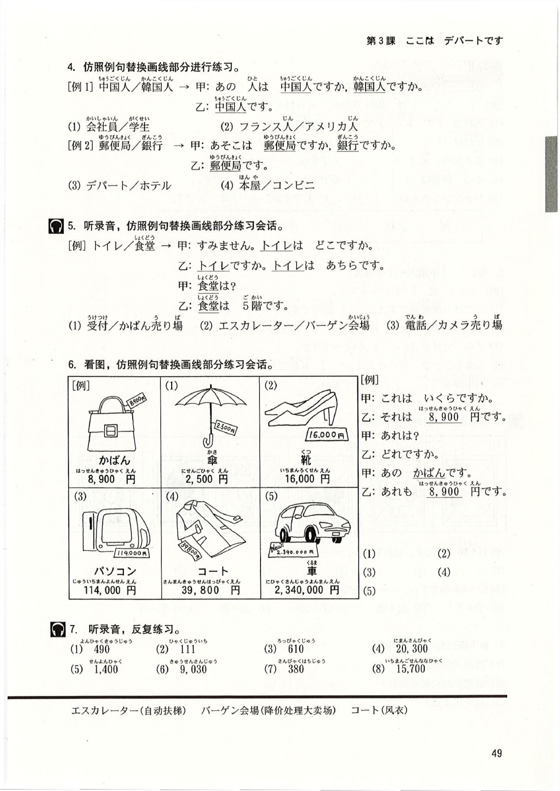

# 第3課 ここはデパートです

> Pages: 59-68

> 图像策略：本课正文以文字重建为主；练习页保留 `Page 65` 楼层导视图和 `Page 66` 价目板参考图，帮助还原地点与价格练习。

> 当前完成度：`S3（学习版）`。`M0-M7` 已全部归位；地点、楼层和价格练习已完成重排，关键图示页保留参考图；录音题仍只保留题型、例题与作答方式，不转写音频内容。

> Page 59

## 基本课文

### 基本句

1. ここは デパートです。  
2. <ruby>食堂<rt>しょくどう</rt></ruby>は デパートの 7<ruby>階<rt>かい</rt></ruby>です。  
3. あそこも <ruby>JC企画<rt>ジェーシーきかく</rt></ruby>の ビルです。  
4. かばん<ruby>売り場<rt>うりば</rt></ruby>は 1<ruby>階<rt>かい</rt></ruby>ですか、2<ruby>階<rt>かい</rt></ruby>ですか。  

### 会话 A

甲：トイレは どこですか。  
乙：あちらです。  

### 会话 B

甲：ここは <ruby>郵便局<rt>ゆうびんきょく</rt></ruby>ですか、<ruby>銀行<rt>ぎんこう</rt></ruby>ですか。  
乙：<ruby>銀行<rt>ぎんこう</rt></ruby>です。  

### 会话 C

甲：これは いくらですか。  
乙：それは 5,800<ruby>円<rt>えん</rt></ruby>です。  
甲：あれは？  
乙：あれも 5,800<ruby>円<rt>えん</rt></ruby>です。  

> Page 60

## 语法解释

### 1. `ここ / そこ / あそこ は 名 です`

这三个词用来指地点，位置关系和 `これ / それ / あれ` 类似：

- `ここ`：离说话人近
- `そこ`：离听话人近
- `あそこ`：离双方都远

例如：

- ここは デパートです。  
  这里是百货商店。
- そこは <ruby>図書館<rt>としょかん</rt></ruby>です。  
  那里是图书馆。
- あそこは <ruby>入り口<rt>いりぐち</rt></ruby>です。  
  那儿是入口。

### 2. `名 は 場所 です`

这个句型表示“某人 / 某物在某个地方”。

- <ruby>食堂<rt>しょくどう</rt></ruby>は デパートの 7<ruby>階<rt>かい</rt></ruby>です。  
  食堂在百货商店的 7 层。
- トイレは ここです。  
  厕所在这儿。
- <ruby>小野<rt>おの</rt></ruby>さんは <ruby>事務所<rt>じむしょ</rt></ruby>です。  
  小野女士在事务所。

要注意：

- `トイレは ここです`：把“厕所”当话题
- `ここは トイレです`：把“这里”当话题  

两句都成立，但重点不同。

### 3. `名 は どこですか`

用来问“某物 / 某人在哪里”。

- トイレは どこですか。  
  厕所在哪里？
- あなたの かばんは どこですか。  
  你的包在哪里？

### 4. `も`

助词 `も` 基本相当于汉语的“也”。

- ここは <ruby>JC企画<rt>ジェーシーきかく</rt></ruby>の ビルです。  
- あそこも <ruby>JC企画<rt>ジェーシーきかく</rt></ruby>の ビルです。  

### 5. `Aですか、Bですか`

当答案有多种可能时，可以把两种候选项都说出来询问。  
这种问法不能用 `はい / いいえ` 回答，而要直接回答具体内容。

- かばん<ruby>売り場<rt>うりば</rt></ruby>は 1<ruby>階<rt>かい</rt></ruby>ですか、2<ruby>階<rt>かい</rt></ruby>ですか。  
- <ruby>今日<rt>きょう</rt></ruby>は <ruby>水曜日<rt>すいようび</rt></ruby>ですか、<ruby>木曜日<rt>もくようび</rt></ruby>ですか。  

> Page 61

### 6. `いくらですか`

问价格时，用：

- `いくらですか`

例如：

- これは いくらですか。  
  这个多少钱？
- その <ruby>服<rt>ふく</rt></ruby>は いくらですか。  
  那件衣服多少钱？

## 补充：100 以上的数字

本课先抓住这几个高频读法：

- `100`：ひゃく
- `300`：さんびゃく
- `600`：ろっぴゃく
- `800`：はっぴゃく
- `1,000`：せん
- `3,000`：さんぜん
- `8,000`：はっせん
- `10,000`：いちまん
- `100,000,000`：いちおく

> Page 62

## 表达及词语讲解

### 1. `1階`

`階` 是量词。  
和数字连用时，发音会有变化，例如：

- `1階`：いっかい
- `3階`：さんがい
- `6階`：ろっかい

### 2. 谓语省略

如果前面已经问过一遍，后面继续追问时，常常省略重复部分。

- これは いくらですか。  
- あれは？  

这里省略的是：

- あれは いくらですか。

### 3. 礼貌说法：`こちら / そちら / あちら / どちら`

这组词是：

- `ここ / そこ / あそこ / どこ`

的礼貌说法。

例如：

- <ruby>受付<rt>うけつけ</rt></ruby>は どちらですか。  
  接待处在哪里？
- あちらです。  
  在那边。

> Page 63

### 4. `お国はどちらですか`

问对方是哪国人时，用：

- <ruby>国<rt>くに</rt></ruby>は どちらですか

更礼貌一点可以说：

- お<ruby>国<rt>くに</rt></ruby>は どちらですか

### 5. 缩略词

日语里很常见把长词缩短：

- パーソナルコンピュータ → パソコン
- コンビニエンスストア → コンビニ
- デジタルカメラ → デジカメ

### 6. `あのう`

向别人搭话、开启一个请求或有点难开口时，可以先说：

- あのう

### 7. `〜ですか`

重复对方刚说的信息并加 `か`，可以表示确认：

- <ruby>地図<rt>ちず</rt></ruby>ですか。  
  地图吗？

## 补充：英文字母

本课页末给了 A-Z 读法表。  
网页版先抓最常见的几个：

- A：エー
- J：ジェー
- K：ケー
- M：エム
- T：ティー
- X：エックス

> Page 64

## 应用课文

### 场景：ホテルの <ruby>周辺<rt>しゅうへん</rt></ruby>

小李请小野带自己熟悉宾馆的周边环境。宾馆附近有各种店铺，非常方便。

（她们走到宾馆附近的便利店前）

<ruby>小野<rt>おの</rt></ruby>：ここは コンビニです。<ruby>隣<rt>となり</rt></ruby>は <ruby>喫茶店<rt>きっさてん</rt></ruby>です。  
<ruby>李<rt>り</rt></ruby>：（指着<ruby>前<rt>まえ</rt></ruby><ruby>方<rt>かた</rt></ruby>的建筑物）あの <ruby>建物<rt>たてもの</rt></ruby>は ホテルですか、マンションですか。  
<ruby>小野<rt>おの</rt></ruby>：あそこは マンションです。  
<ruby>李<rt>り</rt></ruby>：（指着远处的高楼）あの <ruby>建物<rt>たてもの</rt></ruby>は <ruby>何<rt>なん</rt></ruby>ですか。  
<ruby>小野<rt>おの</rt></ruby>：あそこも マンションです。  
<ruby>李<rt>り</rt></ruby>：マンションの <ruby>隣<rt>となり</rt></ruby>は？  
<ruby>小野<rt>おの</rt></ruby>：マンションの <ruby>隣<rt>となり</rt></ruby>は <ruby>病院<rt>びょういん</rt></ruby>です。  

（走了一会儿）

<ruby>李<rt>り</rt></ruby>：<ruby>本屋<rt>ほんや</rt></ruby>は どこですか。  
<ruby>小野<rt>おの</rt></ruby>：（指着<ruby>前<rt>まえ</rt></ruby><ruby>方<rt>かた</rt></ruby>不远处）そこです。その ビルの 2<ruby>階<rt>かい</rt></ruby>です。  

（书店的收款台前）

<ruby>李<rt>り</rt></ruby>：あのう、<ruby>東京<rt>とうきょう</rt></ruby>の <ruby>地図<rt>ちず</rt></ruby>は どこですか。  
<ruby>店員<rt>てんいん</rt></ruby>：<ruby>地図<rt>ちず</rt></ruby>ですか。（指着小<ruby>李<rt>り</rt></ruby>身后）そちらです。  

（小李将地图拿到收款台）

<ruby>李<rt>り</rt></ruby>：いくらですか。  
<ruby>店員<rt>てんいん</rt></ruby>：500<ruby>円<rt>えん</rt></ruby>です。  

> Page 65

## 练习

> 练习保真说明：本节按网页学习版重排。可文字化的题面尽量展开；依赖录音、图表或原页版式的题目，保留题型、例题、小题范围和训练重点。

### 练习 I

#### 1. 看图，仿照例句替换画线部分进行练习

- 例 1：
  - `ここは 食堂です。`
- 图示项目：
  - `(1) カメラ売り場`
  - `(2) 靴売り場`
  - `(3) 受付`
  - `(4) 傘売り場`
  - `(5) かばん売り場`

- 例 2：
  - `銀行は あの ビルの 1階です。`
- 楼层替换项目：
  - `(6) コンビニ / 1階`
  - `(7) 本屋 / 8階`
  - `(8) レストラン / 9階`
  - `(9) 事務所 / 3階`

#### 2. 仿照例句替换画线部分进行练习

- 例：`トイレ → 甲：トイレは どこですか。`
- `乙：あそこです。`
- 替换项目：
  - `(1) 図書館`
  - `(2) 食堂`
  - `(3) 受付`
  - `(4) 事務所`

#### 3. 仿照例句用括号中的词语练习

- 例：`李さんは 中国人です。（張さん）→ 張さんも 中国人です。`
- 替换项目：
  - `(1) 小野さんは JC企画の 社員です。（李さん）`
  - `(2) ここは わたしの レストランです。（そこ）`
  - `(3) この ビルは 病院です。（あの ビル）`
  - `(4) 時計売り場は デパートの 7階です。（食堂）`

> Page 66

### 练习 I（续）

#### 4. 仿照例句替换画线部分进行练习

- 例 1：
  - `中国人 / 韓国人`
  - `甲：あの 人は 中国人ですか、韓国人ですか。`
  - `乙：中国人です。`
- 替换项目：
  - `(1) 会社員 / 学生`
  - `(2) フランス人 / アメリカ人`

- 例 2：
  - `郵便局 / 銀行`
  - `甲：あそこは 郵便局ですか、銀行ですか。`
  - `乙：郵便局です。`
- 替换项目：
  - `(3) デパート / ホテル`
  - `(4) 本屋 / コンビニ`

#### 5. 听录音，仿照例句替换画线部分练习会话

- 例：
  - `トイレ / 食堂`
  - `甲：すみません。トイレは どこですか。`
  - `乙：トイレですか。トイレは あちらです。`
  - `甲：食堂は？`
  - `乙：食堂は 5階です。`
- 替换项目：
  - `(1) 受付 / かばん売り場`
  - `(2) エスカレーター / バーゲン会場`
  - `(3) 電話 / カメラ売り場`

#### 6. 看图，仿照例句替换画线部分练习会话

- 例：
  - `甲：これは いくらですか。`
  - `乙：それは 8,900円です。`
  - `甲：あれは？`
  - `乙：どれですか。`
  - `甲：あの かばんです。`
  - `乙：あれも 8,900円です。`
- 价目图示项目：
  - `(1) 傘 / 2,500円`
  - `(2) 靴 / 16,000円`
  - `(3) パソコン / 114,000円`
  - `(4) コート / 39,800円`
  - `(5) 車 / 2,340,000円`

#### 7. 听录音，反复练习数字

- `(1) 490`
- `(2) 111`
- `(3) 610`
- `(4) 20,300`
- `(5) 1,400`
- `(6) 9,030`
- `(7) 380`
- `(8) 15,700`

> Page 67

### 练习 II

#### 1. 从词语框中选择合适的词语填入括号中

- 词语框：`何 / どれ / だれ / どの / どこ / そこ`
- 例：`（ここ）は 銀行ですか。`
- `(1) あれは（　　　）ですか。 → 病院です。`
- `(2) 受付は（　　　）ですか。 → あそこです。`
- `(3) 森さんの 本は（　　　）ですか。 → これです。`
- `(4) その 辞書は（　　　）のですか。 → わたしのです。`
- `(5) ジョンソンさんは（　　　）人ですか。 → あの 人です。`

#### 2. 在括号中填入一个平假名

- 例：`ここ（は）デパートです。`
- `(1) ここは 郵便局です（　）、銀行ですか。`
- `(2) ここは ホテルです。そこ（　）ホテルです。`
- `(3) この カメラ（　）いくらですか。`
- `(4) レストランは デパート（　）8階です。`
- `(5) 日中商事（　）こちらですか。`

#### 3. 边看图边听录音，回答提问

- 图示价格卡：
  - `① 90円`
  - `② 110円`
  - `③ 270円`
  - `④ 350円`
  - `⑤ 100円`
  - `⑥ 420円`
- 例 1：`90円です。どれですか。 → ①`
- 例 2：`いくらですか。① + ② → 200円です。`
- 练习项目：
  - `(6) ① + ⑤`
  - `(7) ① + ③`
  - `(8) ④ + ⑤`
  - `(9) ② + ⑥`
  - `(10) ③ + ④`

#### 4. 将下面的句子译成日语

- `(1) 厕所在哪儿？`
- `(2) 这里是邮局还是银行？`
- `(3) 这个多少钱？`

### 本课学习检查

- 能问地点和楼层
- 能说 `Aですか、Bですか`
- 能问价格并听懂高频金额
- 能在网页里完成一轮“问路 + 购物”问答

> Page 68

## 生词表

### 词条

- `デパート` `[名]` 百货商店
- `しょくどう（食堂）` `[名]` 食堂
- `ゆうびんきょく（郵便局）` `[名]` 邮局
- `ぎんこう（銀行）` `[名]` 银行
- `としょかん（図書館）` `[名]` 图书馆
- `マンション` `[名]` （高级）公寓
- `ホテル` `[名]` 宾馆
- `コンビニ` `[名]` 便利店
- `きっさてん（喫茶店）` `[名]` 咖啡馆
- `びょういん（病院）` `[名]` 医院
- `ほんや（本屋）` `[名]` 书店
- `レストラン` `[名]` 餐馆，西餐馆
- `ビル` `[名]` 大楼，大厦
- `たてもの（建物）` `[名]` 大楼，建筑物
- `うりば（売り場）` `[名]` 柜台，出售处
- `トイレ` `[名]` 厕所，盥洗室
- `いりぐち（入り口）` `[名]` 入口
- `じむしょ（事務所）` `[名]` 事务所，办事处
- `うけつけ（受付）` `[名]` 接待处
- `バーゲンかいじょう（〜会場）` `[名]` 降价处理大卖场
- `エスカレーター` `[名]` 自动扶梯
- `ふく（服）` `[名]` 衣服
- `コート` `[名]` 风衣，大衣
- `デジカメ` `[名]` 数码相机
- `くに（国）` `[名]` 国，国家
- `ちず（地図）` `[名]` 地图
- `となり（隣）` `[名]` 旁边
- `しゅうへん（周辺）` `[名]` 附近，周边
- `きょう（今日）` `[名]` 今天
- `すいようび（水曜日）` `[名]` 星期三
- `もくようび（木曜日）` `[名]` 星期四
- `ここ` `[代]` 这里，这儿
- `そこ` `[代]` 那里，那儿
- `あそこ` `[代]` 那里，那儿
- `こちら` `[代]` 这儿，这边
- `そちら` `[代]` 那儿，那边
- `あちら` `[代]` 那儿，那边
- `どこ` `[疑]` 哪里，哪儿
- `どちら` `[疑]` 哪儿，哪边
- `あのう` `[叹]` 请问，对不起
- `いくら` 多少钱
- `お〜 / 〜かい / 〜えん / 〜ようび（お〜 / 〜階 / 〜円 / 〜曜日）`

### 专有名词

- `シャンハイ（上海）` `[专]` 上海
- `とうきょう（東京）` `[专]` 东京

### 专栏：地下食品商场

“デパ地<ruby>下<rt>した</rt></ruby>”指百货商店地<ruby>下<rt>した</rt></ruby>的食品商场。  
那里通常有现成菜、点心、便当和各地名产，种类非常丰富。  
对学习者来说，这也是理解日本楼层表达和卖场词汇的好场景。
