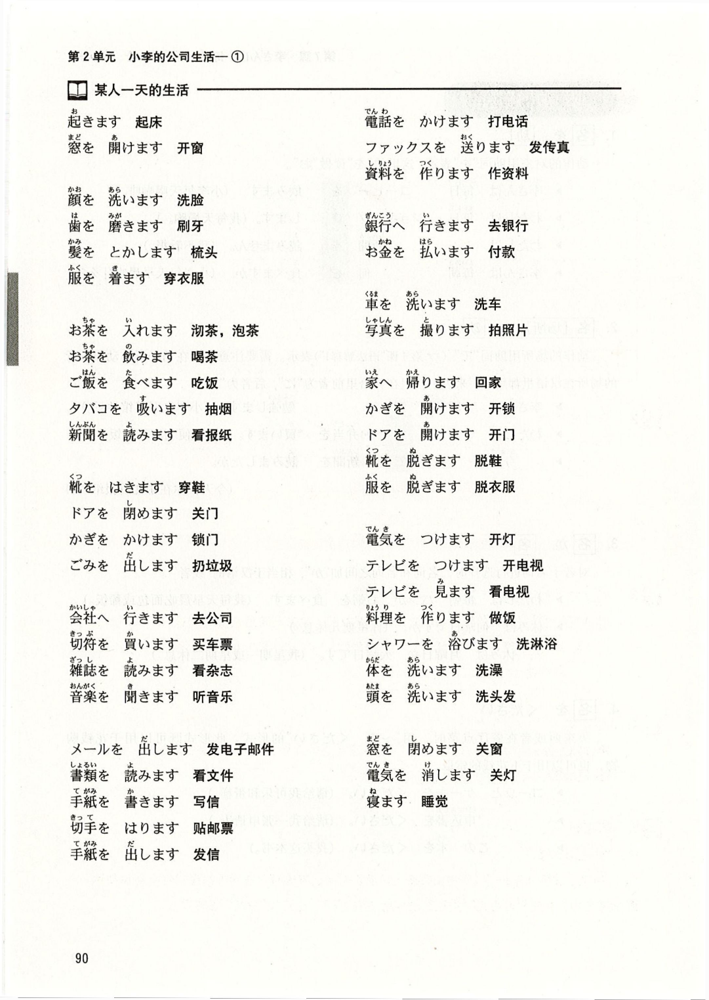

# 第7課 <ruby>李<rt>り</rt></ruby>さんは <ruby>毎日<rt>まいにち</rt></ruby> コーヒーを <ruby>飲みます<rt>のみます</rt></ruby>

> Pages: 105-114

> 图像策略：本课保留动作图示页作为参考图，同时提供完整文字版动作清单。

> 当前完成度：`S3（学习版）`。`M0-M7` 已全部归位；练习页与动作图示页已完成学习版重排；关键动作图示保留参考图；录音题仍只保留题型、例题与作答方式，不转写音频内容。

> Page 105

## 基本课文

### 基本句

1. <ruby>李さん<rt>りさん</rt></ruby>は <ruby>毎日<rt>まいにち</rt></ruby> コーヒーを <ruby>飲みます<rt>のみます</rt></ruby>。
2. <ruby>李さん<rt>りさん</rt></ruby>は <ruby>図書館<rt>としょかん</rt></ruby>で <ruby>勉強します<rt>べんきょうします</rt></ruby>。
3. わたしは <ruby>毎朝<rt>まいあさ</rt></ruby> パンか <ruby>お粥<rt>おかゆ</rt></ruby>を <ruby>食べます<rt>たべます</rt></ruby>。
4. コーラと ケーキを ください。

### 会话 A

甲：<ruby>李さん<rt>りさん</rt></ruby>、<ruby>今朝<rt>けさ</rt></ruby> うちで <ruby>新聞<rt>しんぶん</rt></ruby>を <ruby>読みました<rt>よみました</rt></ruby>か。  
乙：いいえ、<ruby>読みませんでした<rt>よみませんでした</rt></ruby>。

### 会话 B

甲：<ruby>今朝<rt>けさ</rt></ruby> <ruby>何を<rt>なにを</rt></ruby> <ruby>食べました<rt>たべました</rt></ruby>か。  
乙：<ruby>何も<rt>なにも</rt></ruby> <ruby>食べませんでした<rt>たべませんでした</rt></ruby>。

### 会话 C

甲：<ruby>吉田さん<rt>よしださん</rt></ruby>、<ruby>日曜日<rt>にちようび</rt></ruby> <ruby>何を<rt>なにを</rt></ruby> しますか。  
乙：テニスか ジョギングを します。

### 会话 D

甲：いらっしゃいませ。  
乙：この ノートと <ruby>鉛筆<rt>えんぴつ</rt></ruby>を ください。

> Page 106

## 语法解释

### 1. `名を + 动`

动作的对象用助词 `を` 表示。  
这里的 `を` 读作 `お`。

- <ruby>李さん<rt>りさん</rt></ruby>は <ruby>毎日<rt>まいにち</rt></ruby> コーヒーを <ruby>飲みます<rt>のみます</rt></ruby>。  
  小李每天喝咖啡。
- わたしは ジョギングを します。  
  我慢跑。
- <ruby>李さん<rt>りさん</rt></ruby>は <ruby>毎朝<rt>まいあさ</rt></ruby> <ruby>何を<rt>なにを</rt></ruby> <ruby>食べます<rt>たべます</rt></ruby>か。  
  小李每天早上吃什么？

### 2. `名[场所]で + 动`

动作发生的场所用助词 `で` 表示。

- <ruby>李さん<rt>りさん</rt></ruby>は <ruby>図書館<rt>としょかん</rt></ruby>で <ruby>勉強します<rt>べんきょうします</rt></ruby>。  
  小李在图书馆学习。
- わたしは コンビニで <ruby>お弁当<rt>おべんとう</rt></ruby>を <ruby>買います<rt>かいます</rt></ruby>。  
  我在便利店买盒饭。
- <ruby>今日<rt>きょう</rt></ruby> どこで <ruby>新聞<rt>しんぶん</rt></ruby>を <ruby>読みました<rt>よみました</rt></ruby>か。  
  今天你在哪儿看报了？

要注意：

- 存在的地点常用 `に`
- 动作发生的地点常用 `で`

### 3. `名か 名`

在两个或多个名词之间加 `か`，表示“或者”。

- わたしは <ruby>毎朝<rt>まいあさ</rt></ruby> パンか <ruby>お粥<rt>おかゆ</rt></ruby>を <ruby>食べます<rt>たべます</rt></ruby>。  
  我每天早晨吃面包或者粥。
- <ruby>休み<rt>やすみ</rt></ruby>は <ruby>月曜日<rt>げつようび</rt></ruby>か <ruby>火曜日<rt>かようび</rt></ruby>です。  
  我星期一或者星期二休息。

### 4. `名を ください`

买东西、点菜或索取某物时，可以用：

- `〜を ください`

例如：

- コーラと ケーキを ください。  
  请给我可乐和蛋糕。
- <ruby>申込書<rt>もうしこみしょ</rt></ruby>を ください。  
  请给我一张申请表。
- この <ruby>本<rt>ほん</rt></ruby>を ください。  
  我要这本书。

> Page 107

## 补充：一天中的常见动作

这一页原书是图示页。`reader` 版不复刻原排版，但尽量保留动作条目本身，方便学习和检索。

> 参考图：原书这一页属于“图辅助记忆页”。网页版正文以下面的动作清单为主，图片作为对照参考。

### 早晨起居

- <ruby>起きます<rt>おきます</rt></ruby>：起床
- <ruby>顔<rt>かお</rt></ruby>を <ruby>洗います<rt>あらいます</rt></ruby>：洗脸
- <ruby>歯<rt>は</rt></ruby>を <ruby>磨きます<rt>みがきます</rt></ruby>：刷牙
- <ruby>髪<rt>かみ</rt></ruby>を とかします：梳头
- <ruby>服<rt>ふく</rt></ruby>を <ruby>着ます<rt>きます</rt></ruby>：穿衣服
- <ruby>窓<rt>まど</rt></ruby>を <ruby>開けます<rt>あけます</rt></ruby>：开窗

### 联系、整理与文书

- <ruby>電話<rt>でんわ</rt></ruby>を かけます：打电话
- ファックスを <ruby>送ります<rt>おくります</rt></ruby>：发传真
- メールを <ruby>出します<rt>だします</rt></ruby>：发邮件
- <ruby>資料<rt>しりょう</rt></ruby>を <ruby>作ります<rt>つくります</rt></ruby>：做资料
- <ruby>書類<rt>しょるい</rt></ruby>を <ruby>読みます<rt>よみます</rt></ruby>：看文件
- <ruby>手紙<rt>てがみ</rt></ruby>を <ruby>書きます<rt>かきます</rt></ruby>：写信
- <ruby>手紙<rt>てがみ</rt></ruby>を <ruby>出します<rt>だします</rt></ruby>：寄信
- <ruby>切手<rt>きって</rt></ruby>を はります：贴邮票

### 饮食与家务

- <ruby>お茶<rt>おちゃ</rt></ruby>を <ruby>飲みます<rt>のみます</rt></ruby>：喝茶
- <ruby>お茶<rt>おちゃ</rt></ruby>を <ruby>入れます<rt>いれます</rt></ruby>：沏茶
- <ruby>ご飯<rt>ごはん</rt></ruby>を <ruby>食べます<rt>たべます</rt></ruby>：吃饭
- <ruby>料理<rt>りょうり</rt></ruby>を <ruby>作ります<rt>つくります</rt></ruby>：做饭
- <ruby>お金<rt>おかね</rt></ruby>を <ruby>払います<rt>はらいます</rt></ruby>：付款
- ごみを <ruby>出します<rt>だします</rt></ruby>：扔垃圾
- <ruby>車<rt>くるま</rt></ruby>を <ruby>洗います<rt>あらいます</rt></ruby>：洗车

### 外出与办事

- <ruby>銀行<rt>ぎんこう</rt></ruby>へ <ruby>行きます<rt>いきます</rt></ruby>：去银行
- <ruby>会社<rt>かいしゃ</rt></ruby>へ <ruby>行きます<rt>いきます</rt></ruby>：去公司
- <ruby>家<rt>いえ</rt></ruby>へ <ruby>帰ります<rt>かえります</rt></ruby>：回家
- <ruby>切符<rt>きっぷ</rt></ruby>を <ruby>買います<rt>かいます</rt></ruby>：买车票
- <ruby>写真<rt>しゃしん</rt></ruby>を <ruby>撮ります<rt>とります</rt></ruby>：拍照
- <ruby>新聞<rt>しんぶん</rt></ruby>を <ruby>読みます<rt>よみます</rt></ruby>：看报纸
- <ruby>雑誌<rt>ざっし</rt></ruby>を <ruby>読みます<rt>よみます</rt></ruby>：看杂志
- <ruby>音楽<rt>おんがく</rt></ruby>を <ruby>聞きます<rt>ききます</rt></ruby>：听音乐

### 回家后的动作

- かぎを <ruby>開けます<rt>あけます</rt></ruby>：开锁
- ドアを <ruby>開けます<rt>あけます</rt></ruby>：开门
- <ruby>靴<rt>くつ</rt></ruby>を <ruby>脱ぎます<rt>ぬぎます</rt></ruby>：脱鞋
- <ruby>靴<rt>くつ</rt></ruby>を はきます：穿鞋
- <ruby>服<rt>ふく</rt></ruby>を <ruby>脱ぎます<rt>ぬぎます</rt></ruby>：脱衣服
- ドアを <ruby>閉めます<rt>しめます</rt></ruby>：关门
- かぎを かけます：锁门

### 夜里与休息

- <ruby>電気<rt>でんき</rt></ruby>を つけます：开灯
- <ruby>電気<rt>でんき</rt></ruby>を <ruby>消します<rt>けします</rt></ruby>：关灯
- テレビを つけます：打开电视
- テレビを <ruby>見ます<rt>みます</rt></ruby>：看电视
- シャワーを <ruby>浴びます<rt>あびます</rt></ruby>：冲澡
- 体を <ruby>洗います<rt>あらいます</rt></ruby>：洗澡
- 頭を <ruby>洗います<rt>あらいます</rt></ruby>：洗头
- <ruby>寝ます<rt>ねます</rt></ruby>：睡觉

> Page 108

## 表达及词语讲解

### 1. `何` 的读法：`なに` / `なん`

`何` 相当于汉语的“什么”，读法会根据后面的词变化：

- `何を`：なにを
- `何が`：なにが
- `何の`：なんの
- `何時`：なんじ

`何で` 两种都能听到，但教材里常提醒初学者注意区分。

### 2. `そうですか`

降调读时，表示“我知道了 / 原来如此 / 是吗”。

- いつも <ruby>そば屋<rt>そばや</rt></ruby>で <ruby>昼ご飯<rt>ひるごはん</rt></ruby>を <ruby>食べます<rt>たべます</rt></ruby>。  
  我经常在荞麦面馆吃午饭。
- そうですか。  
  是吗。

### 3. `そうですね`

表示赞同、接受对方的提议。

- <ruby>李さん<rt>りさん</rt></ruby>、<ruby>今日<rt>きょう</rt></ruby>は <ruby>そば屋<rt>そばや</rt></ruby>へ <ruby>行きます<rt>いきます</rt></ruby>か。  
  小李，今天去荞麦面馆吗？
- そうですね。  
  好啊。

### 4. `じゃあ`

接过话题继续往下说时常用，意思接近“那么”。

正式场合更常说：

- `では`

### 5. 寒暄语 ④

#### `失礼します`

向长辈、上司告辞时常说，也可用于进入别人房间时。

#### `いってらっしゃい / いってきます / いってまいります`

离开家或单位时：

- <ruby>要走的人说<rt>ようそうてきにん</rt></ruby>：`いってきます / いってまいります`
- <ruby>留下的人说<rt>りゅうしたてきにん</rt></ruby>：`いってらっしゃい`

#### `ただいま / お帰りなさい`

回来的人说 `ただいま`，在家的人回应 `お帰りなさい`。

> Page 109

#### `いらっしゃいませ / かしこまりました`

- `いらっしゃいませ`：欢迎光临
- `かしこまりました`：我知道了 / 遵命

这是店员面对顾客时很常见的说法。

### 6. `すみません`

除了“对不起”，还常用于搭话、请人帮忙，相当于“劳驾、请问”。

### 7. `親子丼`

`丼` 指盖饭。  
`親子丼` 用鸡肉和鸡蛋做浇头，因为里面有“亲”（鸡）和“子”（蛋），所以叫“亲子盖饭”。

### 8. `コンビニ`

便利店在日本日常生活里非常重要，除了卖食品和日用品，还常能缴费、买杂志、买盒饭，非常方便。

> Page 110

## 应用课文

### <ruby>昼ご飯<rt>ひるごはん</rt></ruby>

> 小李和小野正要去吃午饭，路上碰见了手里拎着便利店袋子的吉田课长。

#### 场景 1：今天中午吃什么？

<ruby>吉田<rt>よしだ</rt></ruby>：<ruby>李さん<rt>りさん</rt></ruby>、これから <ruby>昼ご飯です<rt>ひるごめしです</rt></ruby>か。  
<ruby>李<rt>り</rt></ruby>：はい、<ruby>小野さん<rt>おのさん</rt></ruby>と いっしょに <ruby>行きます<rt>いきます</rt></ruby>。  
<ruby>小野<rt>おの</rt></ruby>：<ruby>課長<rt>かちょう</rt></ruby>は？  
<ruby>吉田<rt>よしだ</rt></ruby>：コンビニで <ruby>お弁当<rt>おべんとう</rt></ruby>と <ruby>お茶<rt>おちゃ</rt></ruby>を <ruby>買いました<rt>かいました</rt></ruby>。  
<ruby>李<rt>り</rt></ruby>：いつも コンビニですか。  
<ruby>吉田<rt>よしだ</rt></ruby>：いいえ。いつもは <ruby>そば屋<rt>そばや</rt></ruby>で そばか うどんを <ruby>食べます<rt>たべます</rt></ruby>。  
<ruby>李<rt>り</rt></ruby>：そうですか。

#### 场景 2：去面馆吧

<ruby>小野<rt>おの</rt></ruby>：<ruby>李さん<rt>りさん</rt></ruby>、<ruby>今日<rt>きょう</rt></ruby>は <ruby>そば屋<rt>そばや</rt></ruby>へ <ruby>行きます<rt>いきます</rt></ruby>か。  
<ruby>李<rt>り</rt></ruby>：そうですね。  
<ruby>小野<rt>おの</rt></ruby>：じゃあ、<ruby>課長<rt>かちょう</rt></ruby>、<ruby>失礼します<rt>しつれいします</rt></ruby>。  
<ruby>吉田<rt>よしだ</rt></ruby>：いってらっしゃい。

#### 场景 3：在面馆点餐

<ruby>店員<rt>てんいん</rt></ruby>：いらっしゃいませ。  
<ruby>小野<rt>おの</rt></ruby>：すみません、<ruby>親子丼<rt>おやこどん</rt></ruby>を ください。<ruby>李さん<rt>りさん</rt></ruby>は？  
<ruby>李<rt>り</rt></ruby>：わたしも それを ください。  
<ruby>店員<rt>てんいん</rt></ruby>：かしこまりました。

> Page 111

## 练习

> 练习保真说明：本节按网页学习版重排。可文字化的题面尽量展开；依赖录音、图表或原页版式的题目，保留题型、例题、小题范围和训练重点。

### 练习 I

#### 2. 仿照例句替换画线部分进行练习

- [例 1] <ruby>家<rt>いえ</rt></ruby> / パン / <ruby>食べます<rt>たべます</rt></ruby>  
  → <ruby>家<rt>いえ</rt></ruby>で パンを <ruby>食べます<rt>たべます</rt></ruby>。
- (1) <ruby>喫茶店<rt>きっさてん</rt></ruby> / コーヒー / <ruby>飲みます<rt>のみます</rt></ruby>
- (2) <ruby>電車<rt>でんしゃ</rt></ruby>の <ruby>中<rt>なか</rt></ruby> / <ruby>新聞<rt>しんぶん</rt></ruby> / <ruby>読みます<rt>よみます</rt></ruby>
- (3) <ruby>本屋<rt>ほんや</rt></ruby> / <ruby>地図<rt>ちず</rt></ruby> / <ruby>買います<rt>かいます</rt></ruby>
- (4) <ruby>公園<rt>こうえん</rt></ruby> / テニス / します

- [例 2] <ruby>毎朝<rt>まいあさ</rt></ruby> <ruby>何を<rt>なにを</rt></ruby> <ruby>食べます<rt>たべます</rt></ruby>か。（パン / <ruby>お粥<rt>おかゆ</rt></ruby>）  
  → パンか <ruby>お粥<rt>おかゆ</rt></ruby>を <ruby>食べます<rt>たべます</rt></ruby>。
- (5) <ruby>今日<rt>きょう</rt></ruby> <ruby>何時<rt>なんじ</rt></ruby>まで <ruby>働きます<rt>はたらきます</rt></ruby>か。（<ruby>5時<rt>ごじ</rt></ruby> / <ruby>6時<rt>ろくじ</rt></ruby>）
- (6) <ruby>日曜日<rt>にちようび</rt></ruby> <ruby>何を<rt>なにを</rt></ruby> しますか。（サッカー / <ruby>野球<rt>やきゅう</rt></ruby>）

#### 3. 听录音，仿照例句回答提问

- [例 1] 毎朝 コーヒーを 飲みますか。（いいえ）  
  → いいえ、<ruby>飲みません<rt>のみません</rt></ruby>。
- (1) はい
- (2) いいえ
- (3) いいえ
- (4) はい
- (5) いいえ

- [例 2] <ruby>昨日<rt>きのう</rt></ruby> <ruby>何を<rt>なにを</rt></ruby> <ruby>買いました<rt>かいました</rt></ruby>か。（<ruby>辞書<rt>じしょ</rt></ruby>）  
  → <ruby>辞書<rt>じしょ</rt></ruby>を <ruby>買いました<rt>かいました</rt></ruby>。
- (6) パソコン
- (7) <ruby>何も<rt>なにも</rt></ruby>
- (8) CD
- (9) <ruby>何も<rt>なにも</rt></ruby>
- (10) パンと <ruby>卵<rt>たまご</rt></ruby>

#### 4. 仿照例句替换画线部分练习会话

- [例] デパート / <ruby>靴<rt>くつ</rt></ruby>を <ruby>買います<rt>かいます</rt></ruby>  
  甲：<ruby>先週<rt>せんしゅう</rt></ruby>の <ruby>日曜日<rt>にちようび</rt></ruby> <ruby>何を<rt>なにを</rt></ruby> しましたか。  
  乙：デパートへ <ruby>行きました<rt>いきました</rt></ruby>。  
  甲：デパートで <ruby>何を<rt>なにを</rt></ruby> しましたか。  
  乙：<ruby>靴<rt>くつ</rt></ruby>を <ruby>買いました<rt>かいました</rt></ruby>。
- (1) <ruby>動物園<rt>どうぶつえん</rt></ruby> / パンダを <ruby>見ます<rt>みます</rt></ruby>
- (2) <ruby>友達<rt>ともだち</rt></ruby>の <ruby>家<rt>いえ</rt></ruby> / パーティーを します

> Page 112

#### 5. 先看图并仿照例句进行练习，然后听录音确认对错

例句：

- <ruby>小野さん<rt>おのさん</rt></ruby>の <ruby>1日<rt>ついたち</rt></ruby>です。  
  <ruby>小野さん<rt>おのさん</rt></ruby>は <ruby>今日<rt>きょう</rt></ruby> <ruby>会社<rt>かいしゃ</rt></ruby>へ <ruby>行きませんでした<rt>いきませんでした</rt></ruby>。  
  <ruby>午前中<rt>ごぜんちゅう</rt></ruby> <ruby>部屋<rt>へや</rt></ruby>を <ruby>掃除しました<rt>そうじしました</rt></ruby>。  
  <ruby>午後<rt>ごご</rt></ruby> <ruby>公園<rt>こうえん</rt></ruby>で <ruby>写真<rt>しゃしん</rt></ruby>を <ruby>撮りました<rt>とりました</rt></ruby>。  
  <ruby>夜<rt>よる</rt></ruby> <ruby>手紙<rt>てがみ</rt></ruby>を <ruby>書きました<rt>かきました</rt></ruby>。  
  <ruby>10時<rt>じゅうじ</rt></ruby>から <ruby>11時<rt>じゅういちじ</rt></ruby>まで <ruby>音楽<rt>おんがく</rt></ruby>を <ruby>聞きました<rt>ききました</rt></ruby>。

继续练习：

- (1) <ruby>李さん<rt>りさん</rt></ruby>の <ruby>1日<rt>ついたち</rt></ruby>です。
- (2) <ruby>張さん<rt>ちょうさん</rt></ruby>の <ruby>1日<rt>ついたち</rt></ruby>です。

#### 6. 先听录音，然后看图并扮演乙的角色

例句：

- 甲：いらっしゃいませ。  
  乙：ノートと <ruby>鉛筆<rt>えんぴつ</rt></ruby>を ください。

继续练习：

- (1) イチゴ
- (2) ワインと チーズ
- (3) カレー

> Page 113

### 练习 II

#### 1. 在括号中填入适当的词语

- [例] <ruby>昨日<rt>きのう</rt></ruby>（ <ruby>何<rt>なん</rt></ruby> ）を <ruby>買いました<rt>かいました</rt></ruby>か。  
  → <ruby>車<rt>くるま</rt></ruby>の <ruby>雑誌<rt>ざっし</rt></ruby>を <ruby>買いました<rt>かいました</rt></ruby>。
- (1) （  ）<ruby>上海<rt>シャンハイ</rt></ruby>へ <ruby>行きます<rt>いきます</rt></ruby>か。  
  → <ruby>来週<rt>らいしゅう</rt></ruby> <ruby>行きます<rt>いきます</rt></ruby>。
- (2) <ruby>毎日<rt>まいにち</rt></ruby>（  ）に <ruby>起きます<rt>おきます</rt></ruby>か。  
  → <ruby>6時半<rt>ろくじはん</rt></ruby>に <ruby>起きます<rt>おきます</rt></ruby>。
- (3) （  ）と <ruby>図書館<rt>としょかん</rt></ruby>へ <ruby>行きます<rt>いきます</rt></ruby>か。  
  → <ruby>小野さん<rt>おのさん</rt></ruby>と <ruby>行きます<rt>いきます</rt></ruby>。
- (4) <ruby>駅<rt>えき</rt></ruby>へ（  ）で <ruby>行きます<rt>いきます</rt></ruby>か。  
  → バスで <ruby>行きます<rt>いきます</rt></ruby>。
- (5) <ruby>小野さん<rt>おのさん</rt></ruby>の うちは（  ）ですか。  
  → <ruby>横浜<rt>よこはま</rt></ruby>です。

#### 2. 看图完成句子

- [例] <ruby>毎日<rt>まいにち</rt></ruby> <ruby>6時<rt>ろくじ</rt></ruby>（に）<ruby>起きます<rt>おきます</rt></ruby>。
- (1) <ruby>昨日<rt>きのう</rt></ruby> わたしは <ruby>友達<rt>ともだち</rt></ruby>（  ）<ruby>銀座<rt>ぎんざ</rt></ruby>（  ）<ruby>映画<rt>えいが</rt></ruby>（  ）。
- (2) いつも バス（  ）<ruby>会社<rt>かいしゃ</rt></ruby>（  ）__________________。
- (3) 先週 公園（  ）__________________。
- (4) <ruby>昨日<rt>きのう</rt></ruby>の <ruby>夜<rt>よる</rt></ruby> <ruby>8時<rt>はちじ</rt></ruby>（  ）<ruby>10時<rt>じゅうじ</rt></ruby>（  ）テレビ（  ）__________________。

#### 3. 先听录音“小野的一天”，再从 `a / b` 中选择正确答案

- [例] <ruby>小野さん<rt>おのさん</rt></ruby>は <ruby>何時<rt>なんじ</rt></ruby>に <ruby>起きました<rt>おきました</rt></ruby>か。  
  → `a. 6時` / `b. 9時`
- (1) `a. 9時から 6時まで` / `b. 9時から 5時まで`
- (2) `a. パンと チーズ` / `b. カレー`
- (3) `a. バス` / `b. 電車`
- (4) `a. はい` / `b. いいえ`
- (5) `a. 8時半` / `b. 10時`

#### 4. 翻译练习

- 小李在图书馆学习。
- 小李每天喝咖啡。
- 森先生今天早晨什么都没吃。

> Page 114

## 生词表

### 词条

- `コーヒー` `[名]` 咖啡
- `コーラ` `[名]` 可乐
- `おちゃ（お茶）` `[名]` 茶
- `ワイン` `[名]` 葡萄酒
- `パン` `[名]` 面包
- `ケーキ` `[名]` 蛋糕
- `おかゆ（お粥）` `[名]` 粥
- `ひるごはん（昼ご飯）` `[名]` 午饭
- `おべんとう（お弁当）` `[名]` 盒饭
- `そば` `[名]` 荞麦面
- `うどん` `[名]` 面条
- `おやこどん（親子丼）` `[名]` 鸡肉鸡蛋盖饭
- `カレー` `[名]` 咖喱（饭）
- `たまご（卵）` `[名]` 鸡蛋
- `チーズ` `[名]` 干酪
- `リンゴ` `[名]` 苹果
- `イチゴ` `[名]` 草莓
- `そばや（そば屋）` `[名]` 荞麦面馆
- `テニス` `[名]` 网球
- `ジョギング` `[名]` 慢跑，跑步
- `サッカー` `[名]` 足球
- `やきゅう（野球）` `[名]` 棒球
- `もうしこみしょ（申込書）` `[名]` 申请书
- `てがみ（手紙）` `[名]` 信
- `シーディー（CD）` `[名]` CD
- `おんがく（音楽）` `[名]` 音乐
- `えいが（映画）` `[名]` 电影
- `どうぶつえん（動物園）` `[名]` 动物园
- `パンダ` `[名]` 熊猫
- `のみます（飲みます）` `[动1]` 喝
- `かいます（買います）` `[动1]` 买
- `とります（撮ります）` `[动1]` 拍照，拍摄
- `かきます（書きます）` `[动1]` 写
- `よみます（読みます）` `[动1]` 读
- `ききます（聞きます）` `[动1]` 听
- `たべます（食べます）` `[动2]` 吃
- `みます（見ます）` `[动2]` 看
- `します` `[动3]` 干，做
- `そうじします（掃除〜）` `[动3]` 打扫，扫除
- `これから` `[副]` 从现在起，今后
- `じゃあ / では` `[连]` 那么

### 表达

- `いらっしゃいませ` 欢迎光临
- `しつれいします（失礼します）` 告辞了，我走了
- `しつれいしました（失礼しました）` 打搅了，失礼了
- `いってまいります` 我走了
- `いってきます` 我走了
- `いってらっしゃい` 你走好
- `ただいま` 我回来了
- `おかえりなさい（お帰りなさい）` 你回来了
- `かしこまりました` 我知道了
- `おじゃまします（お邪魔します）` 打扰了
- `ください` 请给我……
- `ごぜんちゅう（午前中）` 上午

### 专栏：工薪族的午餐

日本工薪族的午餐，既有从自家带饭在公司餐厅里就餐的，也有去公司附近的饭馆用餐的，还有去便利店、盒饭店买回盒饭的，情况各异。

很多饭馆在午饭时间推出各种套餐或特惠菜肴，因此午餐可以吃得比较便宜。比如，有的面馆推出小笼屉荞麦面条和小碗鸡肉鸡蛋盖饭套餐，只卖 600 日元。还有的饭馆推出“日替わり定食”（每日一款套餐），这样可以每天花同样的钱吃到不同口味的套餐。因为可以品尝到不同的风味，每天光顾同一家店的人也不少。

便利店里，盒饭的种类非常丰富。饭团子、三明治自不必说，和式的、中式的乃至西式的饭菜应有尽有，陈列在狭小的柜台上。这些盒饭称作“コンビニ弁当”（便利店盒饭），只要提出要求，店员还可以用微波炉帮着加热。这样既可以避免吃凉饭，在时间紧的时候也非常方便。
