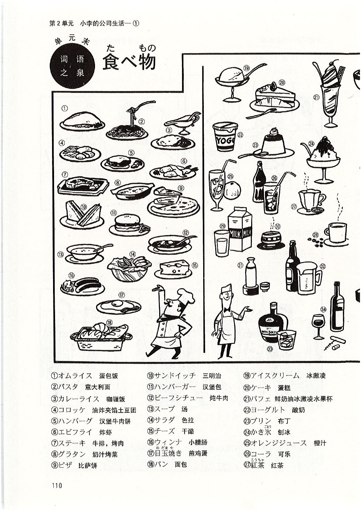

# 第8課 <ruby>李<rt>り</rt></ruby>さんは <ruby>日本語<rt>にほんご</rt></ruby>で <ruby>手紙<rt>てがみ</rt></ruby>を <ruby>書きます<rt>かきます</rt></ruby>

> Pages: 115-129

> 图像策略：本课保留词汇图示页和街头标识页参考图，正文与释义改成网页专题块。

> 当前完成度：`S3（学习版）`。`M0-M7` 已全部归位；练习页与补充专题已完成学习版重排；词汇图示页和街头标识页保留参考图；录音题仍只保留题型、例题与作答方式，不转写音频内容。

> Page 115

## 基本课文

### 基本句

1. <ruby>李さん<rt>りさん</rt></ruby>は <ruby>日本語<rt>にほんご</rt></ruby>で <ruby>手紙<rt>てがみ</rt></ruby>を <ruby>書きます<rt>かきます</rt></ruby>。
2. わたしは <ruby>小野さん<rt>おのさん</rt></ruby>に <ruby>お土産<rt>おみやげ</rt></ruby>を あげます。
3. わたしは <ruby>小野さん<rt>おのさん</rt></ruby>に <ruby>辞書<rt>じしょ</rt></ruby>を もらいました。
4. <ruby>李さん<rt>りさん</rt></ruby>は <ruby>明日<rt>あした</rt></ruby> <ruby>長島さん<rt>ながしまさん</rt></ruby>に <ruby>会います<rt>あいます</rt></ruby>。

### 会话 A

甲：<ruby>昨日<rt>きのう</rt></ruby>、<ruby>母<rt>はは</rt></ruby>に <ruby>誕生日<rt>たんじょうび</rt></ruby>の プレゼントを <ruby>送りました<rt>おくりました</rt></ruby>。  
乙：<ruby>何で<rt>なんで</rt></ruby> <ruby>送りました<rt>おくりました</rt></ruby>か。  
甲：<ruby>航空便<rt>こうくうびん</rt></ruby>で <ruby>送りました<rt>おくりました</rt></ruby>。

### 会话 B

甲：その <ruby>映画<rt>えいが</rt></ruby>の チケットを だれに あげますか。  
乙：<ruby>李さん<rt>りさん</rt></ruby>に あげます。

### 会话 C

甲：だれに その パンフレットを もらいましたか。  
乙：<ruby>長島さん<rt>ながしまさん</rt></ruby>に もらいました。

### 会话 D

甲：すみません、<ruby>李さん<rt>りさん</rt></ruby>は いますか。  
乙：もう <ruby>帰りました<rt>かえりました</rt></ruby>よ。

> Page 116

## 语法解释

### 1. `名[工具]で + 动`

第 6 课学过表示交通工具的助词 `で`。在这一课里，`で` 还可以表示**手段、工具、原材料**。

- <ruby>李さん<rt>りさん</rt></ruby>は <ruby>日本語<rt>にほんご</rt></ruby>で <ruby>手紙<rt>てがみ</rt></ruby>を <ruby>書きます<rt>かきます</rt></ruby>。  
  小李用日语写信。
- <ruby>手紙<rt>てがみ</rt></ruby>を <ruby>速達<rt>そくたつ</rt></ruby>で <ruby>送りました<rt>おくりました</rt></ruby>。  
  用速递寄了信。
- <ruby>新聞紙<rt>しんぶんし</rt></ruby>で <ruby>紙飛行機<rt>かみひこうき</rt></ruby>を <ruby>作りました<rt>つくりました</rt></ruby>。  
  用报纸折了纸飞机。
- <ruby>何で<rt>なんで</rt></ruby> うどんを <ruby>作ります<rt>つくります</rt></ruby>か。  
  用什么做面条？

### 2. `名1[人]は 名2[人]に 名3[物]を あげます`

`あげます` 相当于汉语里的“给”。  
它表示物品从**第一人称到第二 / 第三人称**，或从**第三人称到第三人称**的移动。

- わたしは <ruby>小野さん<rt>おのさん</rt></ruby>に <ruby>お土産<rt>おみやげ</rt></ruby>を あげます。  
  我送给小野女士礼物。
- <ruby>小野さん<rt>おのさん</rt></ruby>は <ruby>森さん<rt>もりさん</rt></ruby>に チョコレートを あげました。  
  小野女士给了森先生巧克力。

当第三人称里有一方是说话人的亲属时，要按说话人的立场处理：

- <ruby>弟<rt>おとうと</rt></ruby>は <ruby>小野さん<rt>おのさん</rt></ruby>に <ruby>花<rt>はな</rt></ruby>を あげました。  
  弟弟送花给小野女士。
- <ruby>母<rt>はは</rt></ruby>は <ruby>長島さん<rt>ながしまさん</rt></ruby>に ワインを あげました。  
  母亲送葡萄酒给长岛先生。

> Page 117

### 3. `名1[人]は 名2[人]に / から 名3[物]を もらいます`

`もらいます` 与 `あげます` 相反，表示“拿到、得到、接受”。  
赠送者可以用 `に` 表示，也可以用 `から` 表示。

- わたしは <ruby>小野さん<rt>おのさん</rt></ruby>に <ruby>辞書<rt>じしょ</rt></ruby>を もらいました。  
  我从小野女士那儿得到了一本词典。
- わたしは <ruby>長島さん<rt>ながしまさん</rt></ruby>から <ruby>写真<rt>しゃしん</rt></ruby>を もらいました。  
  我从长岛先生那儿得到了照片。
- <ruby>森さん<rt>もりさん</rt></ruby>は <ruby>長島さん<rt>ながしまさん</rt></ruby>に パンフレットを もらいました。  
  森先生从长岛先生那儿得到了小册子。

同样地，如果其中一方是说话人的亲属，也按说话人的立场处理：

- <ruby>母<rt>はは</rt></ruby>は <ruby>小野さん<rt>おのさん</rt></ruby>に ハンカチを もらいました。  
  母亲从小野女士那里得到了手绢。
- <ruby>弟<rt>おとうと</rt></ruby>は <ruby>長島さん<rt>ながしまさん</rt></ruby>から <ruby>本<rt>ほん</rt></ruby>を もらいました。  
  弟弟从长岛先生那里得到了书。

### 4. `名[人]に 会います`

`会います` 表示“见、遇见”，对象用助词 `に` 表示。

- <ruby>李さん<rt>りさん</rt></ruby>は <ruby>明日<rt>あした</rt></ruby> <ruby>長島さん<rt>ながしまさん</rt></ruby>に <ruby>会います<rt>あいます</rt></ruby>。  
  小李明天见长岛先生。
- わたしは <ruby>駅<rt>えき</rt></ruby>で <ruby>森さん<rt>もりさん</rt></ruby>に <ruby>会いました<rt>あいました</rt></ruby>。  
  我在车站遇见了森先生。

### 5. `よ`

句尾助词 `よ` 用来**提醒对方注意他不知道或没留意的信息**。语气根据场景不同，可以是告知、提醒，也可以带一点轻微警告。

- すみません、<ruby>李さん<rt>りさん</rt></ruby>は いますか。  
  请问，小李在吗？  
  もう <ruby>帰りました<rt>かえりました</rt></ruby>よ。  
  已经回去了。  
- わたしは <ruby>毎日<rt>まいにち</rt></ruby> アイスクリームを <ruby>食べます<rt>たべます</rt></ruby>。  
  我每天都吃冰激凌。  
  <ruby>太ります<rt>ふとります</rt></ruby>よ。  
  那你要发胖的。

### 6. `もう ①`

`もう` 在这里表示“已经”，用于说明动作已经完成。

- <ruby>昼ご飯<rt>ひるごはん</rt></ruby>を <ruby>食べました<rt>たべました</rt></ruby>か。  
  你吃过午饭了吗？  
  ええ、もう <ruby>食べました<rt>たべました</rt></ruby>。  
  是的，我已经吃过了。

> Page 118

## 表达及词语讲解

### 1. `〜から もらいます`

表示“从某人那里得到某物”时，可以说：

- `［人］に もらいます`
- `［人］から もらいます`

人的后面既可以用 `に`，也可以用 `から`。一般多用 `に`；如果给出东西的一方是**公司、学校**这样的组织，则更常用 `から`。

- 父は <ruby>会社<rt>かいしゃ</rt></ruby>から <ruby>記念品<rt>きねんひん</rt></ruby>を もらいました。  
  父亲从公司得到了一份纪念品。

### 2. `あげます` 的用法

直接对别人说 `あげます`，有时会显得有点单方面“强塞给你”的感觉。  
在日常会话里，更自然的说法往往是：

- どうぞ
- どうですか

例如：

甲：<ruby>李さん<rt>りさん</rt></ruby>、これ、どうぞ。  
乙：わあ、どうも ありがとう ございます。

### 3. `さっき` 和 `たった今`

这两个词都表示离现在很近的过去，但语气轻重不同：

- `たった今`：刚刚，离现在非常近
- `さっき`：刚才，稍早一点

它们后面的动词都要用过去式。

- <ruby>李さん<rt>りさん</rt></ruby>は <ruby>たった今<rt>たったいま</rt></ruby> <ruby>帰りました<rt>かえりました</rt></ruby>よ。  
  小李刚刚回去了。

### 4. `電話 / ファックス / メールを もらいます`

`〜を もらいます` 不只可以表示收到具体物品，也可以表示“收到某种通讯”：

- <ruby>電話<rt>でんわ</rt></ruby>を もらいます
- ファックスを もらいます
- メールを もらいます
- <ruby>手紙<rt>てがみ</rt></ruby>を もらいます

与之对应：

- <ruby>電話<rt>でんわ</rt></ruby>を かけます / <ruby>電話します<rt>でんわします</rt></ruby>：打电话
- ファックス / メール / <ruby>手紙<rt>てがみ</rt></ruby>を <ruby>送ります<rt>おくります</rt></ruby>：发传真 / 邮件 / 信
- <ruby>手紙<rt>てがみ</rt></ruby>を <ruby>出します<rt>だします</rt></ruby>：寄信

### 5. `スケジュール表の 件`

`〜の 件` 是比较郑重的表达，多用于正式场合，也常见于传真或邮件标题。

> Page 119

例如，传真和邮件里都可以这样写：

#### 传真送信状

- 受信者（收信人）：長島 武 様
- 送信者（发信人）：李秀麗
- 件名（文件名）：スケジュール表の 件

#### 邮件标题

- 日時：2004.10.25
- 宛先：nagashima@cam.ne.jp
- 件名：スケジュール表の 件

### 6. `お願いします`

请求对方做某事时，可以用：

- `名词 + （を）お願いします`

例如：

- すみません、<ruby>田中さん<rt>たなかさん</rt></ruby>を <ruby>お願いします<rt>おねがいします</rt></ruby>。  
  劳驾，请让田中先生接电话。
- これ、<ruby>お願いします<rt>おねがいします</rt></ruby>。  
  请帮我办一下这个。

### 7. `分かりました`

汉语里的“明白了”通常只是表示“我理解了”。  
而日语里的 `分かりました` 除了表示理解，也常表示**承诺、应答、接受请求**。

- もう <ruby>一度<rt>いちど</rt></ruby> ファックスを <ruby>お願いします<rt>おねがいします</rt></ruby>。  
  请再发一遍传真。  
  <ruby>分かりました<rt>わかりました</rt></ruby>。  
  好的。

### 8. `ファックスも メールも`

助词 `も` 表示“也”或“都”。  
所以 `ファックスも メールも 届きました` 的意思是：

- 传真也收到了，邮件也收到了
- <ruby>更自然地说<rt>こうしぜんち</rt></ruby>，<ruby>就是<rt>しゅうこれ</rt></ruby>：传真和邮件都收到了

### 9. `前（に）[时间]`

`前（に）` 除了可以表示位置上的“前面”，还可以表示时间上的“以前”。  
这里的 `に` 有时可以省略。

- <ruby>前に<rt>まえに</rt></ruby> <ruby>田中さん<rt>たなかさん</rt></ruby>に メールを もらいました。  
  以前收到过田中先生的邮件。

### 10. 箱根

箱根是神奈川县著名的观光地，有箱根山、芦之湖、温泉等景观。  
<ruby>从那里还能比较近地看到富士山<rt>じゅうなさとひちかんとうふじさん</rt></ruby>。<ruby>箱根也有许多美术馆和博物馆<rt>はこねやゆうびかずひろもの</rt></ruby>，<ruby>其中“箱根彫刻の森美術館”很有名<rt>きちゅう“はこねちょうこくのもりびじゅつかん”こんゆうめい</rt></ruby>。

> Page 120

## 应用课文

### <ruby>スケジュール表<rt>スケジュールひょう</rt></ruby>

> 小李 11 月初计划和摄影师长岛及小野一起去箱根采访，但小李发给长岛的日程表似乎没有收到，于是长岛打来了电话。

#### 场景 1：长岛来电话了

<ruby>小野<rt>おの</rt></ruby>：さっき <ruby>長島さん<rt>ながしまさん</rt></ruby>に <ruby>電話<rt>でんわ</rt></ruby>を もらいました。  
<ruby>李<rt>り</rt></ruby>：<ruby>スケジュール表<rt>スケジュールひょう</rt></ruby>の <ruby>件です<rt>けんです</rt></ruby>か。  
<ruby>小野<rt>おの</rt></ruby>：はい。  
<ruby>李<rt>り</rt></ruby>：もう ファックスで <ruby>送りました<rt>おくりました</rt></ruby>よ。  
<ruby>小野<rt>おの</rt></ruby>：いつですか。  
<ruby>李<rt>り</rt></ruby>：<ruby>昨日<rt>きのう</rt></ruby>の <ruby>夕方<rt>ゆうがた</rt></ruby>です。  
<ruby>李<rt>り</rt></ruby>：もう <ruby>一度<rt>いちど</rt></ruby> <ruby>送ります<rt>おくります</rt></ruby>か。  
<ruby>小野<rt>おの</rt></ruby>：ええ、<ruby>お願いします<rt>おねがいします</rt></ruby>。  
<ruby>小野<rt>おの</rt></ruby>：わたしは メールで <ruby>送ります<rt>おくります</rt></ruby>。  
<ruby>李<rt>り</rt></ruby>：<ruby>分かりました<rt>わかりました</rt></ruby>。

#### 场景 2：传真和邮件都收到了

<ruby>小野<rt>おの</rt></ruby>：<ruby>李さん<rt>りさん</rt></ruby>、たった <ruby>今<rt>いま</rt></ruby> <ruby>長島さん<rt>ながしまさん</rt></ruby>に メールを もらいました。  
<ruby>李<rt>り</rt></ruby>：ファックスは <ruby>届きました<rt>とどきました</rt></ruby>か。  
<ruby>小野<rt>おの</rt></ruby>：ええ、ファックスも メールも <ruby>届きました<rt>とどきました</rt></ruby>よ。  
<ruby>李<rt>り</rt></ruby>：そうですか。よかったです。

#### 场景 3：赠送影集

<ruby>小野<rt>おの</rt></ruby>：<ruby>李さん<rt>りさん</rt></ruby>、これ、どうぞ。  
<ruby>小野<rt>おの</rt></ruby>：<ruby>箱根<rt>はこね</rt></ruby>の <ruby>写真集<rt>しゃしんしゅう</rt></ruby>です。  
<ruby>小野<rt>おの</rt></ruby>：<ruby>前に<rt>まえに</rt></ruby> <ruby>長島さん<rt>ながしまさん</rt></ruby>に もらいました。  
<ruby>李<rt>り</rt></ruby>：ありがとう ございます。

> Page 121

## 练习

> 练习保真说明：本节按网页学习版重排。可文字化的题面尽量展开；依赖录音、图表或原页版式的题目，保留题型、例题、小题范围和训练重点。

### 练习 I

#### 1. 仿照例句替换画线部分进行练习

- [例 1] <ruby>鉛筆<rt>えんぴつ</rt></ruby> / <ruby>手紙<rt>てがみ</rt></ruby> / <ruby>書きます<rt>かきます</rt></ruby>  
  → <ruby>鉛筆<rt>えんぴつ</rt></ruby>で <ruby>手紙<rt>てがみ</rt></ruby>を <ruby>書きます<rt>かきます</rt></ruby>。
- (1) ボールペン / <ruby>名前<rt>なまえ</rt></ruby> / <ruby>書きます<rt>かきます</rt></ruby>
- (2) パソコン / <ruby>地図<rt>ちず</rt></ruby> / かきます
- (3) はし / うどん / <ruby>食べます<rt>たべます</rt></ruby>
- (4) テレビ / <ruby>中国語<rt>ちゅうごくご</rt></ruby> / <ruby>勉強します<rt>べんきょうします</rt></ruby>
- (5) ファックス / <ruby>申込書<rt>もうしこみしょ</rt></ruby> / <ruby>送ります<rt>おくります</rt></ruby>
- (6) スプーン / アイスクリーム / <ruby>食べます<rt>たべます</rt></ruby>

- [例 2] 木 / 箱  
  → 木で <ruby>箱<rt>はこ</rt></ruby>を <ruby>作ります<rt>つくります</rt></ruby>。
- (7) <ruby>小麦粉<rt>こむぎこ</rt></ruby> / うどん
- (8) <ruby>小麦粉<rt>こむぎこ</rt></ruby> / パン
- (9) 木 / <ruby>机<rt>つくえ</rt></ruby>と いす

#### 2. 仿照例句替换画线部分进行练习

- [例] 公園 / 小野  
  → <ruby>公園<rt>こうえん</rt></ruby>で <ruby>小野さん<rt>おのさん</rt></ruby>に <ruby>会いました<rt>あいました</rt></ruby>。
- (1) <ruby>駅<rt>えき</rt></ruby> / スミス
- (2) 図書館 / 陳
- (3) デパート / <ruby>李<rt>り</rt></ruby>

#### 3. 看图，仿照例句替换画线部分练习会话

- [例 1] <ruby>小野さん<rt>おのさん</rt></ruby> / <ruby>花<rt>はな</rt></ruby>  
  甲：<ruby>森さん<rt>もりさん</rt></ruby>は <ruby>小野さん<rt>おのさん</rt></ruby>に <ruby>何を<rt>なにを</rt></ruby> あげましたか。  
  乙：<ruby>花<rt>はな</rt></ruby>を あげました。
- (1) <ruby>李さん<rt>りさん</rt></ruby> / コンサートの チケット
- (2) <ruby>張さん<rt>ちょうさん</rt></ruby> / サッカーの <ruby>雑誌<rt>ざっし</rt></ruby>
- (3) <ruby>弟<rt>おとうと</rt></ruby> / <ruby>お金<rt>おかね</rt></ruby>
- (4) <ruby>課長<rt>かちょう</rt></ruby> / <ruby>何も<rt>なにも</rt></ruby>

- [例 2] <ruby>小野さん<rt>おのさん</rt></ruby> / <ruby>花<rt>はな</rt></ruby>  
  甲：<ruby>森さん<rt>もりさん</rt></ruby>は <ruby>小野さん<rt>おのさん</rt></ruby>に <ruby>何を<rt>なにを</rt></ruby> もらいましたか。  
  乙：<ruby>花<rt>はな</rt></ruby>を もらいました。
- (5) <ruby>お母さん<rt>おかあさん</rt></ruby> / <ruby>時計<rt>とけい</rt></ruby>
- (6) <ruby>友達<rt>ともだち</rt></ruby> / <ruby>中国語<rt>ちゅうごくご</rt></ruby>の <ruby>本<rt>ほん</rt></ruby>
- (7) <ruby>小野さん<rt>おのさん</rt></ruby> / CD
- (8) <ruby>お兄さん<rt>おにいさん</rt></ruby> / <ruby>何も<rt>なにも</rt></ruby>

> Page 122

#### 4. 仿照例句替换画线部分进行练习

- [例] <ruby>お昼ご飯<rt>おひるごめし</rt></ruby> / <ruby>食べます<rt>たべます</rt></ruby>  
  → もう <ruby>お昼ご飯<rt>おひるごめし</rt></ruby>を <ruby>食べました<rt>たべました</rt></ruby>か。  
  → はい、もう <ruby>食べました<rt>たべました</rt></ruby>。
- (1) この <ruby>本<rt>ほん</rt></ruby> / <ruby>読みます<rt>よみます</rt></ruby>
- (2) <ruby>手紙<rt>てがみ</rt></ruby> / <ruby>書きます<rt>かきます</rt></ruby>
- (3) <ruby>宿題<rt>しゅくだい</rt></ruby> / します

#### 5. 仿照例句替换画线部分进行练习

- [例] 李さん / 手紙 / 書きます（はい）  
  → <ruby>李さん<rt>りさん</rt></ruby>に <ruby>手紙<rt>てがみ</rt></ruby>を <ruby>書きます<rt>かきます</rt></ruby>か。  
  → はい、<ruby>書きます<rt>かきます</rt></ruby>。
- (1) 友達 / 自転車 / 借ります（いいえ）
- (2) 李さん / 電話番号 / 教えました（はい）
- (3) 友達 / お金 / 貸しました（いいえ）
- (4) お母さん / 電話 / します（はい）

#### 6. 仿照例句回答提问

- [例] <ruby>何で<rt>なんで</rt></ruby> <ruby>本<rt>ほん</rt></ruby>を <ruby>送りました<rt>おくりました</rt></ruby>か。（<ruby>航空便<rt>こうくうびん</rt></ruby>）  
  → <ruby>航空便<rt>こうくうびん</rt></ruby>で <ruby>送りました<rt>おくりました</rt></ruby>。
- (1) キムさんに <ruby>何を<rt>なにを</rt></ruby> <ruby>習いました<rt>ならいました</rt></ruby>か。（<ruby>韓国語<rt>かんこくご</rt></ruby>）
- (2) <ruby>何で<rt>なんで</rt></ruby> <ruby>名前<rt>なまえ</rt></ruby>と <ruby>住所<rt>じゅうしょ</rt></ruby>を <ruby>書きました<rt>かきました</rt></ruby>か。（ボールペン）
- (3) <ruby>昼休み<rt>ひるやすみ</rt></ruby>に だれと テニスを しましたか。（<ruby>小野さん<rt>おのさん</rt></ruby>）
- (4) <ruby>駅<rt>えき</rt></ruby>で だれに <ruby>会いました<rt>あいました</rt></ruby>か。（スミスさん）

#### 7. 边看表格边听录音，在正确答案上画 `○`

- [例] もう プレゼントを <ruby>買いました<rt>かいました</rt></ruby>か。 → はい / いいえ
- [例] もう <ruby>小野さん<rt>おのさん</rt></ruby>と <ruby>映画<rt>えいが</rt></ruby>を <ruby>見ました<rt>みました</rt></ruby>か。 → はい / いいえ
- (1) はい / いいえ
- (2) はい / いいえ
- (3) はい / いいえ
- (4) はい / いいえ
- (5) はい / いいえ

完成情况：

| <ruby>完成情况<rt>かんせいじょうきょう</rt></ruby> | 行为动作 |
| --- | --- |
|  | プレゼントを <ruby>買います<rt>かいます</rt></ruby>。 |
| ✓ | <ruby>小野さん<rt>おのさん</rt></ruby>と <ruby>映画<rt>えいが</rt></ruby>を <ruby>見ます<rt>みます</rt></ruby>。 |
| ✓ | <ruby>JC企画<rt>ジェーシーきかく</rt></ruby>に ファックスを <ruby>送ります<rt>おくります</rt></ruby>。 |
|  | <ruby>李さん<rt>りさん</rt></ruby>に <ruby>手紙<rt>てがみ</rt></ruby>を <ruby>書きます<rt>かきます</rt></ruby>。 |
|  | <ruby>森さん<rt>もりさん</rt></ruby>に <ruby>飛行機<rt>ひこうき</rt></ruby>の チケットを もらいます。 |
| ✓ | スミスさんに デジカメを <ruby>借ります<rt>かります</rt></ruby>。 |
| ✓ | <ruby>吉田さん<rt>よしださん</rt></ruby>に <ruby>電話します<rt>でんわします</rt></ruby>。 |

> Page 123

### 练习 II

#### 1. 用括号中的词语造句

- [例] `{これ / です / の / わたし / 本 / は}`  
  → これは わたしの <ruby>本<rt>ほん</rt></ruby>です。
- (1) `{を / か / 送りました / 誕生日に / 何 / 李さんの}`
- (2) `{で / を / と / 住所 / ボールペン / 書きます / 名前}`
- (3) `{に / で / に / 先生 / 10時 / 会います / 学校}`

#### 2. 从方框中选择适当的词语填入括号中

- [例] <ruby>誕生日<rt>たんじょうび</rt></ruby>は（ いつ ）ですか。  
  → <ruby>明日<rt>あした</rt></ruby>です。
- (1) その プレゼントを（  ）あげますか。  
  → <ruby>森さん<rt>もりさん</rt></ruby>に あげます。
- (2) その プレゼントを（  ）<ruby>送ります<rt>おくります</rt></ruby>か。  
  → <ruby>航空便<rt>こうくうびん</rt></ruby>で <ruby>送ります<rt>おくります</rt></ruby>。
- (3) （  ）<ruby>食べませんでした<rt>たべませんでした</rt></ruby>か。  
  → ええ、<ruby>食べませんでした<rt>たべませんでした</rt></ruby>。
- (4) その <ruby>地図<rt>ちず</rt></ruby>を（  ）もらいましたか。  
  → <ruby>駅<rt>えき</rt></ruby>で もらいました。

可选词语：

- いつ
- どこで
- <ruby>何で<rt>なんで</rt></ruby>
- だれに
- <ruby>何も<rt>なにも</rt></ruby>

#### 3. 将方框中的词语变成适当形式填空

- [例]  
  <ruby>李さん<rt>りさん</rt></ruby>は <ruby>小野さん<rt>おのさん</rt></ruby>に <ruby>お茶<rt>おちゃ</rt></ruby>を あげました。  
  → <ruby>小野さん<rt>おのさん</rt></ruby>は <ruby>李さん<rt>りさん</rt></ruby>に <ruby>お茶<rt>おちゃ</rt></ruby>を もらいました。

- (1)  
  わたしは キムさんに <ruby>韓国語<rt>かんこくご</rt></ruby>を <ruby>習います<rt>ならいます</rt></ruby>。  
  → キムさんは わたしに <ruby>韓国語<rt>かんこくご</rt></ruby>を ________。
- (2)  
  <ruby>小野さん<rt>おのさん</rt></ruby>は <ruby>李さん<rt>りさん</rt></ruby>に シルクの ハンカチを もらいました。  
  → <ruby>李さん<rt>りさん</rt></ruby>は <ruby>小野さん<rt>おのさん</rt></ruby>に シルクの ハンカチを ________。
- (3)  
  <ruby>田中さん<rt>たなかさん</rt></ruby>は <ruby>森さん<rt>もりさん</rt></ruby>に <ruby>自転車<rt>じてんしゃ</rt></ruby>を <ruby>借りました<rt>かりました</rt></ruby>。  
  → <ruby>森さん<rt>もりさん</rt></ruby>は <ruby>田中さん<rt>たなかさん</rt></ruby>に <ruby>自転車<rt>じてんしゃ</rt></ruby>を ________。

可变形词语：

- あげます
- <ruby>貸します<rt>かします</rt></ruby>
- <ruby>教えます<rt>おしえます</rt></ruby>
- もらいます

#### 4. 听录音回答提问

- [例]  
  ① <ruby>李さん<rt>りさん</rt></ruby>は だれに <ruby>手紙<rt>てがみ</rt></ruby>を <ruby>書きました<rt>かきました</rt></ruby>か。<ruby>［お母さん］<rt>［おかあさん］</rt></ruby>  
  ② <ruby>何で<rt>なんで</rt></ruby> <ruby>送りました<rt>おくりました</rt></ruby>か。<ruby>［航空便］<rt>［こうくうびん］</rt></ruby>
- (1) ①［    ］ ②［    ］
- (2) ①［    ］ ②［    ］

#### 5. 将下面的句子译成日语

- (1) 我送给小野女士礼物。
- (2) 我从长岛先生那儿得到的小册子。
- (3) 用航空邮件给妈妈寄了生日礼物。

> Page 124

## 生词表

### 词条

- `プレゼント` `[名]` 礼物
- `チケット` `[名]` 票
- `パンフレット` `[名]` 小册子
- `きねんひん（記念品）` `[名]` 纪念品
- `スケジュールひょう（〜表）` `[名]` 日程表
- `しゃしんしゅう（写真集）` `[名]` 影集
- `はな（花）` `[名]` 花
- `おかね（お金）` `[名]` 钱，金钱
- `ボールペン` `[名]` 圆珠笔
- `しゅくだい（宿題）` `[名]` 作业
- `こうくうびん（航空便）` `[名]` 航空邮件
- `そくたつ（速達）` `[名]` 速递，快件
- `ファックス` `[名]` 传真
- `メール` `[名]` 邮件
- `でんわばんごう（電話番号）` `[名]` 电话号码
- `じゅうしょ（住所）` `[名]` 住址
- `なまえ（名前）` `[名]` 姓名
- `けん（件）` `[名]` 事件，事情
- `しんぶんし（新聞紙）` `[名]` 报纸
- `かみひこうき（紙飛行機）` `[名]` 纸折的飞机
- `チョコレート` `[名]` 巧克力
- `アイスクリーム` `[名]` 冰激凌
- `こむぎこ（小麦粉）` `[名]` 面粉
- `はし` `[名]` 筷子
- `スプーン` `[名]` 勺子
- `おにいさん（お兄さん）` `[名]` 哥哥
- `かんこくご（韓国語）` `[名]` 韩语
- `ゆうがた（夕方）` `[名]` 傍晚
- `ひるやすみ（昼休み）` `[名]` 午休
- `もらいます` `[动1]` 拿到，得到
- `あいます（会います）` `[动1]` 见
- `おくります（送ります）` `[动1]` 寄
- `つくります（作ります）` `[动1]` 做，制造
- `ふとります（太ります）` `[动1]` 胖
- `だします（出します）` `[动1]` 寄（信）
- `とどきます（届きます）` `[动1]` 收到，送到，寄到
- `かきます` `[动1]` 画
- `かします（貸します）` `[动1]` 借出，借给
- `ならいます（習います）` `[动1]` 学习
- `あげます` `[动2]` 给
- `かけます` `[动2]` 打（电话）
- `かります（借ります）` `[动2]` （向别人）借
- `おしえます（教えます）` `[动2]` 教
- `もう` `[副]` 已经
- `さっき` `[副]` 刚才
- `たったいま（たった今）` `[副]` 刚刚
- `もういちど（もう一度）` `[副]` 再一次
- `まえに（前に）` `[副]` 以前

### 专有名词

- `ちん（陳）` `[专]` 陈

### 表达

- `どうですか` 怎样，如何
- `おねがいします（お願いします）` 拜托了
- `わかりました（分かりました）` 明白了
- `よかったです` 太好了
- `〜様` 敬称后缀

### 专栏：送鲜花上门

最近，在日本，为贺喜而送鲜花的人增加了，送鲜花上门服务非常流行。

几乎所有的花店都实行送货上门服务。只要在店里办好手续，便可以把花送到全日本任何地方。手续也很简单，只需要去花店选好花就行了。既可以自己选择店里的品种，也可以采用先讲好金额，由店员进行搭配的方式。

不仅可以指定发送日期，还可以附上赠言卡，堪称最贴切的礼物。现在，订购鲜花和贺卡、要求在夫人生日那天送达的男性在不断增加。

> Page 125

## 场景对话：在车站

### 1. 询问售票处在哪里

- 售票处在哪里？  
  — 在那边。

### 2. 询问车费

- 到东京要多少钱？  
  — 160 日元。

### 3. 询问电车是否去某地

- 这辆电车去东京吗？  
  — 对，去。

### 4. 询问下一班快车的时间

- 请问，下一班快车是几点几分的？  
  — 10 点 35 分。

> Page 126

## 单元末：乘车与出行

### 5. 购买新干线车票

- 13時15分発、名古屋まで お願いします。  
  我要一张 13 点 15 分发车、去名古屋的车票。
- はい。喫煙席ですか、禁煙席ですか。  
  好的。您要吸烟席还是禁烟席？
- 禁煙席を お願いします。  
  要禁烟席。

### 6. 询问到目的地所需时间

- 名古屋まで どのぐらい かかりますか。  
  到名古屋要多长时间？
- 1時間45分ですね。  
  大约 1 小时 45 分。

### 7. 询问下一站

- すみません、次の駅は どこですか。  
  请问，下一站是哪儿？
- 名古屋ですよ。  
  是名古屋。

### 8. 确认末班车时间

- 終電は 何時ですか。  
  末班车是几点？
- 12時30分です。  
  12 点 30 分。

> Page 127

## 补充专题：食べ物

这一页原书是图示词汇页。`reader` 版把它改成分类速查，保留词汇和中文释义，不强行复刻原图布局。

> 参考图：这一页更适合“图片 + 分类词汇表”的混合处理。图片负责建立直观印象，正文负责检索和学习。

### 洋食与轻食

- `オムライス`：蛋包饭
- `パスタ`：意大利面
- `カレーライス`：咖喱饭
- `コロッケ`：油炸夹馅土豆团
- `ハンバーグ`：汉堡牛肉饼
- `エビフライ`：炸虾
- `ステーキ`：牛排，烤肉
- `グラタン`：奶汁烤菜
- `ピザ`：比萨饼
- `サンドイッチ`：三明治
- `ハンバーガー`：汉堡包
- `ビーフシチュー`：炖牛肉
- `スープ`：汤
- `サラダ`：色拉
- `チーズ`：干酪
- `ウィンナ`：小腊肠
- `目玉焼き`：煎鸡蛋
- `パン`：面包

### 甜点与冷饮

- `アイスクリーム`：冰激凌
- `ケーキ`：蛋糕
- `パフェ`：鲜奶油冰激凌水果杯
- `ヨーグルト`：酸奶
- `プリン`：布丁
- `かき氷`：刨冰
- `オレンジジュース`：橙汁
- `コーラ`：可乐
- `紅茶`：红茶

> Page 128

## 单元末：饮料、和食与烹饪方法

### 饮料

- `コーヒー`：咖啡
- `牛乳`：牛奶
- `緑茶`：绿茶
- `日本酒`：日本酒
- `ビール`：啤酒
- `ウィスキー`：威士忌
- `ワイン`：葡萄酒

### 常见和食

- `天丼`：天妇罗盖饭  
  把天妇罗盖在白饭上并淋上酱汁。
- `牛丼`：牛肉盖饭  
  牛肉加白糖、酱油调料煮熟后浇在白米饭上。
- `定食`：套餐  
  生鱼片、炸猪排等菜肴配上米饭、酱汤等。
- `味噌汁`：酱汤  
  大酱用汤料溶解后加入蔬菜等煮成的汤。
- `ご飯`：米饭
- `焼きそば`：炒面  
  肉、蔬菜、面条等加汁翻炒而成。
- `お好み焼き`：杂样煎菜饼  
  在面粉里加入鸡蛋、水，再搅拌菜和肉烙成的饼。
- `すき焼き`：日式牛肉火锅  
  牛肉、豆腐、葱等用白糖酱油调料煮成。
- `刺し身`：生鲜鱼、贝片  
  新鲜的生鱼或贝类切成薄片后蘸酱油食用。
- `寿司`：寿司  
  生鲜鱼、贝片放在用醋拌的饭团上。
- `天ぷら`：天妇罗  
  鱼和蔬菜挂上面糊后油炸。
- `とんかつ`：炸猪排  
  猪肉滚鸡蛋和面包粉后油炸。
- `天ぷらうどん`：天妇罗汤面  
  面条上放天妇罗。
- `ざるそば`：凉荞麦面  
  盛在小笼屉上，蘸酱油味汁食用。
- `うな重`：鳗鱼饭  
  鳗鱼蘸酱油调料烧烤后放在米饭上。
- `ラーメン`：汤面，面条

### 烹饪方法

- `焼く`：烧烤
- `煮る`：煮，炖，熬，焖
- `炒める`：炒
- `揚げる`：炸
- `蒸す`：蒸
- `ゆでる`：煮，烫，焯

### 中餐常见词

- `餃子`：饺子
- `肉まん`：肉包子
- `チャーハン`：炒饭
- `シューマイ`：烧麦
- `八宝菜`：八宝菜
- `チンジャオロース`：青椒肉丝

> Page 129

## 日本风情：街上见到的标识

在日本的街头和公共设施里，很常见到各种标识。这里把原书中的几项整理成“日文 + 含义”速查版。

> 参考图：标识页属于典型的“图本体信息页”，保留参考图会明显提升直观理解。

### 交通与公共标识

- `最高速度`：最高限速
- `一時停止`：停车，一时停车
- `横断禁止`：禁止行人横穿
- `駐車場`：停车场
- `禁煙`：禁止吸烟
- `非常口`：安全出口
